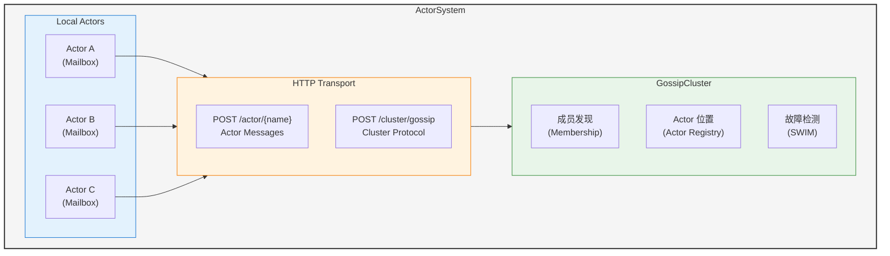
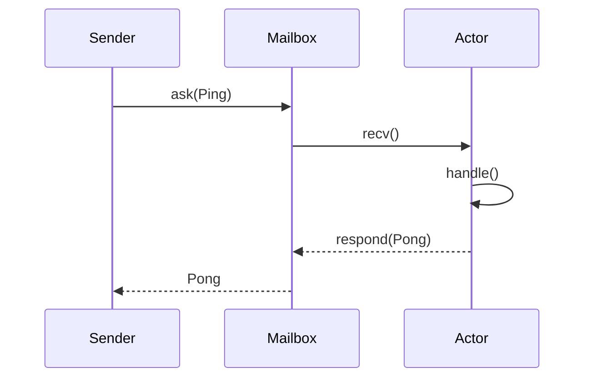
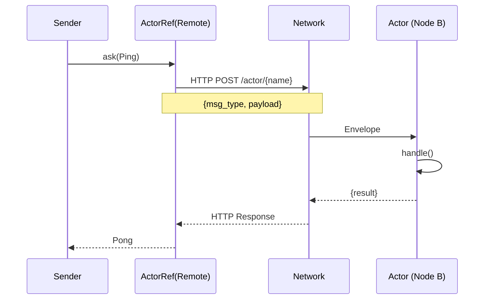

# Pulsing Actor System 设计文档

## 概述

Pulsing Actor System 是一个轻量级的分布式 Actor 框架，专为 Pulsing 项目设计。它提供了简单易用的 Actor 模型实现，支持单机和集群部署，无需依赖外部服务（如 etcd、NATS）。

## 设计目标

1. **轻量级** - 最小化依赖，易于集成
2. **零外部依赖** - 不依赖 etcd、NATS 等外部服务
3. **位置透明** - 本地和远程 Actor 使用相同 API
4. **高性能** - 基于 Tokio 异步运行时
5. **易于使用** - 简洁的 API 设计

## 架构概览



## 核心组件

### 1. Actor

Actor 是系统的基本计算单元，具有以下特性：

- **封装状态** - 状态只能通过消息访问
- **异步消息处理** - 非阻塞处理
- **生命周期管理** - on_start / on_stop 回调

```rust
#[async_trait]
pub trait Actor: Send + 'static {
    /// Actor 唯一标识
    fn id(&self) -> &ActorId;

    /// 启动回调
    async fn on_start(&mut self, ctx: &mut ActorContext) -> anyhow::Result<()> {
        Ok(())
    }

    /// 停止回调
    async fn on_stop(&mut self, ctx: &mut ActorContext) -> anyhow::Result<()> {
        Ok(())
    }

    /// 处理原始消息 (用于类型擦除的远程消息)
    async fn receive(
        &mut self,
        msg: RawMessage,
        ctx: &mut ActorContext,
    ) -> anyhow::Result<RawMessage>;
}
```

### 2. Message

消息是 Actor 间通信的载体：

```rust
pub trait Message: Serialize + DeserializeOwned + Send + 'static {
    /// 消息类型标识 (用于序列化/反序列化)
    fn type_id() -> &'static str;
}

// 示例
#[derive(Serialize, Deserialize)]
struct Ping { value: i32 }

impl Message for Ping {
    fn type_id() -> &'static str { "Ping" }
}
```

### 3. ActorRef

ActorRef 是 Actor 的引用，提供位置透明的消息发送：

```rust
pub struct ActorRef {
    actor_id: ActorId,
    inner: ActorRefInner,  // Local 或 Remote
}

impl ActorRef {
    /// 请求-响应模式
    pub async fn ask<M, R>(&self, msg: M) -> anyhow::Result<R>
    where
        M: Message,
        R: Message;

    /// 单向消息 (Fire-and-forget)
    pub async fn tell<M>(&self, msg: M) -> anyhow::Result<()>
    where
        M: Message;
}
```

**位置透明性：**

```rust
// 本地 Actor
let local_ref = system.spawn(MyActor::new()).await?;

// 远程 Actor (API 完全相同)
let remote_ref = system.actor_ref(&remote_actor_id).await?;

// 使用方式完全一致
let response: Pong = local_ref.ask(Ping { value: 1 }).await?;
let response: Pong = remote_ref.ask(Ping { value: 1 }).await?;
```

### 4. ActorContext

ActorContext 提供 Actor 执行上下文：

```rust
pub struct ActorContext {
    actor_id: Option<ActorId>,
    node_id: Option<NodeId>,
    system: Option<Arc<dyn ActorSystemRef>>,
    cancel_token: CancellationToken,
}

impl ActorContext {
    /// 获取其他 Actor 的引用
    pub async fn actor_ref(&self, id: &ActorId) -> anyhow::Result<ActorRef>;

    /// 检查是否应该停止
    pub fn is_cancelled(&self) -> bool;
}
```

### 5. Mailbox

Mailbox 是 Actor 的消息队列：

```rust
pub struct Mailbox {
    sender: mpsc::Sender<Envelope>,
    receiver: mpsc::Receiver<Envelope>,
}

pub struct Envelope {
    msg_type: String,
    payload: Vec<u8>,
    respond_to: Option<oneshot::Sender<Result<Vec<u8>>>>,
}
```

**特性：**
- 有界队列 (默认 256)
- 背压支持
- Ask/Tell 两种模式

### 6. ActorSystem

ActorSystem 是整个框架的入口：

```rust
pub struct ActorSystem {
    node_id: NodeId,
    addr: SocketAddr,
    local_actors: Arc<DashMap<String, LocalActorHandle>>,
    cluster: Arc<RwLock<Option<Arc<GossipCluster>>>>,
    transport: Arc<HttpTransport>,
    cancel_token: CancellationToken,
}

impl ActorSystem {
    /// Builder 模式创建系统 (推荐)
    pub fn builder() -> ActorSystemBuilder;

    /// 创建匿名 Actor (仅通过 ActorRef 访问)
    pub async fn spawn<A: IntoActor>(&self, actor: A) -> anyhow::Result<ActorRef>;

    /// 创建命名 Actor (支持跨节点发现)
    pub async fn spawn_named<P: AsRef<str>, A: IntoActor>(&self, name: P, actor: A) -> anyhow::Result<ActorRef>;

    /// Builder 模式创建 Actor (高级配置)
    pub fn spawning(&self) -> SpawnBuilder;

    /// 解析命名 Actor
    pub async fn resolve<P: IntoActorPath>(&self, name: P) -> anyhow::Result<ActorRef>;

    /// Builder 模式解析 Actor (高级配置)
    pub fn resolving(&self) -> ResolveBuilder;

    /// 停止 Actor
    pub async fn stop(&self, actor_name: &str) -> anyhow::Result<()>;

    /// 关闭系统
    pub async fn shutdown(&self) -> anyhow::Result<()>;
}
```

## 消息处理流程

### 本地消息



### 远程消息



## 集群管理

### GossipCluster

负责集群成员管理和 Actor 位置发现：

```rust
pub struct GossipCluster {
    local_node: NodeId,
    local_addr: SocketAddr,
    members: Arc<RwLock<HashMap<NodeId, MemberInfo>>>,
    actors: Arc<RwLock<HashMap<ActorId, NodeId>>>,
    transport: Arc<HttpTransport>,
    seed_addrs: Arc<RwLock<Vec<SocketAddr>>>,
    config: GossipConfig,
    swim: SwimDetector,
}
```

**功能：**
- 成员发现和同步
- Actor 位置注册/查询
- SWIM 故障检测
- 周期性 seed 探测

### 节点发现

详见 [Node Discovery 设计文档](./node-discovery.md)

## 配置选项

使用 Builder 模式配置 ActorSystem：

```rust
// 单机模式
let system = ActorSystem::builder().build().await?;

// 指定绑定地址
let system = ActorSystem::builder()
    .addr("0.0.0.0:8001")
    .build()
    .await?;

// 集群模式 (加入现有集群)
let system = ActorSystem::builder()
    .addr("0.0.0.0:8002")
    .seeds(&["127.0.0.1:8001"])
    .build()
    .await?;
```

### 内部配置结构

```rust
pub struct SystemConfig {
    /// HTTP 绑定地址
    pub addr: SocketAddr,

    /// Seed 节点地址
    pub seed_nodes: Vec<SocketAddr>,

    /// Gossip 配置
    pub gossip_config: GossipConfig,
}
```

## 使用示例

### 定义 Actor (简洁版)

```rust
use pulsing_actor::prelude::*;

struct Echo;

#[async_trait]
impl Actor for Echo {
    async fn receive(&mut self, msg: Message, _ctx: &mut ActorContext) -> anyhow::Result<Message> {
        let s: String = msg.unpack()?;
        Message::pack(&format!("echo: {}", s))
    }
}
```

### 定义 Actor (类型消息)

```rust
use pulsing_actor::prelude::*;
use serde::{Serialize, Deserialize};

#[derive(Serialize, Deserialize)]
struct Ping { value: i32 }

#[derive(Serialize, Deserialize)]
struct Pong { result: i32 }

struct Calculator;

#[async_trait]
impl Actor for Calculator {
    async fn receive(&mut self, msg: Message, _ctx: &mut ActorContext) -> anyhow::Result<Message> {
        let ping: Ping = msg.unpack()?;
        Message::pack(&Pong { result: ping.value * 2 })
    }
}
```

### 单机模式

```rust
#[tokio::main]
async fn main() -> anyhow::Result<()> {
    // 创建系统 (builder 模式)
    let system = ActorSystem::builder().build().await?;

    // 创建 Actor
    let actor_ref = system.spawn("echo", EchoActor).await?;

    // 发送消息
    let response: Pong = actor_ref.ask(Ping { value: 21 }).await?;
    assert_eq!(response.result, 42);

    // 关闭
    system.shutdown().await?;
    Ok(())
}
```

### 集群模式

```rust
// 节点 1 (Seed)
let system1 = ActorSystem::builder()
    .addr("0.0.0.0:8001")
    .build()
    .await?;

// 创建命名 Actor (可跨节点发现)
system1.spawn_named("services/echo", EchoActor).await?;

// 节点 2 (加入集群)
let system2 = ActorSystem::builder()
    .addr("0.0.0.0:8002")
    .seeds(&["127.0.0.1:8001"])
    .build()
    .await?;

// 等待集群同步
tokio::time::sleep(Duration::from_millis(500)).await;

// 通过名称解析远程 Actor
let remote_ref = system2.resolve("services/echo").await?;

let response: Pong = remote_ref.ask(Ping { value: 10 }).await?;
assert_eq!(response.result, 20);
```

## 模块结构

```
pulsing/actor_system/
├── src/
│   ├── lib.rs              # 库入口，prelude 导出
│   ├── system.rs           # ActorSystem 实现
│   ├── actor/
│   │   ├── mod.rs
│   │   ├── traits.rs       # Actor, Message, Handler traits
│   │   ├── context.rs      # ActorContext
│   │   ├── mailbox.rs      # Mailbox, Envelope
│   │   └── reference.rs    # ActorRef, RemoteTransport
│   ├── cluster/
│   │   ├── mod.rs
│   │   ├── gossip.rs       # GossipCluster, GossipMessage
│   │   ├── member.rs       # MemberInfo, MemberStatus
│   │   └── swim.rs         # SWIM 故障检测
│   └── transport/
│       ├── mod.rs
│       ├── http.rs         # HTTP 传输层
│       ├── tcp.rs          # TCP 传输层 (保留)
│       └── codec.rs        # 消息编解码
├── tests/                  # 集成测试
├── examples/               # 使用示例
└── Cargo.toml
```

## 错误处理

```rust
// Actor 内部错误
async fn receive(&mut self, msg: RawMessage, _ctx: &mut ActorContext)
    -> anyhow::Result<RawMessage>
{
    // 返回 Err 会通过响应通道传递给调用者
    Err(anyhow::anyhow!("Processing failed"))
}

// 调用方处理
match actor_ref.ask::<Ping, Pong>(msg).await {
    Ok(response) => { /* 成功 */ }
    Err(e) => { /* 处理错误 */ }
}
```

## 性能考虑

1. **消息序列化** - 使用 bincode 进行高效二进制序列化
2. **连接复用** - HTTP keepalive 和连接池
3. **异步处理** - 基于 Tokio，非阻塞 I/O
4. **有界队列** - Mailbox 有界防止内存溢出

## 未来规划

- [ ] Actor 监督树 (Supervision)（不计划引入）
- [ ] 持久化支持
- [ ] 更完善的 Leader Election
- [ ] Metrics 和 Tracing 集成
- [ ] Actor 迁移支持
