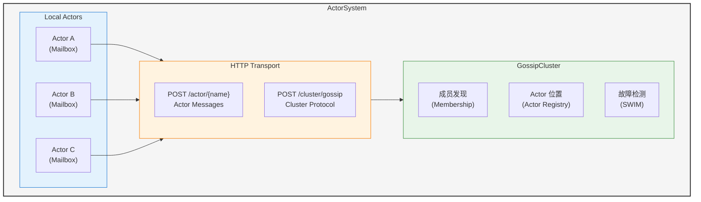
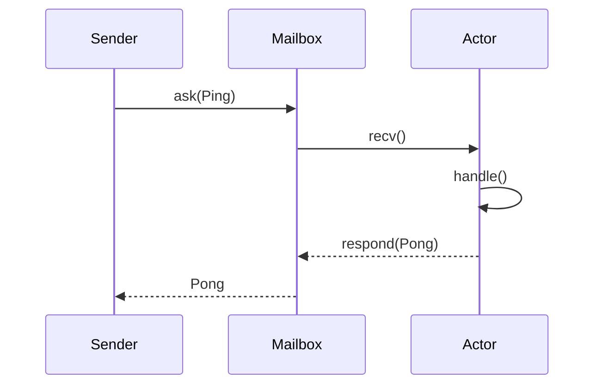
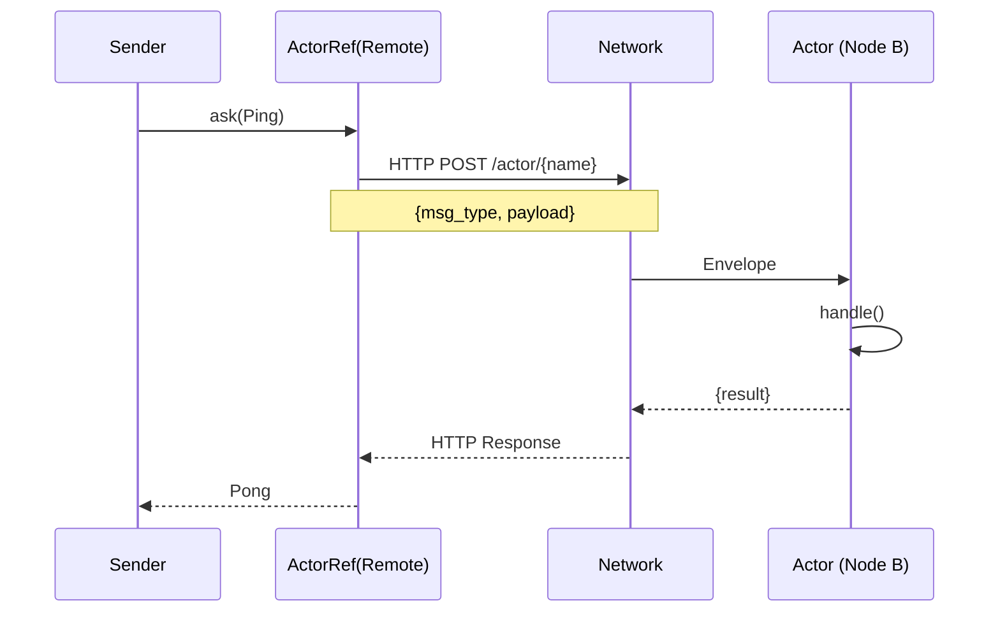

# Architecture

Overview of Pulsing Actor System architecture.

## System Components

## Key Concepts

### Actor

An Actor is a computational unit that:
- Encapsulates state
- Processes messages asynchronously
- Has a unique identifier
- Can be local or remote

### Message

Messages are the communication mechanism between actors:
- **Single messages**: Request-response pattern
- **Streaming messages**: Continuous data flow

### ActorRef

ActorRef provides location transparency:
- Same API for local and remote actors
- Automatic routing based on actor location
- Handles serialization/deserialization

### Cluster

The cluster provides:
- **Node Discovery**: Automatic discovery via Gossip protocol
- **Actor Registry**: Track actor locations across nodes
- **Failure Detection**: SWIM protocol for health checks

## Message Flow

### Local Message

### Remote Message

## Design Principles

1. **Zero External Dependencies**: No need for etcd, NATS, or other external services
2. **Location Transparency**: Same API for local and remote actors
3. **High Performance**: Built on Tokio async runtime
4. **Simple API**: Easy to use Python interface
5. **Cluster Awareness**: Automatic discovery and routing

## For More Details

- [Actor System Design](../design/actor-system.md)
- [Node Discovery](../design/node-discovery.md)
- [Actor Addressing](../design/actor-addressing.md)
- [HTTP2 Transport](../design/http2-transport.md)
