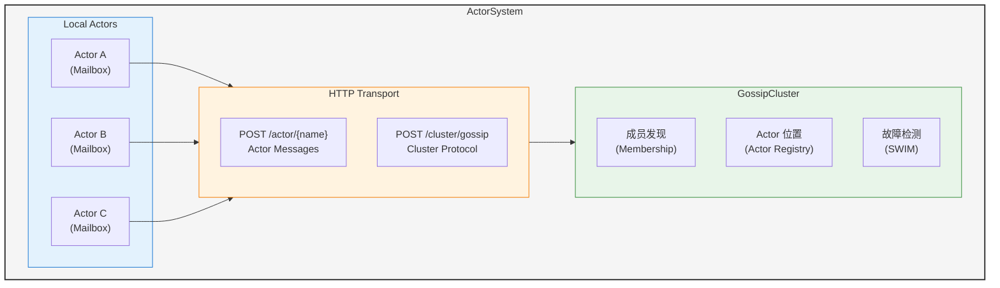
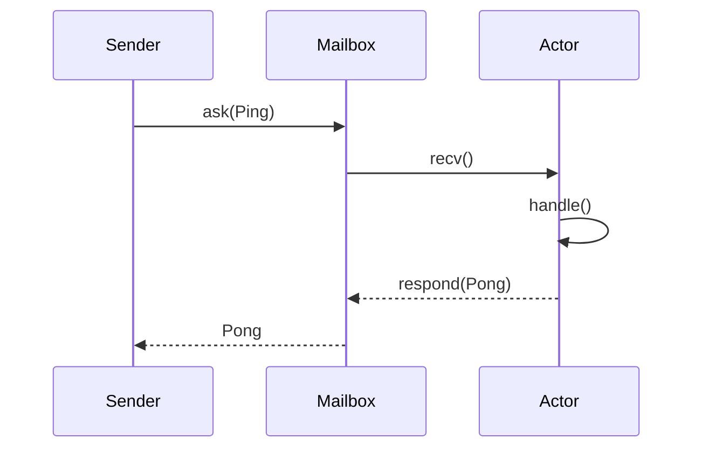
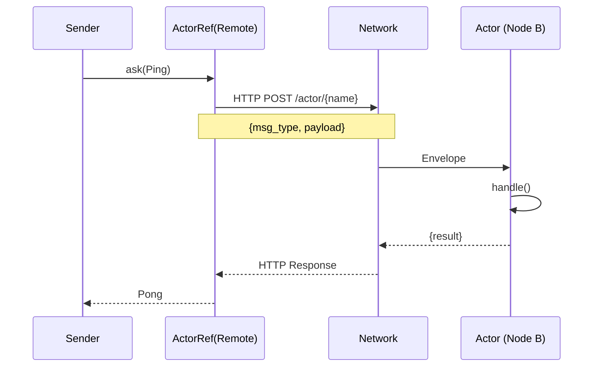

# 架构概述

Pulsing Actor 系统架构概览。

## 系统组件

## 核心概念

### Actor

Actor 是一个计算单元，具有以下特性：
- 封装状态
- 异步处理消息
- 具有唯一标识符
- 可以是本地或远程

### Message

消息是 Actor 之间的通信机制：
- **单条消息**：请求-响应模式
- **流式消息**：连续数据流

### ActorRef

ActorRef 提供位置透明性：
- 本地和远程 Actor 使用相同 API
- 根据 Actor 位置自动路由
- 处理序列化/反序列化

### Cluster

集群提供：
- **节点发现**：通过 Gossip 协议自动发现
- **Actor 注册表**：跟踪跨节点的 Actor 位置
- **故障检测**：使用 SWIM 协议进行健康检查

## 消息流程

### 本地消息

### 远程消息

## 设计原则

1. **零外部依赖**：无需 etcd、NATS 或其他外部服务
2. **位置透明**：本地和远程 Actor 使用相同 API
3. **高性能**：基于 Tokio 异步运行时构建
4. **简单 API**：易于使用的 Python 接口
5. **集群感知**：自动发现和路由

## 更多详情

- [Actor 系统设计](actor-system.md)
- [节点发现](node-discovery.md)
- [集群组网](cluster-networking.zh.md)
- [Actor 寻址](actor-addressing.md)
- [HTTP2 传输](http2-transport.md)
