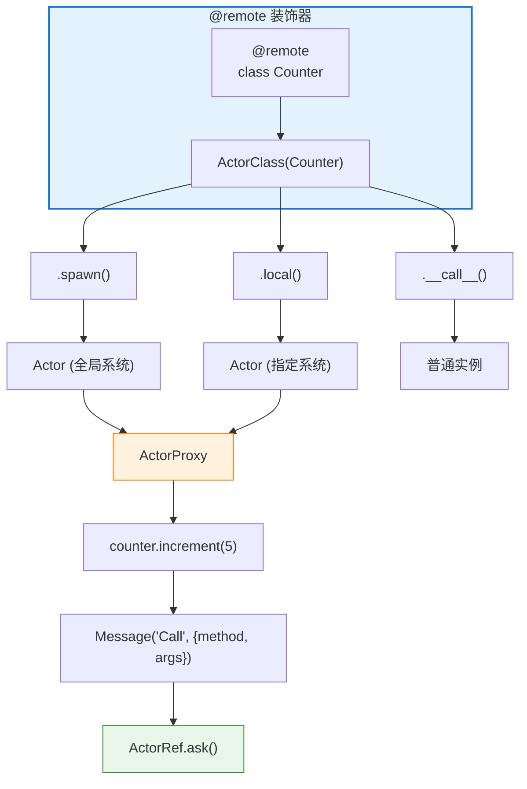
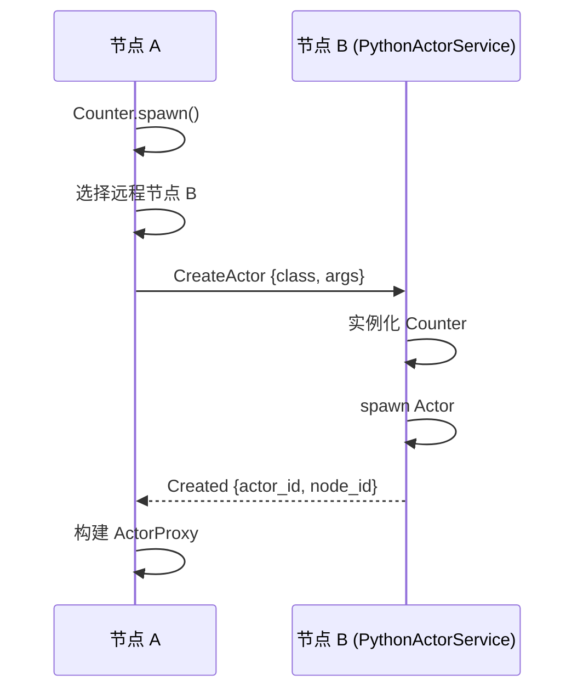

# @remote 装饰器设计文档

## 概述

`@remote` 是一个便利装饰器，将普通 Python 类自动转换为分布式 Actor。它提供类似 Ray 的编程体验，让用户无需关心底层的消息传递细节。

## 设计目标

1. **简洁易用** - 一个装饰器即可将普通类变为分布式 Actor
2. **透明调用** - 方法调用自动转为 Actor 消息，用户感知不到分布式通信
3. **灵活部署** - 支持本地创建和远程创建两种模式
4. **向后兼容** - 装饰后的类仍可作为普通类使用

## 架构



## 核心组件

### 1. ActorClass

装饰器返回的包装类，提供三种使用方式：

| 方法 | 说明 |
|------|------|
| `.spawn(**kwargs)` | 使用全局系统创建 Actor（推荐） |
| `.local(system, **kwargs)` | 在指定系统本地节点创建 Actor |
| `(**kwargs)` | 直接调用，返回普通实例（非 Actor） |

### 2. ActorProxy

Actor 实例的代理，核心功能是**将方法调用转换为消息**：

```python
# 用户代码
result = await counter.increment(5)

# 实际执行
msg = Message("Call", {"method": "increment", "args": [5], "kwargs": {}})
response = await actor_ref.ask(msg)
return response["result"]
```

### 3. PythonActorService

每个节点自动创建的系统 Actor，负责处理远程 Actor 创建请求：



### 4. _WrappedActor

将用户类包装为 Pulsing Actor，处理 `Call` 消息并调用对应方法：

```python
class _WrappedActor:
    async def receive(self, msg):
        if msg.msg_type == "Call":
            method = getattr(self._instance, msg["method"])
            result = method(*msg["args"], **msg["kwargs"])
            return Message("Result", {"result": result})
```

## 使用方式

### 基本用法

```python
import pulsing as pul

@pul.remote
class Counter:
    def __init__(self, init_value=0):
        self.value = init_value

    def get(self):
        return self.value

    def increment(self, n=1):
        self.value += n
        return self.value

async def main():
    await pul.init()

    # 创建 Actor
    counter = await Counter.spawn(init_value=10)

    # 调用方法
    print(await counter.get())        # 10
    print(await counter.increment(5)) # 15

    await shutdown()
```

### 集群模式

```python
# 节点 A (种子节点)
await init(addr="0.0.0.0:8001")

# 节点 B (加入集群)
await init(addr="0.0.0.0:8002", seeds=["127.0.0.1:8001"])

# 创建 Actor (可能在任意节点)
counter = await Counter.spawn(init_value=100)
print(await counter.get())  # 100
```

### 异步方法支持

```python
@remote
class AsyncWorker:
    async def fetch_data(self, url):
        async with aiohttp.ClientSession() as session:
            async with session.get(url) as resp:
                return await resp.text()

worker = await AsyncWorker.spawn()
html = await worker.fetch_data("https://example.com")
```

### 命名 Actor

```python
# 指定名称，便于其他节点发现
counter = await Counter.spawn(name="global_counter", init_value=0)

# 其他地方可以通过名称解析
from pulsing.actor import get_system
ref = await get_system().resolve("global_counter")
```

### 作为普通类使用

```python
# 直接调用，不创建 Actor
counter = Counter(init_value=10)  # 返回普通 Counter 实例
counter.increment(5)              # 同步调用，返回 15
```

## 与 Ray 对比

| 特性 | Ray | Pulsing @remote |
|------|-----|-----------------|
| 装饰器 | `@ray.remote` | `@remote` |
| 创建 Actor | `Counter.remote()` | `await Counter.spawn()` |
| 方法调用 | `ray.get(counter.increment.remote(5))` | `await counter.increment(5)` |
| 调度策略 | 自动调度 + 资源约束 | 随机选择节点 |
| 依赖 | Ray 集群 | 无外部依赖 |

## 限制

1. **方法参数必须可序列化** - 参数通过 pickle 传输
2. **返回值必须可序列化** - 结果通过 pickle 返回
3. **类必须在所有节点可导入** - 远程创建需要目标节点能 import 该类
4. **不支持属性访问** - 只能调用方法，不能直接访问 `counter.value`

## 最佳实践

### 1. 方法设计

```python
@remote
class GoodDesign:
    # ✓ 返回完整状态
    def get_state(self):
        return {"value": self.value, "count": self.count}

    # ✗ 避免：返回不可序列化对象
    def get_connection(self):
        return self.db_connection  # 无法序列化
```

### 2. 错误处理

```python
try:
    result = await counter.increment(5)
except RuntimeError as e:
    # 远程方法抛出的异常会被包装为 RuntimeError
    print(f"远程错误: {e}")
```

### 3. 批量操作

```python
# 并行调用多个 Actor
workers = [await Worker.spawn(id=i) for i in range(4)]
results = await asyncio.gather(*[w.process(data) for w in workers])
```

## 内部实现

### 类注册表

`@remote` 装饰时，类会被注册到全局表：

```python
_actor_class_registry["__main__.Counter"] = Counter
```

远程创建时，目标节点通过类名查找并实例化。

### 消息协议

```python
# 方法调用
{"msg_type": "Call", "method": "increment", "args": [5], "kwargs": {}}

# 成功响应
{"msg_type": "Result", "result": 15}

# 错误响应
{"msg_type": "Error", "error": "Division by zero"}
```

### 远程创建协议

```python
# 创建请求
{
    "msg_type": "CreateActor",
    "class_name": "__main__.Counter",
    "actor_name": "Counter_abc12345",
    "args": [],
    "kwargs": {"init_value": 10},
    "public": True
}

# 创建成功
{
    "msg_type": "Created",
    "actor_id": 12345,
    "node_id": 9876543210,
    "methods": ["get", "increment", "decrement"]
}
```

## 未来规划

- [ ] 支持指定目标节点 `Counter.spawn(node_id=xxx)`
- [ ] 支持负载均衡策略（轮询、最小负载等）
- [ ] 支持资源约束 `Counter.spawn(num_cpus=2)`
- [ ] 支持 Actor 池 `CounterPool.spawn(size=4)`
