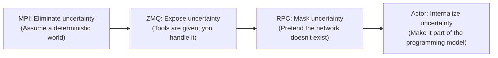

# Evolution of In-Cluster Communication: From MPI to Modern Actors

When building distributed systems—especially modern AI infrastructure—one of the earliest architectural decisions is: **how should components talk to each other?**

Communication paradigms shape a system’s DNA. This article reviews four generations of in-cluster communication—MPI, ZMQ, RPC, and Actors—focusing on what each generation tried to solve, and what it *cost* in terms of complexity and constraints.

Finally, we explain why the **Actor model** is experiencing a modern renaissance at the intersection of the Rust ecosystem and AI orchestration—and why it forms the foundation of the Pulsing framework.

---

## Overview: The Law of Conservation of Complexity

The core challenge of distributed systems is **uncertainty** (latency, failures, reordering). The evolution of communication technology is essentially a shift of responsibility: **who absorbs and manages that uncertainty**.



| Dimension | MPI | ZMQ | RPC | Actor |
|------|-----|-----|-----|-------|
| **Core metaphor** | Army (marching in sync) | Walkie-talkie (free channels) | Phone call (1-to-1) | Mail system (async delivery) |
| **Control plane** | Static (fixed at launch) | Manual (built by developers) | Bolt-on (Service Mesh) | Built-in (Gossip/Supervision) |
| **State management** | Tightly coupled (SPMD) | None | Externalized (Redis/DB) | Memory-resident (stateful) |
| **Transport base** | TCP/RDMA (long-lived) | TCP (socket abstraction) | TCP/HTTP/2/QUIC (implementation-dependent; e.g. gRPC = HTTP/2) | **HTTP/2 (multiplexing)** |
| **Fault philosophy** | Crash-stop | Dev-dependent | Retry + circuit-break | Let it crash + restart |
| **Best fit** | Data plane (tensor sync) | Transport plumbing | Business plane (CRUD services) | Control plane (complex orchestration) |

---

## Generation 1: MPI — Extreme Performance in a Static World

### The monarch of rigid synchronization

MPI (Message Passing Interface) was born in HPC. Its worldview is **static and perfect**: all nodes are ready at startup, the network is reliable, and compute loads are balanced.

Under the BSP (Bulk Synchronous Parallel) model, MPI abstracts communication as **collectives**—all participants perform the same communication step at the same time:

```text
        Compute phase         Barrier         Communication phase
Rank 0: [██████████]  ───── ▐ ──────────▶  AllReduce
Rank 1: [████████]    ───── ▐ ──────────▶  AllReduce
Rank 2: [████████████] ──── ▐ ──────────▶  AllReduce
Rank 3: [████████]    ───── ▐ ──────────▶  AllReduce
                            ▲
                   Barrel effect: the slowest rank dictates the pace
```

This “everyone must arrive” rigidity is both the source of MPI’s peak performance and the root of its limitations.

### Why MPI remains irreplaceable

In the **data plane** of AI training—e.g. gradient synchronization via AllReduce—MPI (and its GPU-specialized descendant NCCL) still dominates.

The reason is the optimization space enabled by **predefined patterns**:
- Topology is known (Ring, Tree, Recursive Halving-Doubling), enabling precise routing for hardware (NVLink, InfiniBand, PCIe).
- Buffer sizes are known, enabling DMA zero-copy and pipelined overlap (compute/comm overlap).
- Participant sets are fixed, enabling scheduling and tuning around a stable world.

In short, MPI’s power comes from **maximally exploiting determinism**.

### Limitation: when determinism crumbles

As AI systems evolve beyond pure data parallelism, MPI’s “determinism assumptions” often stop holding:

| Scenario | MPI assumption | Reality |
|------|------------|------|
| Pipeline parallelism | stages are homogeneous | stage compute differs; irregular point-to-point is needed |
| Inference serving | uniform load | request arrival is stochastic; dynamic load balancing is needed |
| Agent collaboration | fixed topology | collaboration relationships change at runtime |
| Elastic training | fixed node count | nodes may fail; scaling is required |

More critically, MPI’s **fault tolerance is close to zero**—one rank failure often forces communicator rebuild. On thousand-GPU clusters, failures are not “if”, but “how often”.

> MPI answers “how to communicate efficiently in a deterministic world”, but struggles with “what to do when the world is uncertain”.

---

## Generation 2: ZMQ — Freedom, with Sharp Edges

### From collectives to point-to-point

MPI’s core limitation is that it assumes everyone participates in each step. When you only need “A sends a message to B”, collectives are too heavy.

ZeroMQ (ØMQ) emerged as “sockets with batteries”, offering flexible async messaging primitives for arbitrary topologies:

```text
MPI world (regular):                 ZMQ world (free-form):

  0 ←──AllReduce──▶ 1                0 ──push──▶ 1
  ▲                  ▲                │            │
  │   AllReduce      │                ▼            ▼
  ▼                  ▼                2 ◀──req──── 3
  2 ←──AllReduce──▶ 3                     pub
                                          │
  Everyone must participate               4 ◀──sub── 5
                                      any connection, any time
```

REQ/REP, PUB/SUB, PUSH/PULL, DEALER/ROUTER, etc. make it easy to wire diverse patterns, with very high performance via async I/O and multiplexing.

### Problem: mechanism without policy

ZMQ intentionally stays at the **transport layer**. It provides mechanisms, but not application-level policy. Coordination becomes the developer’s job.

In practice, this often shows up as:

**Stalls / “waiting forever”**—easy to trigger when application logic doesn’t coordinate well (not always a kernel deadlock; often waiting for an event that will never happen):

```text
❌ Scenario 1: REQ/REP finite-state rules get violated

  # A REQ socket must follow: send -> recv -> send -> recv ...
  A(REQ): send(req1) → send(req2)   # second send may block or raise EFSM (binding/config dependent)
  A(REQ): recv(resp1)               # response ordering assumptions are also easy to get wrong

❌ Scenario 2: DIY correlation (DEALER/ROUTER) misses a branch

  A: send(req, id=42) → await(resp, id=42)
  B: receives req(id=42) but crashes/reconnects/forgets to reply in some branch
  A: waits forever for resp(id=42) (no built-in paradigm forcing “must reply” or “must timeout”)
```

**App-perceived “message loss”**—common with PUB/SUB and during reconnect / subscription propagation:

```text
❌ Scenario: subscription not established yet (or reconnect window)

  Pub: send(msg)                 # publisher emits
  Sub: [not connected / subscription filter not delivered yet]  # subscriber not “ready”
  Sub: recv()                    # msg is not replayed (PUB/SUB does not retain history for late joiners)

Notes:
  - In non-PUB/SUB patterns, ZMQ often buffers in in-process memory queues; but those queues are in-process.
    Process crashes, HWM limits, or non-blocking sends (EAGAIN) can still look like “it never arrived”.
```

**Backpressure “gotchas”**—when consumption can’t keep up with production:

- ZMQ provides **High Water Mark (HWM)** and related knobs, but behavior depends heavily on socket type and send mode:
  it may block, it may return EAGAIN (non-blocking), and in PUB/SUB some situations can drop.
- Structurally, it lacks an end-to-end, semantics-aligned backpressure paradigm: how to express *must be ordered, must not drop tokens*,
  plus consistent cancellation/timeout/retry semantics.
- In AI inference (e.g. LLM token streaming), sustained producer > consumer often becomes a trade-off: buffer memory, drop data, or block and risk cascaded stalls.

Developers end up implementing heartbeats, ACKs, retry queues, and connection state machines—often the most fragile part of the system.

> ZMQ answers “how to let any node talk to any node”, but pushes “how to be reliable” onto every developer.

---

## Generation 3: RPC — The Cost of Pretending to be Local

### Call semantics: rescuing structure from ZMQ chaos

Facing the “I sent a request, will I get a response?” problem, RPC wraps remote communication into **call semantics**.

```python
# ZMQ: two steps; manual pairing; forget recv and you stall
socket.send(request)
response = socket.recv()

# RPC: request/response are bound by language semantics
response = service.compute(request)
```

This is more than syntax sugar. Call semantics impose three constraints:

1. **Request-response pairing**: you can’t “send and forget to receive”.
2. **Deadline/timeout mechanisms**: most frameworks support deadlines, but you typically must **set them explicitly** (many defaults can wait “forever”).
3. **IDL contracts**: Protobuf/IDL fixes the protocol at build time.

### The fallacies of distributed computing

RPC’s promise—**remote calls feel local**—is a leaky abstraction. Peter Deutsch’s “Eight Fallacies of Distributed Computing” remain true:

- The network is reliable
- Latency is zero — in practice often \(10^3\) to \(10^6\)× gaps depending on serialization, kernel, network, and queuing
- Bandwidth is infinite
- The network is secure
- Topology doesn’t change
- There is one administrator
- Transport cost is zero
- The network is homogeneous

RPC tends to encourage code that “pretends the network doesn’t exist”; when it fails, error handling becomes a patch afterwards.

### The “microservice tax”

RPC is fundamentally point-to-point and lacks a unified **cluster view**. In practice, as systems scale, teams often stack supporting infrastructure (not every system needs all of it, but it’s common at scale):

```text
What a “simple” RPC often looks like in reality:

[Service A] ──IPC── [Sidecar/Envoy] ──network── [Sidecar/Envoy] ──IPC── [Service B]
                          ▲                            ▲
                          │        Control Plane        │
                          └──── [Etcd] [Consul] ───────┘
                                    ▲
                          [Prometheus] [Jaeger] [Sentinel]
```

- **Service discovery**: Etcd / Consul / ZooKeeper — where is the service?
- **Traffic governance**: Envoy / Nginx — LB, circuit breaking, rate limiting
- **Sidecars**: separating governance from business code

Each component is a system you deploy and operate—this is the “microservice tax”.

### The stateless fallacy

For AI systems, RPC often conflicts with **stateless-first architecture**.

Microservices frequently push stateless services (state in Redis/DB) for horizontal scaling and failover. This is great for CRUD, but often very costly for AI:

- **KV cache**: LLM inference context must reside in GPU memory. Pulling from Redis, deserializing, and loading into GPU per request is too slow.
- **Agent memory**: multi-turn state and reasoning traces need to persist.
- **Model weights**: loading large models takes tens of seconds; per-request reload is impossible.

> RPC answers “how to make remote calls reliable”, but its ecosystem tends to rely on bolt-on clustering, and stateless-first designs clash with AI reality.

---

## Generation 4: Actor — Embracing Uncertainty

### From masking to internalizing

The first three generations respond to network uncertainty by eliminating it (MPI), exposing it (ZMQ), or masking it (RPC). The Actor model takes a fourth path: **make uncertainty part of the programming model**.

Originating with Carl Hewitt (1973) and popularized by Erlang (1986) and Akka (2009), its core principles are:

**1. Message passing, not function calls**

Actors don’t “call” each other; they **deliver messages**. This small shift changes everything:

- Sending is async and non-blocking—senders don’t stall because receivers are slow.
- Each Actor has a **mailbox** as a natural buffer, decoupling producers and consumers.
- Delivery is “best-effort”, forcing failure to be part of the design, not an afterthought.

**2. Private state, not shared memory**

Actors encapsulate private state, accessible only via messages:

- No locks, no races—concurrency safety is architecturally guaranteed.
- State is memory-resident—naturally fitting KV caches and agent memory.

**3. “Let it crash”**

Instead of preventing all failures, accept failures as normal and build **supervision**: parent actors monitor children and apply policies (restart/stop/escalate) when failures happen.

```text
           [Supervisor]
            /        \
     [Worker A]    [Worker B]
         ↓              ↓
       crash!         running
         ↓
     auto-restart ✓
```

This “isolate + restart” pattern gives the system self-healing properties: a single actor crash doesn’t take down the whole system.

### Why actors synthesize the strengths of the previous three

| Previous pain point | Actor answer |
|----------|-------------|
| MPI: hard to express irregular comms | any actors can communicate anytime |
| ZMQ: no coordination paradigm | Ask/Tell/Stream provide semantic constraints |
| RPC: lacks cluster capability | built-in discovery + location transparency |
| RPC: stateless limitation | actors are naturally stateful, memory-resident |
| All: fragile fault tolerance | supervision + automatic restart |

---

## Pulsing: Modern Actors Powered by Rust

The Actor model is conceptually strong, but earlier implementations had trade-offs—Erlang’s performance ceiling, Akka’s JVM GC pauses, Ray’s Python+C++ complexity.

Pulsing modernizes the Actor model using **Rust + Tokio + HTTP/2**, with concrete engineering decisions across five dimensions.

### 1. Zero-dependency clustering: Gossip + SWIM

RPC stacks often need bolt-on Etcd/Consul for discovery. Pulsing builds clustering into the Actor System.

Each node only needs a seed address. Membership is exchanged via Gossip; failures are detected via SWIM:

```text
Startup (Kubernetes example):

  New Pod                Service IP              Existing Pods
    │                        │                      │
    ├── Probe 1 (Join) ────▶ ├── routed to Pod A ─▶ │
    │◀── Welcome [A] ───────┤                       │
    │                        │                      │
    ├── Probe 2 (Join) ────▶ ├── routed to Pod B ─▶ │
    │◀── Welcome [A,B] ─────┤                       │
    │                        │                      │
    └── normal Gossip begins ────────────────────────┘
         then every ~200ms sync with random peers
```

On failure, SWIM’s Ping → Suspect → Dead state machine cleans up membership and actor registrations:

- Ping timeout → Suspect
- Suspect timeout → Dead (removed from members)
- actor registrations on the dead node are cleaned up

**Key design**: all communication (actor messages + gossip + health checks) shares a single HTTP port—simplifying networking and firewall rules.

### 2. Location-transparent addressing: a unified Actor URI scheme

In RPC, clients must know service endpoints. Pulsing provides a URI-style address scheme so physical location is transparent:

```text
actor:///services/llm/router           → named actor (cluster-routed)
actor:///services/llm/router@node_a    → specific node instance
actor://node_a/worker_123              → globally precise address
actor://localhost/worker_123           → local shorthand
```

The same named actor can run multiple instances across nodes; the system load-balances automatically:

```python
# deployed on Node A
await system.spawn(LLMRouter(), name="services/llm/router")

# deployed on Node B (same name)
await system.spawn(LLMRouter(), name="services/llm/router")

# resolved from any node; instance chosen automatically
router = await system.resolve("services/llm/router")
result = await router.ask(request)  # routed to A or B
```

This removes the need for external LBs while keeping the API minimal.

### 3. Stateful orchestration: Actors as owners of state

This is the most fundamental advantage of Actors over stateless RPC. In Pulsing, actors are **owners** of state:

```python
@pul.remote
class InferenceWorker:
    def __init__(self, model_path: str):
        self.model = load_model(model_path)  # weights stay in memory
        self.kv_cache = {}                   # KV cache stays in memory

    async def generate(self, prompt: str):
        # reuse in-memory model and cache; no per-request DB load
        for token in self.model.generate(prompt, cache=self.kv_cache):
            yield {"token": token}
```

Implications:
- **KV cache residency**: no per-request serialize/deserialize round-trips.
- **Weight residency**: load once, serve for the lifetime of the process.
- **Agent memory residency**: multi-turn context lives inside actor state.

### 4. Streaming & backpressure: HTTP/2 end-to-end flow control

LLM token streaming is a canonical AI communication pattern. Traditional RPC streaming can be awkward; ZMQ can be tricky under backpressure.

Pulsing uses **h2c (HTTP/2 over cleartext)** to leverage HTTP/2 multiplexing and flow control:

**Connection multiplexing**: nodes keep one long-lived TCP connection; Ask/Tell/Stream map to independent HTTP/2 streams. No per-actor connection explosion.

**End-to-end backpressure**: HTTP/2 Flow Control Windows automatically throttle producers when consumers slow down:

```text
When producer rate > consumer rate:

  [LLM Actor]         [Network]           [Client]
       │                   │                   │
       │── Token ────────▶ │── Token ────────▶ │
       │── Token ────────▶ │── Token ────────▶ │ ← client slows
       │── Token ────────▶ │   H2 window full  │
       │   send() Pending  │◀─ stop ACKs ─────│ ← window exhausted
       │   ← generation pauses automatically  │
       │                   │                   │ ← client catches up
       │   send() resumes  │◀─ Window Update ─│ ← window freed
       │── Token ────────▶ │── Token ────────▶ │
```

No user-written flow-control code is required: Rust `Future` Pending semantics and HTTP/2 flow control compose naturally, propagating backpressure from network to application.

### 5. Type safety: compile-time communication contracts

MPI often manipulates `void*`; ZMQ sends blobs; type errors surface at runtime. Pulsing pushes contracts to compile time via Rust’s type system.

With the Behavior API (inspired by Akka Typed), message types are checked at compile time:

```rust
// A type-safe counter actor
fn counter(initial: i32) -> Behavior<CounterMsg> {
    stateful(initial, |count, msg, ctx| match msg {
        CounterMsg::Increment(n) => {
            *count += n;
            BehaviorAction::Same        // keep current behavior
        }
        CounterMsg::Reset => {
            *count = 0;
            BehaviorAction::Same
        }
    })
}

// TypedRef<CounterMsg> ensures only CounterMsg can be sent
let counter: TypedRef<CounterMsg> = system.spawn(counter(0));
counter.tell(CounterMsg::Increment(5)).await?;  // ✅ compiles
// counter.tell("hello").await?;                 // ❌ compile error
```

More importantly, `BehaviorAction::Become` allows safe behavior switches—natural for building agent state machines like `Idle → Thinking → Answering → Idle`.

---

## Summary: Positioning & Collaboration

The evolution of these four generations is about answering progressively deeper questions:

| Generation | Core question | Answer |
|------|----------|------|
| MPI | How do many processes synchronize data efficiently? | collectives + BSP |
| ZMQ | How can any two processes talk at any time? | async messaging primitives |
| RPC | How can remote communication feel reliable like local calls? | call semantics + IDL |
| Actor | How can a group of processes behave like one system? | message passing + supervision + cluster awareness |

Each generation doesn’t negate the previous; it complements it in new dimensions.

If **MPI/NCCL** is the **superhighway** of AI infrastructure—the data plane for massive tensor transport—then **Pulsing** is the **intelligent traffic control system**—the control plane for complex orchestration:

- not rigid like MPI; adapts to dynamic agent topologies
- not primitive like ZMQ; provides governance and clear paradigms
- not heavy like RPC stacks; remains lightweight and low-latency
- naturally stateful; fits KV cache and agent memory realities

In the spiral of technology, the Actor model—powered by Rust—returns as a strong primitive for the next generation of distributed intelligent systems.

---

## Further Reading

- [Actor System Design](actor-system.md) — Pulsing core architecture
- [HTTP/2 Transport](http2-transport.md) — streaming and backpressure details
- [Node Discovery](node-discovery.md) — Gossip + SWIM clustering
- [Actor Addressing](actor-addressing.md) — URI address system
- [Behavior API](behavior.md) — type-safe functional actors
