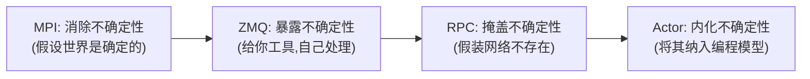

# 集群内通信技术演进：从 MPI 到现代 Actor

在构建分布式系统（特别是现代 AI 基础设施）时，架构师面临的首要决策往往是：**我们该如何对话？**

通信范式的选择决定了系统的基因。本文将从技术演进的视角，深度剖析分布式通信技术的四个代际：MPI、ZMQ、RPC 以及 Actor。我们将深入探讨每一代技术试图解决的根本问题，以及它们为此付出的代价。

最终，我们将揭示为什么在 Rust 生态和 AI 编排的交汇点上，**Actor 模型**正在经历一次现代化的复兴，并成为 Pulsing 框架的核心基石。

---

## 演进总览：复杂性守恒定律

分布式系统的核心挑战在于**不确定性**（网络延迟、节点故障、消息乱序）。通信技术的演进，本质上是关于"谁来处理这些不确定性"的权力转移过程。



| 维度 | MPI | ZMQ | RPC | Actor |
|------|-----|-----|-----|-------|
| **核心隐喻** | 军队 (同步行进) | 对讲机 (自由频道) | 电话 (一对一呼叫) | 邮件系统 (异步投递) |
| **控制平面** | 静态 (启动即固定) | 手动 (开发者自建) | 外挂 (Service Mesh) | 内建 (Gossip/成员管理/寻址) |
| **状态管理** | 紧耦合 (SPMD) | 无 | 外部化 (Redis/DB) | 内存驻留 (Stateful) |
| **通信基座** | TCP/RDMA (长连接) | TCP (Socket抽象) | TCP/HTTP/2/QUIC（取决于实现；如 gRPC=HTTP/2） | **HTTP/2 (多路复用)** |
| **容错哲学** | 崩溃即停止 | 依赖开发者 | 重试 + 熔断 | Let it crash +（按策略恢复） |
| **适用领域** | 数据面 (Tensor 同步) | 传输层 (底层管道) | 业务面 (CRUD 服务) | 控制面 (复杂编排) |

---

## 第一代：MPI —— 静态世界的极致性能

### 刚性同步的霸主

MPI (Message Passing Interface) 诞生于高性能计算 (HPC) 领域。它的世界观是**静态且完美**的：所有节点在启动时都已就绪，网络是可靠的，计算任务是均匀的。

在 BSP (Bulk Synchronous Parallel) 模型下，MPI 将通信抽象为**集合操作 (Collectives)**——所有参与者在同一时刻执行相同的通信操作：

```text
        计算阶段           Barrier          通信阶段
Rank 0: [██████████]  ───── ▐ ──────────▶  AllReduce
Rank 1: [████████]    ───── ▐ ──────────▶  AllReduce
Rank 2: [████████████] ──── ▐ ──────────▶  AllReduce
Rank 3: [████████]    ───── ▐ ──────────▶  AllReduce
                            ▲
                   木桶效应：最慢的节点决定整体速度
```

这种"所有人必须到齐"的刚性同步，是 MPI 性能极致的来源，也是它局限性的根源。

### 为什么 MPI 至今无法被替代？

在 AI 训练的**数据面 (Data Plane)**——例如数据并行中的梯度同步（AllReduce）——MPI（及其 GPU 特化版本 NCCL）仍然是绝对的统治者。

原因在于**通信模式的预定义性**带来的优化空间：
- 通信拓扑是已知的（Ring, Tree, Recursive Halving-Doubling），可以针对硬件拓扑（NVLink, InfiniBand, PCIe）做精确的路径规划。
- Buffer 大小是已知的，可以做 DMA 零拷贝、Pipeline 重叠（计算与通信重叠）。
- 参与者集合是固定的，可以做编译期的通信调度优化。

换句话说，MPI 的威力来自于**对确定性世界的极致利用**。

### 局限：确定性假设的崩塌

然而当 AI 系统从单纯的数据并行演化到更复杂的形态时，MPI 的"确定性假设"开始崩塌：

| 场景 | MPI 的假设 | 现实 |
|------|------------|------|
| 流水线并行 | 所有 Stage 同构 | Stage 间计算量差异大，需要不规则的点对点通信 |
| 推理服务 | 负载均匀 | 请求到达率随机，需要动态负载均衡 |
| Agent 协作 | 通信拓扑固定 | Agent 间的协作关系在运行时动态变化 |
| 弹性训练 | 节点数固定 | 节点可能故障、可能需要扩缩容 |

更致命的是，MPI 的**容错几乎为零**——一个 Rank 挂掉，整个 Communicator 就需要重建。在千卡集群上，节点故障不是"如果"的问题，而是"多久一次"的问题。

> MPI 解决了"如何在确定世界中高效通信"，但它无法回答"当世界变得不确定时怎么办"。

---

## 第二代：ZMQ —— 自由但危险的积木

### 从集合通信到点对点

MPI 的核心局限在于：它假设所有节点在每个通信步骤中都参与。当我们只需要"节点 A 给节点 B 发一条消息"时，MPI 的集合操作就显得笨重了。

ZeroMQ (ØMQ) 应运而生。它自称"带电池的 Socket"，提供了一套灵活的异步消息原语，让任意两个节点可以随时通信：

```text
MPI 的世界（规则通信）：            ZMQ 的世界（自由通信）：

  0 ←──AllReduce──▶ 1                0 ──push──▶ 1
  ▲                  ▲                │            │
  │   AllReduce      │                ▼            ▼
  ▼                  ▼                2 ◀──req──── 3
  2 ←──AllReduce──▶ 3                     pub
                                          │
  所有人必须参与                        4 ◀──sub── 5
                                      任意连接，任意时刻
```

ZMQ 通过 REQ/REP、PUB/SUB、PUSH/PULL、DEALER/ROUTER 等 Socket 模式，让开发者能灵活地搭建任意通信拓扑。它实现了**真正的异步 IO 和多路复用**，性能极高。

### 问题：只有机制 (Mechanism)，没有策略 (Policy)

ZMQ 的伟大之处在于它解构了通信原语，但它刻意停留在**传输层**，拒绝提供应用层的通信策略。这意味着所有**协调的责任**被完全交给了开发者。

在实际项目中，这导致了几类典型的痛点：

**卡死/等不到消息**——两端逻辑配合不当时很容易发生（这不一定是底层 socket 的“死锁”，更多是应用协议层面的“等待永远不会发生的事件”）：

```text
❌ 场景 1：REQ/REP 的状态机约束被破坏

  # REQ socket 必须严格遵循：send -> recv -> send -> recv ...
  A(REQ): send(req1) → send(req2)   # 第二次 send 可能阻塞或报 EFSM（取决于语言绑定/配置）
  A(REQ): recv(resp1)               # 逻辑上期望的 resp1/resp2 顺序也容易被写乱

❌ 场景 2：DEALER/ROUTER 自己实现相关性（correlation）时漏掉一种分支

  A: send(req, id=42) → await(resp, id=42)
  B: 收到 req(id=42)，处理过程中异常退出/重连/逻辑分支漏回包
  A: 永远等不到 id=42 的 resp（没有统一的范式来强制“必回包/必超时”）
```

**消息“看似丢失”**——常见于 PUB/SUB 以及重连/订阅传播阶段：

```text
❌ 场景：订阅尚未建立（或重连期间）

  Pub: send(msg)                 # 发布端发出
  Sub: [尚未 connect / 尚未发送订阅过滤器]  # 订阅者还没“准备好”
  Sub: recv()                    # 这条 msg 不会补发（PUB/SUB 默认不为晚到订阅者保留历史）

说明：
  - 对于非 PUB/SUB 模式，ZMQ 往往会在发送端/中间层做内存队列缓冲；但队列是内存态的，
    进程崩溃、队列达到 HWM、或使用 non-blocking 发送时，都可能表现为“消息没到/没了”。
```

**背压 (Backpressure) 失控**——当消费速度跟不上生产速度时：

- ZMQ 提供了 **高水位 (HWM)** 等机制，但其行为强烈依赖 socket 类型与发送方式：可能阻塞、可能返回 EAGAIN（non-blocking），PUB/SUB 在一些情况下还可能直接丢弃。
- 更关键的是：它缺少一个“端到端”的、与业务语义对齐的背压范式（比如：如何表达 *必须有序、不丢 token*，以及 *取消/超时/重试* 的一致语义）。
- 在 AI 推理场景中（如 LLM Token 流式生成），一旦生产速度持续高于消费速度，就容易陷入“要么堆内存、要么丢数据、要么阻塞卡死”的工程权衡。

开发者不得不手动实现心跳协议、ACK 确认、重试队列、连接状态机……这些 ad-hoc 代码往往成为系统中最脆弱的部分。

> ZMQ 解决了"如何让任意节点随时通信"，但它把"如何保证通信可靠"这个更难的问题留给了每一个开发者。

---

## 第三代：RPC —— 伪装成本地调用的代价

### Call 语义：对 ZMQ 混乱的救赎

面对 ZMQ "发了请求不知道收不收得到响应"的困境，RPC (Remote Procedure Call) 给出了一个优雅的解法：**用函数调用的语义来封装远程通信**。

```python
# ZMQ：两步操作，需要手动配对，忘记 recv 就卡死
socket.send(request)
response = socket.recv()

# RPC：一行代码，请求和响应在语法层面就是绑定的
response = service.compute(request)
```

这不仅仅是语法糖。RPC 的 Call 语义带来了三个关键约束：

1. **请求-响应自动配对**：不可能出现"发了请求忘记收响应"。
2. **超时/截止时间机制**：多数 RPC 框架提供 deadline/timeout，但通常需要**显式设置**（不少实现默认可以“无限等”）。
3. **接口契约 (IDL)**：通过 Protobuf 等接口定义语言，编译期就确定了通信协议。

### "分布式计算的误区"

然而 RPC 的美好愿景——**让远程调用看起来像本地调用**——本身就是一个危险的抽象泄漏。Peter Deutsch 提出的“分布式计算的八大误区 (Fallacies of Distributed Computing)”至今仍然成立：

- 网络是可靠的（The network is reliable）
- 延迟为零（Latency is zero）——现实中常见差异在 \(10^3\) 甚至 \(10^6\) 倍量级（取决于序列化、内核、网络、排队）
- 带宽是无限的（Bandwidth is infinite）
- 网络是安全的（The network is secure）
- 拓扑不变（Topology doesn't change）
- 只有一个管理员（There is one administrator）
- 传输成本为零（Transport cost is zero）
- 网络是同质的（The network is homogeneous）

RPC 试图掩盖这些现实，诱导开发者写出"假装网络不存在"的代码。当网络真的出问题时，错误处理往往是事后补丁。

### "微服务税" (The Microservice Tax)

RPC 更深层的问题在于：它本质上只是一个**点对点的调用协议**，没有"集群"的统一视图。为了让 RPC 在大规模系统中可用，工程上经常会在它之上堆叠大量配套设施（不一定每个系统都需要，但一旦规模上来就很常见）：

```text
一个"简单"的 RPC 调用，实际经过的路径：

[Service A] ──IPC── [Sidecar/Envoy] ──network── [Sidecar/Envoy] ──IPC── [Service B]
                          ▲                            ▲
                          │        Control Plane        │
                          └──── [Etcd] [Consul] ───────┘
                                    ▲
                          [Prometheus] [Jaeger] [Sentinel]
```

- **服务发现**：Etcd / Consul / ZooKeeper —— 告诉客户端"服务在哪"
- **流量治理**：Envoy / Nginx —— 负载均衡、熔断限流
- **Sidecar 模式**：把治理逻辑从业务代码中剥离出去

每一项都是独立的系统，都需要部署和运维。这就是"微服务税"——你以为你只是在写业务逻辑，但实际上你在运维一个庞大的基础设施帝国。

### 无状态的谬误

对于 AI 系统来说，RPC 还有一个更根本的冲突：**无状态 (Stateless) 设计**。

传统微服务架构常推崇无状态——每个请求都是独立的，状态存储在 Redis/DB 中，以便水平扩展与故障迁移。这对 CRUD 业务很合理，但对 AI 场景往往代价极高：

- **KV Cache**：LLM 推理的上下文缓存需要驻留在 GPU 显存中。每次请求从 Redis 拉取、反序列化、加载到 GPU，延迟不可接受。
- **Agent Memory**：智能体在多轮对话中积累的记忆和推理状态，天然需要持久驻留。
- **模型权重**：加载一个大模型需要几十秒，不可能每个请求都重新加载。

> RPC 解决了"如何让远程通信可靠"，但它缺乏集群视角，且它的无状态哲学与 AI 场景天然冲突。

---

## 第四代：Actor —— 拥抱不确定性

### 从掩盖到内化

前三代技术对网络不确定性的态度分别是：消除它 (MPI)、暴露它 (ZMQ)、掩盖它 (RPC)。Actor 模型选择了第四条路：**将不确定性内化为编程模型的一部分**。

这个思想最早由 Carl Hewitt 在 1973 年提出，后来被 Erlang (1986) 和 Akka (2009) 发扬光大。它的核心原则：

**1. 消息传递，而非函数调用**

Actor 之间不"调用"彼此，而是"投递消息"。这个看似微小的区别，带来了根本性的变化：

- 发送是异步的、非阻塞的——发送端不会因为接收端慢而卡住。
- 每个 Actor 有自己的**邮箱 (Mailbox)**，作为天然的缓冲区，解耦了生产者和消费者。
- 消息的投递语义是"尽力而为"，而不是"保证到达"——这迫使开发者从设计之初就考虑失败场景。

**2. 私有状态，而非共享内存**

每个 Actor 封装自己的状态，外部只能通过消息访问。这意味着：
- 没有锁、没有竞态条件——并发安全是架构层面保证的。
- 状态是**内存驻留**的——天然适合 AI 场景中的 KV Cache、Agent Memory。

**3. "Let it crash" 哲学**

与其试图预防所有故障（如 MPI 的做法），不如承认故障是常态，并建立**监督 (Supervision)** 机制：父 Actor 监控子 Actor，当子 Actor 崩溃时，按照预定义的策略（重启/停止/上报）进行处理。

```text
           [Supervisor]
            /        \
     [Worker A]    [Worker B]
         ↓              ↓
       崩溃!         正常运行
         ↓
    自动重启 ✓
```

这种"隔离 + 重启"的模式，让系统具备了**自愈能力**——单个 Actor 的失败不会拖垮整个系统。

!!! note
    这里的“监督/重启”描述的是 Actor 模型的经典做法（如 Erlang/Akka）。在 Pulsing 中，目前提供的是 **actor 级别的重启策略**（如 Python `@pul.remote(restart_policy=...)`），并不等同于完整的 supervision tree（后者通常涉及父子层级、策略传播与结构化的失败处理）。

### 为什么 Actor 能综合前三代的优势？

回顾四代技术的痛点，Actor 模型的回答是系统性的：

| 前代痛点 | Actor 的回答 |
|----------|-------------|
| MPI：无法不规则通信 | 任意 Actor 之间可以随时通信 |
| ZMQ：缺乏协调范式 | Ask/Tell/Stream 提供了明确的语义约束 |
| RPC：缺乏集群能力 | 内建服务发现、位置透明寻址 |
| RPC：无状态限制 | Actor 天然有状态，状态内存驻留 |
| 所有：容错脆弱 | 监督 + 自动重启 |

---

## Pulsing：Rust 加持下的现代 Actor

Actor 模型的思想很好，但早期的实现各有不足——Erlang 的性能天花板、Akka 受限于 JVM 的 GC 暂停、Ray 的 Python+C++ 双层架构的复杂性。

Pulsing 代表了 Actor 模型的一次**现代化重构**，它利用 **Rust + Tokio + HTTP/2** 技术栈，在四个核心维度上做出了具体的工程决策。

### 1. 零依赖组网：Gossip + SWIM 自动集群

RPC 系统需要外挂 Etcd/Consul 来做服务发现。Pulsing 将集群能力**内建**到了 Actor System 中。

每个 Pulsing 节点启动时，只需知道一个种子地址。节点通过 Gossip 协议自动交换成员信息，通过 SWIM 协议检测故障：

```text
启动流程（以 Kubernetes 为例）：

  New Pod                Service IP              Existing Pods
    │                        │                      │
    ├── Probe 1 (Join) ────▶ ├── 路由到 Pod A ────▶ │
    │◀── Welcome [A] ───────┤                       │
    │                        │                      │
    ├── Probe 2 (Join) ────▶ ├── 路由到 Pod B ────▶ │
    │◀── Welcome [A,B] ─────┤                       │
    │                        │                      │
    └── 开始正常 Gossip ─────────────────────────────┘
         此后每 200ms 与随机节点同步状态
```

节点故障时，SWIM 协议通过 Ping → Suspect → Dead 状态机自动检测并清理：

- Ping 超时 → 标记为 Suspect
- Suspect 超时 → 标记为 Dead，从成员列表移除
- 该节点上的所有 Actor 注册信息被自动清理

**关键设计：所有通信（Actor 消息 + Gossip 协议 + 健康检查）共用一个 HTTP 端口**。这极大简化了网络配置和防火墙规则。

### 2. 位置透明寻址：统一的 Actor 地址体系

RPC 系统中，客户端必须知道服务的地址（IP:Port）。Pulsing 设计了一套 URI 风格的地址体系，让 Actor 的物理位置对使用者完全透明：

```text
actor:///services/llm/router           → 具名 Actor（集群自动路由）
actor:///services/llm/router@node_a    → 指定节点实例
actor://node_a/worker_123              → 全局精确地址
actor://localhost/worker_123           → 本地快捷引用
```

同一个具名 Actor 可以在多个节点上部署实例，系统自动做负载均衡：

```python
# Node A 上部署
await system.spawn(LLMRouter(), name="services/llm/router")

# Node B 上也部署同名 Actor
await system.spawn(LLMRouter(), name="services/llm/router")

# 从任意节点访问——系统自动选择实例
router = await system.resolve("services/llm/router")
result = await router.ask(request)  # 可能路由到 A 或 B
```

这解决了 RPC 需要外挂负载均衡器的问题，同时保持了 API 的极简。

### 3. 有状态编排：Actor 作为状态的 Owner

这是 Actor 相对于无状态 RPC 的最根本优势。在 Pulsing 中，Actor 是状态的**所有者 (Owner)**：

```python
@pul.remote
class InferenceWorker:
    def __init__(self, model_path: str):
        self.model = load_model(model_path)  # 模型权重常驻内存
        self.kv_cache = {}                    # KV Cache 常驻内存

    async def generate(self, prompt: str):
        # 直接使用内存中的模型和缓存，无需每次从 DB 加载
        for token in self.model.generate(prompt, cache=self.kv_cache):
            yield {"token": token}
```

这意味着：
- **KV Cache 常驻**：推理上下文不需要在请求间序列化/反序列化。
- **模型权重常驻**：加载一次，服务终身。
- **Agent 记忆常驻**：多轮对话的上下文直接存在 Actor 内存中。

### 4. 流式与背压：HTTP/2 驱动的端到端流控

LLM 的 Token 流式生成是 AI 场景中最典型的通信模式。传统 RPC 处理流式响应往往比较笨拙，ZMQ 则容易在背压处理上失控。

Pulsing 基于 **h2c (HTTP/2 over cleartext)** 设计了传输层，天然利用 HTTP/2 的多路复用和流控机制：

**连接复用**：节点间维持一条 TCP 长连接，所有 Actor 消息（Ask / Tell / Stream）作为独立的 HTTP/2 Streams 并行传输。不需要为每个 Actor 对建立独立连接。

**端到端背压**：利用 HTTP/2 的 Flow Control Window 机制，实现从消费端到生产端的自动减速：

```text
Token 生成速度 > 消费速度时，自动减速过程：

  [LLM Actor]         [Network]           [Client]
       │                   │                   │
       │── Token ────────▶ │── Token ────────▶ │
       │── Token ────────▶ │── Token ────────▶ │ ← 处理变慢
       │── Token ────────▶ │   H2 窗口填满     │
       │   send() Pending  │◀─ 不再发送 WINDOW_UPDATE ─│ ← 窗口耗尽
       │   ← 自动暂停生成  │                   │
       │                   │                   │ ← 处理完成
       │   send() 恢复     │◀─ Window Update ──│ ← 释放窗口
       │── Token ────────▶ │── Token ────────▶ │
```

整个过程无需用户编写任何流控代码——HTTP/2 的流量控制通过 WINDOW_UPDATE 控制可发送字节额度；当额度耗尽，发送侧写入会自然阻塞/挂起。Rust `Future` 的 Pending 机制与 HTTP/2 Flow Control 能很好地组合，让背压从网络层自然传导到应用层。

### 5. 类型安全：编译期的通信契约

MPI 操作 `void*` 裸指针，ZMQ 传输二进制 Blob，消息类型错误只能在运行时发现。Pulsing 利用 Rust 的类型系统，将通信契约提前到了编译期。

通过 Behavior API（灵感来自 Akka Typed），Actor 的消息类型在编译时就被检查：

```rust
// 定义一个类型安全的计数器 Actor
fn counter(initial: i32) -> Behavior<CounterMsg> {
    stateful(initial, |count, msg, ctx| match msg {
        CounterMsg::Increment(n) => {
            *count += n;
            BehaviorAction::Same        // 保持当前行为
        }
        CounterMsg::Reset => {
            *count = 0;
            BehaviorAction::Same
        }
    })
}

// TypedRef<CounterMsg> 保证只能发送 CounterMsg 类型的消息
let counter: TypedRef<CounterMsg> = system.spawn(counter(0));
counter.tell(CounterMsg::Increment(5)).await?;  // ✅ 编译通过
// counter.tell("hello").await?;                 // ❌ 编译错误
```

更重要的是，`BehaviorAction::Become` 支持 Actor 在不同状态间安全切换——这对于实现 AI Agent 的状态机（如 `Idle → Thinking → Answering → Idle`）非常自然。

---

## 总结：定位与协作

四代通信技术的演进，本质上是在回答一个不断深化的问题：

| 代际 | 核心问题 | 回答 |
|------|----------|------|
| MPI | 如何让一群进程高效地同步数据？ | 集合操作 + BSP 同步 |
| ZMQ | 如何让任意两个进程随时通信？ | 异步消息原语 |
| RPC | 如何让远程通信像本地调用一样可靠？ | Call 语义 + IDL 契约 |
| Actor | 如何让一群进程作为一个系统协同工作？ | 消息传递 + 监督 + 集群感知 |

每一代技术都不是对上一代的否定，而是在新的维度上的补全。

如果说 **MPI/NCCL** 是 AI 基础设施的**高速公路**——负责大规模张量传输的数据面，那么 **Pulsing** 就是**智能交通指挥系统**——负责复杂编排逻辑的控制面：

- 它不像 MPI 那样僵化，能适应动态的 Agent 拓扑。
- 它不像 ZMQ 那样原始，提供了完善的集群治理和通信范式。
- 它不像 RPC 那样依赖繁重的外挂设施，保持了极致的轻量和低延迟。
- 它天然支持有状态编排，契合 AI 场景中 KV Cache 和 Agent Memory 的需求。

在技术演进的螺旋中，Actor 模型借由 Rust 的力量，再次成为构建下一代分布式智能系统的最佳原语。

---

## 进一步阅读

- [Actor 系统设计](actor-system.zh.md) —— Pulsing 核心架构
- [HTTP/2 传输层](http2-transport.zh.md) —— 流式与背压的实现细节
- [节点发现](node-discovery.zh.md) —— Gossip + SWIM 的组网机制
- [Actor 寻址](actor-addressing.zh.md) —— URI 地址体系设计
- [Behavior API](behavior.zh.md) —— 类型安全的函数式 Actor
