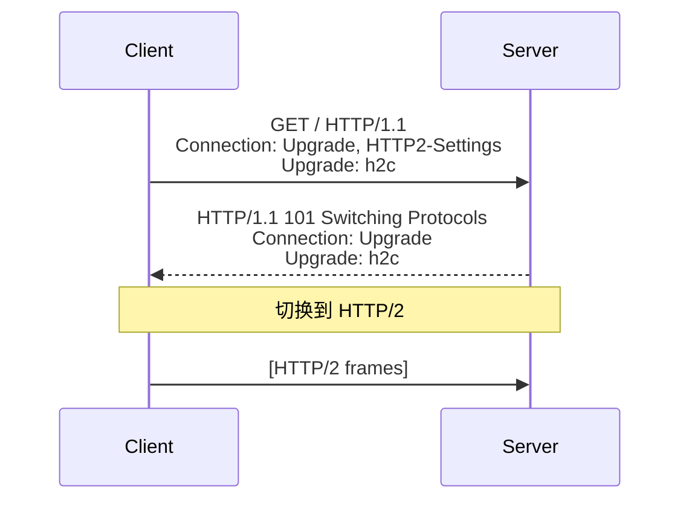
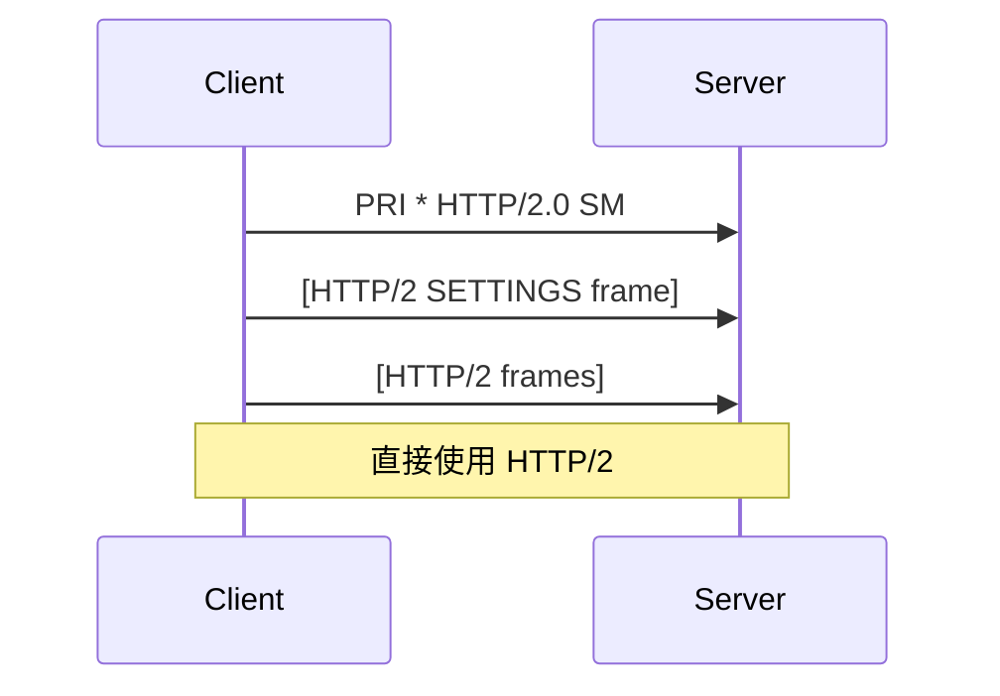
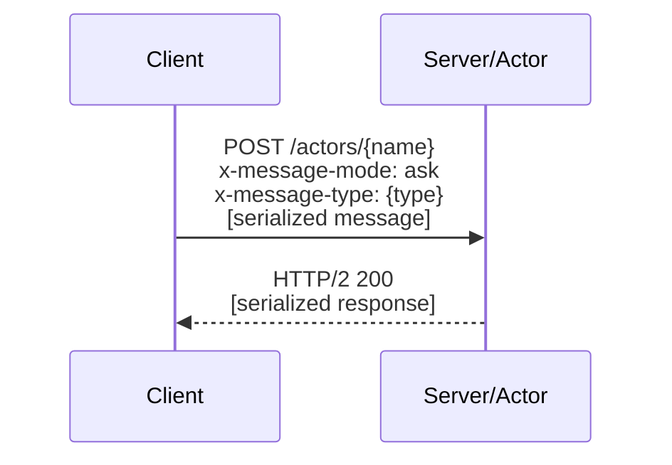
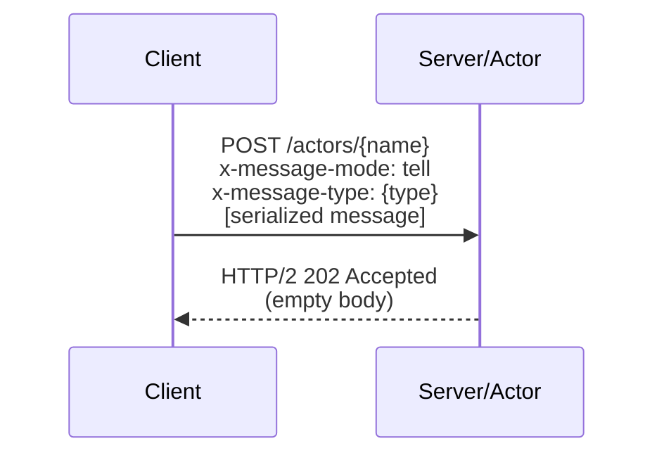
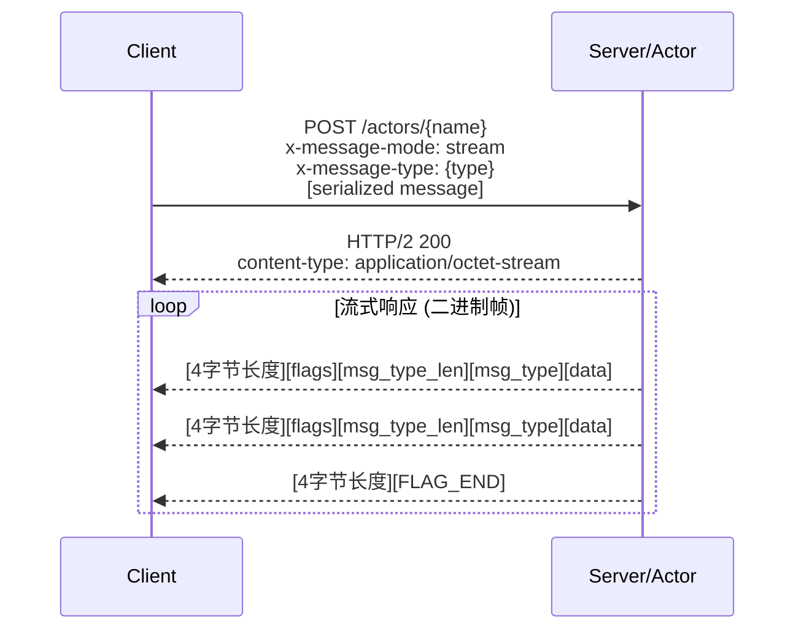
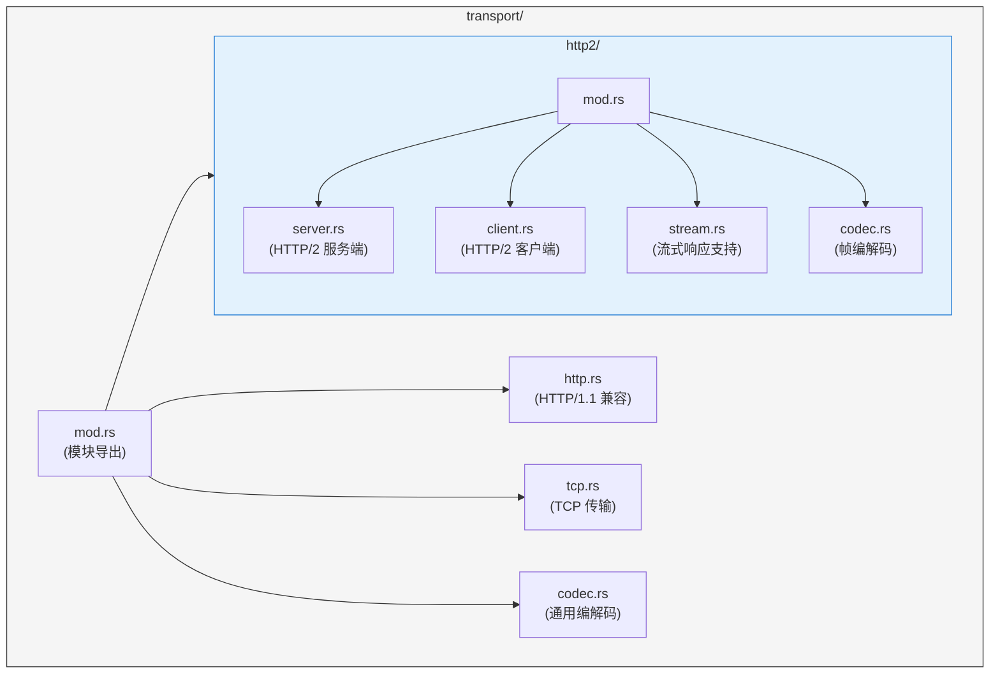

# HTTP/2 传输层设计文档

## 概述

本文档描述 Pulsing Actor System 传输层的 HTTP/2 重构方案。重构目标是支持流式响应（`ask_stream`），同时不强制要求 TLS 加密（支持 h2c - HTTP/2 over cleartext）。

## 设计目标

1. **支持 HTTP/2 (h2c)** - 明文 HTTP/2，无需 TLS
2. **支持流式响应** - 用于 `ask_stream()` API
3. **向后兼容** - 保持现有 `ask`/`tell` 语义
4. **高性能** - 连接复用、多路复用
5. **可选 TLS** - 未来可添加 TLS 支持

## HTTP/2 模式选择

### h2 vs h2c

| 模式 | 说明 | 使用场景 |
|------|------|---------|
| **h2** | HTTP/2 over TLS | 公网、需要加密 |
| **h2c** | HTTP/2 over cleartext | 内网、服务间通信 |

本设计选择 **h2c** 作为默认模式，因为：
- 服务间通信通常在内网
- 避免 TLS 证书管理复杂性
- 减少加密/解密开销

### Prior Knowledge vs Upgrade

h2c 有两种建立方式：

#### 1. HTTP Upgrade - 从 HTTP/1.1 升级



#### 2. Prior Knowledge - 直接发送 HTTP/2 帧



本设计采用 **Prior Knowledge** 模式，因为：
- 更简单，无需升级握手
- 服务间通信场景，客户端服务端都受控
- 性能更好（省一次往返）

## 协议设计

### 消息模式

#### 1. Ask (请求-响应)



#### 2. Tell (单向消息)



#### 3. Ask Stream (流式响应)



### 流式帧格式 (Binary Framing Protocol)

采用高性能二进制分帧协议，避免 JSON 解析和 Base64 编解码开销：

```
+----------------+-------+-------------+----------+------------+
| Length (4B BE) | Flags | MsgType Len | MsgType  | Raw Data   |
+----------------+-------+-------------+----------+------------+
|   u32 big-end  |  1B   |    1B       | variable | variable   |
+----------------+-------+-------------+----------+------------+

Flags:
  - 0x01: FLAG_END   - 流结束标志
  - 0x02: FLAG_ERROR - 错误标志 (此时 Raw Data 为 UTF-8 错误信息)
```

```rust
/// 流式帧 (二进制格式)
#[derive(Debug, Clone)]
pub struct StreamFrame {
    /// 消息类型
    pub msg_type: String,
    /// 原始二进制数据
    pub raw_data: Vec<u8>,
    /// 是否是最后一帧
    pub end: bool,
    /// 错误信息（如果有）
    pub error: Option<String>,
}
```

### HTTP 头定义

| Header | 值 | 说明 |
|--------|---|------|
| `x-message-mode` | `ask` / `tell` / `stream` | 消息模式 |
| `x-message-type` | string | 消息类型标识 |
| `x-request-id` | string | 请求 ID（用于追踪） |

## 架构设计

### 模块结构



### 服务端设计

```rust
/// HTTP/2 服务端配置
pub struct Http2ServerConfig {
    /// 绑定地址
    pub bind_addr: SocketAddr,
    /// 最大并发流数
    pub max_concurrent_streams: u32,
    /// 初始窗口大小
    pub initial_window_size: u32,
    /// 连接级窗口大小
    pub initial_connection_window_size: u32,
    /// Keep-alive 间隔
    pub keepalive_interval: Option<Duration>,
    /// Keep-alive 超时
    pub keepalive_timeout: Duration,
}

/// HTTP/2 服务端
pub struct Http2Server {
    config: Http2ServerConfig,
    handler: Arc<dyn Http2MessageHandler>,
    cancel: CancellationToken,
}

impl Http2Server {
    pub async fn new(
        config: Http2ServerConfig,
        handler: Arc<dyn Http2MessageHandler>,
        cancel: CancellationToken,
    ) -> anyhow::Result<(Self, SocketAddr)>;

    pub fn local_addr(&self) -> SocketAddr;
}
```

### 客户端设计

```rust
/// HTTP/2 客户端配置
pub struct Http2ClientConfig {
    /// 连接超时
    pub connect_timeout: Duration,
    /// 请求超时
    pub request_timeout: Duration,
    /// 每主机最大连接数
    pub max_connections_per_host: usize,
    /// 是否启用 HTTP/2 prior knowledge
    pub http2_prior_knowledge: bool,
}

/// HTTP/2 客户端
pub struct Http2Client {
    config: Http2ClientConfig,
    // 连接池
    connections: Arc<ConnectionPool>,
}

impl Http2Client {
    pub fn new(config: Http2ClientConfig) -> Self;

    /// 发送 ask 请求
    pub async fn ask(
        &self,
        addr: SocketAddr,
        path: &str,
        msg_type: &str,
        payload: Vec<u8>,
    ) -> anyhow::Result<Vec<u8>>;

    /// 发送 tell 请求
    pub async fn tell(
        &self,
        addr: SocketAddr,
        path: &str,
        msg_type: &str,
        payload: Vec<u8>,
    ) -> anyhow::Result<()>;

    /// 发送流式请求
    pub async fn ask_stream(
        &self,
        addr: SocketAddr,
        path: &str,
        msg_type: &str,
        payload: Vec<u8>,
    ) -> anyhow::Result<impl Stream<Item = anyhow::Result<StreamFrame>>>;
}
```

### 消息处理器 Trait

```rust
/// HTTP/2 消息处理器
#[async_trait]
pub trait Http2MessageHandler: Send + Sync + 'static {
    /// 处理 ask 消息
    async fn handle_ask(
        &self,
        path: &str,
        msg_type: &str,
        payload: Vec<u8>,
    ) -> anyhow::Result<Vec<u8>>;

    /// 处理 tell 消息
    async fn handle_tell(
        &self,
        path: &str,
        msg_type: &str,
        payload: Vec<u8>,
    ) -> anyhow::Result<()>;

    /// 处理流式请求
    async fn handle_stream(
        &self,
        path: &str,
        msg_type: &str,
        payload: Vec<u8>,
    ) -> anyhow::Result<Pin<Box<dyn Stream<Item = anyhow::Result<(String, Vec<u8>)>> + Send>>>;
}
```

## 实现方案

### 服务端实现

使用 `hyper` + `hyper-util` 实现 h2c 服务端：

```rust
use hyper::server::conn::http2;
use hyper_util::rt::TokioIo;

pub async fn serve_h2c(
    listener: TcpListener,
    handler: Arc<dyn Http2MessageHandler>,
    cancel: CancellationToken,
) -> anyhow::Result<()> {
    loop {
        tokio::select! {
            result = listener.accept() => {
                let (stream, addr) = result?;
                let io = TokioIo::new(stream);
                let handler = handler.clone();
                let cancel = cancel.clone();

                tokio::spawn(async move {
                    let service = hyper::service::service_fn(move |req| {
                        handle_request(req, handler.clone())
                    });

                    // 使用 HTTP/2 prior knowledge
                    let conn = http2::Builder::new(TokioExecutor::new())
                        .max_concurrent_streams(100)
                        .initial_window_size(65535)
                        .serve_connection(io, service);

                    tokio::select! {
                        result = conn => {
                            if let Err(e) = result {
                                tracing::error!("Connection error: {}", e);
                            }
                        }
                        _ = cancel.cancelled() => {}
                    }
                });
            }
            _ = cancel.cancelled() => break,
        }
    }
    Ok(())
}
```

### 流式响应实现

```rust
async fn handle_stream_request(
    handler: &dyn Http2MessageHandler,
    path: &str,
    msg_type: &str,
    payload: Vec<u8>,
) -> Response<Body> {
    match handler.handle_stream(path, msg_type, payload).await {
        Ok(stream) => {
            // 将 Stream 转换为二进制帧格式的 Body
            let body_stream = stream
                .map(|result| {
                    match result {
                        Ok((msg_type, data)) => {
                            let frame = StreamFrame::from_raw(msg_type, data);
                            Ok(Bytes::from(frame.to_binary()))
                        }
                        Err(e) => {
                            let frame = StreamFrame::error(0, e.to_string());
                            Ok(Bytes::from(frame.to_binary()))
                        }
                    }
                })
                .chain(futures::stream::once(async {
                    // 发送结束帧
                    let end_frame = StreamFrame::end(0);
                    Ok::<_, std::io::Error>(Bytes::from(end_frame.to_binary()))
                }));

            let body = Body::from_stream(body_stream);

            Response::builder()
                .status(StatusCode::OK)
                .header("content-type", "application/octet-stream")
                .body(body)
                .unwrap()
        }
        Err(e) => {
            Response::builder()
                .status(StatusCode::INTERNAL_SERVER_ERROR)
                .body(Body::from(e.to_string()))
                .unwrap()
        }
    }
}
```

### 客户端流式接收

```rust
impl Http2Client {
    pub async fn ask_stream(
        &self,
        addr: SocketAddr,
        path: &str,
        msg_type: &str,
        payload: Vec<u8>,
    ) -> anyhow::Result<impl Stream<Item = anyhow::Result<StreamFrame>>> {
        let url = format!("http://{}{}", addr, path);

        let response = self.client
            .post(&url)
            .header("x-message-mode", "stream")
            .header("x-message-type", msg_type)
            .body(payload)
            .send()
            .await?;

        if !response.status().is_success() {
            return Err(anyhow::anyhow!("Request failed: {}", response.status()));
        }

        // 使用 BinaryFrameParser 解析二进制帧流
        let body_stream = response.bytes_stream();
        let parser = BinaryFrameParser::new();

        let stream = async_stream::try_stream! {
            let mut parser = parser;
            tokio::pin!(body_stream);

            while let Some(chunk) = body_stream.next().await {
                let bytes = chunk.map_err(|e| anyhow::anyhow!("Stream error: {}", e))?;
                parser.feed(&bytes);

                while let Some(frame) = parser.next_frame()? {
                    if frame.end {
                        return;
                    }
                    yield frame;
                }
            }
        };

        Ok(stream)
    }
}
```

## 取消机制

### 客户端取消

```rust
pub struct StreamHandle<T> {
    inner: Pin<Box<dyn Stream<Item = anyhow::Result<T>> + Send>>,
    cancel: CancellationToken,
}

impl<T> StreamHandle<T> {
    /// 显式取消
    pub fn cancel(&self) {
        self.cancel.cancel();
    }
}

impl<T> Drop for StreamHandle<T> {
    fn drop(&mut self) {
        // Drop 时自动取消
        self.cancel.cancel();
    }
}

impl<T> Stream for StreamHandle<T> {
    type Item = anyhow::Result<T>;

    fn poll_next(mut self: Pin<&mut Self>, cx: &mut Context<'_>) -> Poll<Option<Self::Item>> {
        if self.cancel.is_cancelled() {
            return Poll::Ready(None);
        }
        self.inner.as_mut().poll_next(cx)
    }
}
```

### 服务端感知取消

HTTP/2 提供了 RST_STREAM 帧，当客户端取消时：
1. 客户端发送 RST_STREAM
2. hyper 检测到后会关闭该流
3. 服务端 handler 的 Stream 会收到错误或提前结束

```rust
async fn handle_stream(
    &self,
    path: &str,
    msg_type: &str,
    payload: Vec<u8>,
    cancel: CancellationToken,  // 从连接状态传入
) -> anyhow::Result<impl Stream<Item = ...>> {
    let stream = self.generate_tokens(...)
        .take_until(cancel.cancelled());  // 取消时停止生成
    Ok(stream)
}
```

## 背压机制

HTTP/2 内置流量控制（flow control）：

1. **连接级窗口** - 控制整个连接的数据量
2. **流级窗口** - 控制单个流的数据量

当接收方处理慢时：
- 窗口耗尽
- 发送方暂停发送
- `Stream::poll_next` 返回 `Pending`
- 上游生产者自然减速

无需额外实现背压逻辑。

## 配置选项

```rust
/// HTTP/2 传输配置
pub struct Http2TransportConfig {
    // ========== 服务端配置 ==========
    /// 最大并发流数 (默认: 100)
    pub max_concurrent_streams: u32,
    /// 初始窗口大小 (默认: 65535)
    pub initial_window_size: u32,
    /// 连接级窗口大小 (默认: 1MB)
    pub initial_connection_window_size: u32,
    /// 最大帧大小 (默认: 16KB)
    pub max_frame_size: u32,
    /// 最大头部列表大小 (默认: 16KB)
    pub max_header_list_size: u32,

    // ========== 客户端配置 ==========
    /// 连接超时 (默认: 5s)
    pub connect_timeout: Duration,
    /// 请求超时 (默认: 30s)
    pub request_timeout: Duration,
    /// 流超时 (默认: 5min)
    pub stream_timeout: Duration,
    /// 每主机最大连接数 (默认: 10)
    pub max_connections_per_host: usize,

    // ========== 通用配置 ==========
    /// Keep-alive 间隔 (默认: 30s)
    pub keepalive_interval: Duration,
    /// Keep-alive 超时 (默认: 10s)
    pub keepalive_timeout: Duration,
}

impl Default for Http2TransportConfig {
    fn default() -> Self {
        Self {
            max_concurrent_streams: 100,
            initial_window_size: 65535,
            initial_connection_window_size: 1024 * 1024,  // 1MB
            max_frame_size: 16 * 1024,
            max_header_list_size: 16 * 1024,
            connect_timeout: Duration::from_secs(5),
            request_timeout: Duration::from_secs(30),
            stream_timeout: Duration::from_secs(300),
            max_connections_per_host: 10,
            keepalive_interval: Duration::from_secs(30),
            keepalive_timeout: Duration::from_secs(10),
        }
    }
}
```

## 迁移路径

### Phase 1: 添加 HTTP/2 支持（保持兼容）

1. 创建 `transport/http2/` 模块
2. 实现 h2c 服务端和客户端
3. 保留现有 HTTP/1.1 实现
4. 通过配置选择使用哪种传输

### Phase 2: 添加流式响应支持

1. 扩展 `HttpMessageHandler` trait
2. 实现 `ask_stream` 方法
3. 更新路由处理逻辑

### Phase 3: 集成到 ActorRef

1. 扩展 `RemoteTransport` trait
2. 实现 `request_stream` 方法
3. 更新 `ActorRef::ask_stream`

### Phase 4: 默认启用 HTTP/2

1. 将 HTTP/2 设为默认
2. 更新文档
3. 性能测试和优化

## 测试计划

### 单元测试

- [ ] 帧编解码测试
- [ ] 配置解析测试

### 集成测试

- [ ] ask 请求/响应
- [ ] tell 单向消息
- [ ] ask_stream 流式响应
- [ ] 取消机制
- [ ] 背压测试
- [ ] 连接复用测试
- [ ] 故障恢复测试

### 性能测试

- [ ] 吞吐量对比 (HTTP/1.1 vs HTTP/2)
- [ ] 延迟对比
- [ ] 并发流测试
- [ ] 大消息传输测试

## 参考资料

- [RFC 7540 - HTTP/2](https://tools.ietf.org/html/rfc7540)
- [hyper HTTP/2 支持](https://docs.rs/hyper/latest/hyper/server/conn/http2/)
- [h2 crate](https://docs.rs/h2/)
