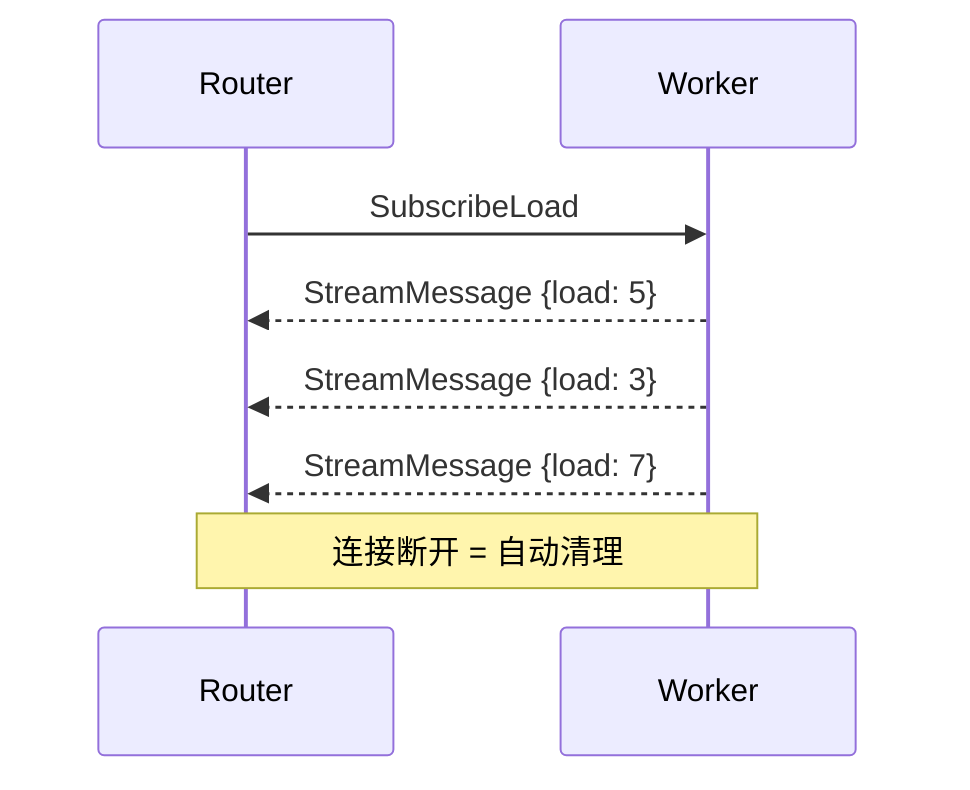
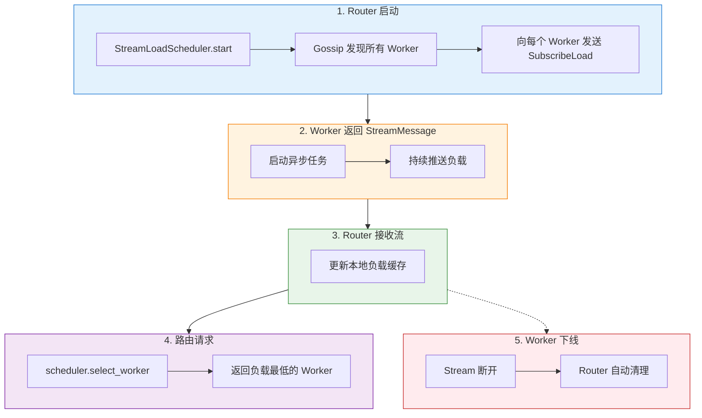

# Pulsing 负载信息同步设计

## 概述

Pulsing Actor System 使用基于 **StreamMessage 的流式订阅** 机制实现 Worker 负载信息的实时同步。

## 架构



## 核心组件

### Worker 端 (`TransformersWorker`)

```python
class TransformersWorker(Actor):
    async def receive(self, msg):
        if msg.msg_type == "SubscribeLoad":
            return self._handle_subscribe_load()
        # ...

    def _handle_subscribe_load(self) -> StreamMessage:
        """返回持续推送负载的流"""
        stream_msg, writer = StreamMessage.create("LoadStream")
        self._load_subscribers.append(writer)

        async def produce():
            while True:
                await writer.write(self._get_load_snapshot())
                await asyncio.sleep(1.0)

        asyncio.create_task(produce())
        return stream_msg
```

### Router 端 (`StreamLoadScheduler`)

```python
scheduler = StreamLoadScheduler(actor_system, "worker")
await scheduler.start()  # 发现 Worker + 订阅负载流

worker_ref = await scheduler.select_worker()  # 选择负载最低的
```

## 使用方式

### 启动 Router (默认使用 StreamLoadScheduler)

```python
from pulsing.serving import start_router

runner = await start_router(
    system,
    http_port=8080,
    model_name="my-model",
    scheduler_type="stream_load",  # 默认值；也支持 scheduler=... 实例。不支持 scheduler_class。
)
```

### 可选的调度器类型

| 类型 | 说明 | 负载感知 |
|------|------|----------|
| `stream_load` | 流式负载订阅 (默认) | ✅ 实时 |
| `random` | 随机选择 | ❌ |
| `round_robin` | 轮询选择 | ❌ |
| `power_of_two` | Power-of-Two (Rust) | ✅ 本地计数 |
| `cache_aware` | 缓存感知 (Rust) | ✅ 本地计数 |

## 信息流



## 与 Gossip 的配合

| 机制 | 职责 |
|------|------|
| Gossip | 服务发现、成员管理 |
| StreamMessage | 实时状态同步 |

```python
# Gossip: 发现 Worker
workers = await gossip.get_named_actor_instances("worker")

# StreamMessage: 订阅负载
for worker in workers:
    await consumer.subscribe(worker)
```
