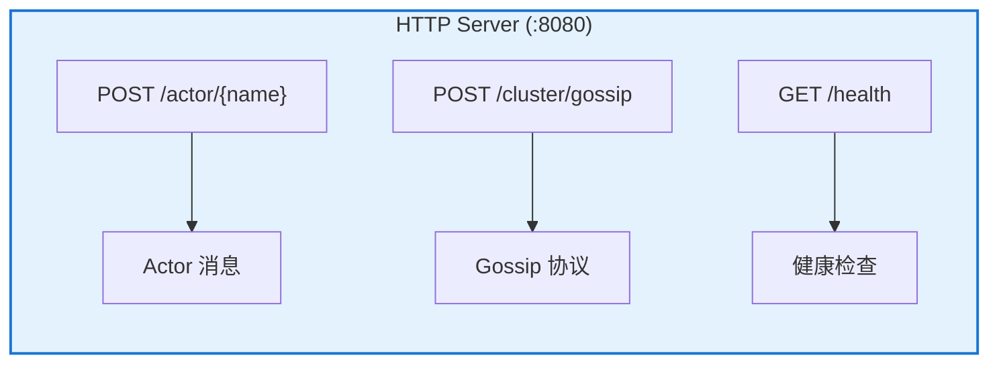
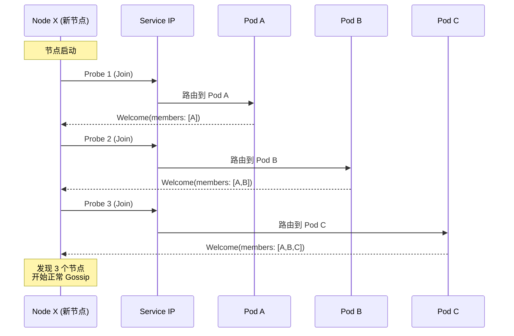
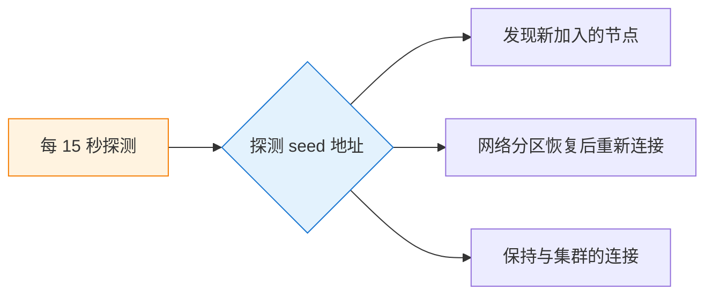
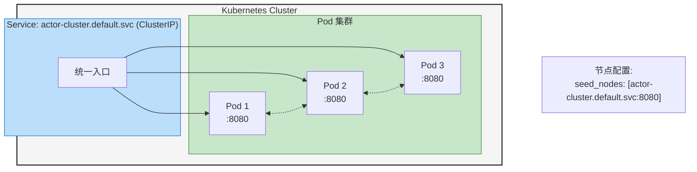
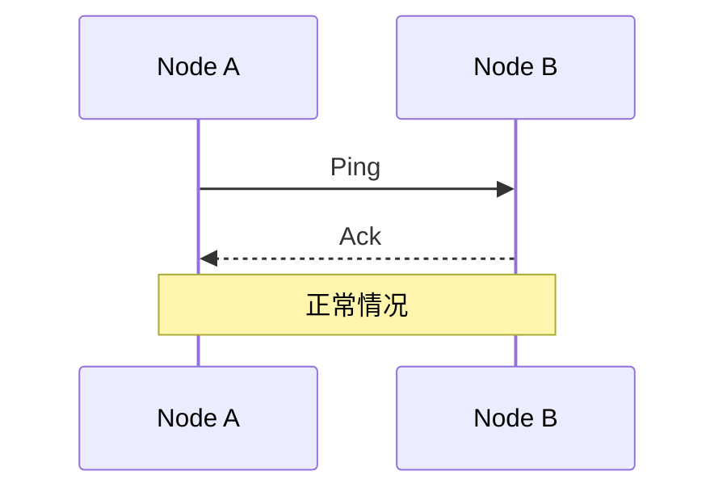
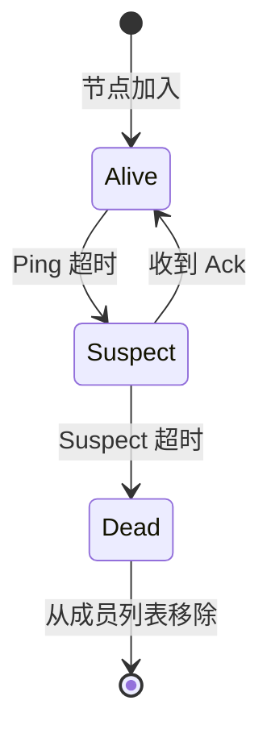
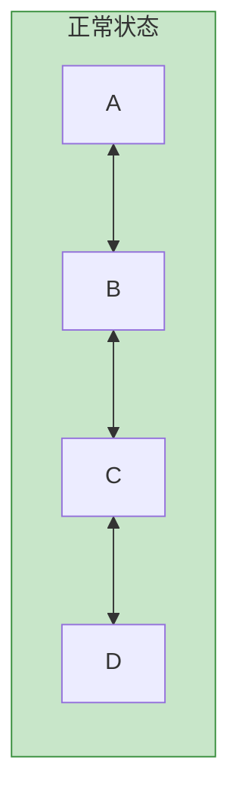
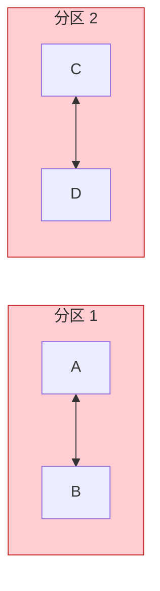
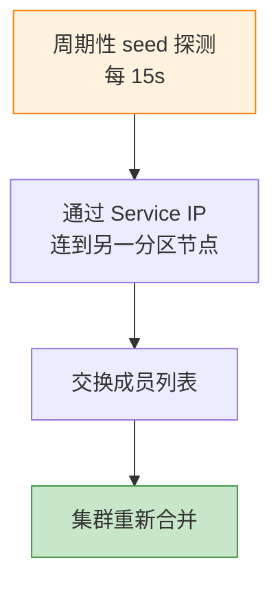

# Node Discovery 设计文档

## 概述

Pulsing Actor System 采用基于 **Gossip 协议** 的去中心化节点发现机制，无需依赖外部服务（如 etcd、Consul），通过简单的 seed 节点配置即可实现集群自动组网。

## 设计目标

1. **零外部依赖** - 不依赖 etcd、NATS 等外部服务
2. **简单配置** - 只需配置 seed 地址即可加入集群
3. **自动恢复** - 网络分区后能自动恢复
4. **Kubernetes 友好** - 利用 Service IP 简化部署

## 架构设计

### 单一 HTTP 端口

所有通信（Actor 消息 + Gossip 协议）共用一个 HTTP 端口：



**优势：**
- 简化网络配置和防火墙规则
- 利用 HTTP 协议的超时、重试、连接池
- 便于调试和监控

### 节点发现流程

#### 1. 启动时多次探测 (seed_probe_count = 3)



#### 2. 周期性重探测 (seed_rejoin_interval = 15s)



### Kubernetes 部署模式

```yaml
# Service 配置
apiVersion: v1
kind: Service
metadata:
  name: actor-cluster
spec:
  selector:
    app: actor-node
  ports:
    - port: 8080
      targetPort: 8080
```



**工作原理：**
1. 新 Pod 启动，通过 Service IP 连接
2. K8s 负载均衡将请求路由到某个现有 Pod
3. 收到 Welcome 消息，获取所有成员地址
4. 直接与各 Pod IP 建立 Gossip 连接

### 单机部署模式

```
┌─────────────┐
│   Leader    │ ← 已知地址 (如: 10.0.0.1:8080)
│   Node      │
└──────┬──────┘
       │
  ┌────┴────┐
  ↓         ↓
┌─────┐  ┌─────┐
│ W1  │  │ W2  │  Worker 节点
└─────┘  └─────┘

Worker 配置:
  seed_nodes: ["10.0.0.1:8080"]
```

## 配置参数

```rust
pub struct GossipConfig {
    /// Gossip 同步间隔 (默认 200ms)
    pub gossip_interval: Duration,

    /// 每轮 Gossip 的目标节点数 (默认 3)
    pub fanout: usize,

    /// 启动时每个 seed 探测次数 (默认 3)
    /// 通过负载均衡可发现不同 Pod
    pub seed_probe_count: usize,

    /// 探测间隔 (默认 100ms)
    pub seed_probe_interval: Duration,

    /// 周期性 seed 重探测间隔 (默认 15s)
    /// 设为 None 禁用
    pub seed_rejoin_interval: Option<Duration>,

    /// SWIM 故障检测配置
    pub swim: SwimConfig,
}
```

## Gossip 协议

### 消息类型

| 消息类型 | 用途 |
|---------|------|
| `Join` | 新节点请求加入集群 |
| `Welcome` | 响应 Join，包含完整成员列表 |
| `Sync` | 周期性状态同步 |
| `Leave` | 节点优雅退出 |
| `Swim(Ping/Ack)` | 故障检测 |
| `ActorRegistered` | Actor 注册通知 |
| `ActorUnregistered` | Actor 注销通知 |

### SWIM 故障检测

采用 SWIM (Scalable Weakly-consistent Infection-style Membership) 协议：





## 使用示例

### 基本配置

```rust
// Kubernetes 集群
let config = SystemConfig::with_addr("0.0.0.0:8080".parse()?)
    .with_seeds(vec!["actor-cluster.svc:8080".parse()?]);

// 单机模式
let config = SystemConfig::with_addr("0.0.0.0:8080".parse()?)
    .with_seeds(vec!["leader-ip:8080".parse()?]);

let system = ActorSystem::new(config).await?;
```

### 自定义探测参数

```rust
let config = SystemConfig {
    addr: "0.0.0.0:8080".parse()?,
    seed_nodes: vec!["my-service.svc:8080".parse()?],
    gossip_config: GossipConfig {
        seed_probe_count: 5,                              // 探测 5 次
        seed_probe_interval: Duration::from_millis(50),   // 50ms 间隔
        seed_rejoin_interval: Some(Duration::from_secs(30)), // 30s 重探测
        ..Default::default()
    },
    ..Default::default()
};
```

## 容错机制

### 网络分区恢复





**恢复流程：**



### 节点故障

```
故障检测:
  1. SWIM Ping 超时 → Suspect 状态
  2. Suspect 超时 → Dead 状态
  3. Dead 节点从成员列表移除

优雅退出:
  1. 节点发送 Leave 消息
  2. 其他节点立即标记为 Leaving
  3. 停止向该节点发送消息
```

## 最佳实践

1. **Kubernetes 部署**
   - 使用 ClusterIP Service 作为 seed
   - 配置合适的 `seed_probe_count` (建议 3-5)
   - 启用 `seed_rejoin_interval` 应对 Pod 滚动更新

2. **网络配置**
   - 确保节点间 HTTP 端口可达
   - 单一端口简化防火墙规则

3. **监控**
   - 观察 `members` 数量变化
   - 监控 Gossip 同步延迟
   - 关注 Suspect/Dead 状态的节点
