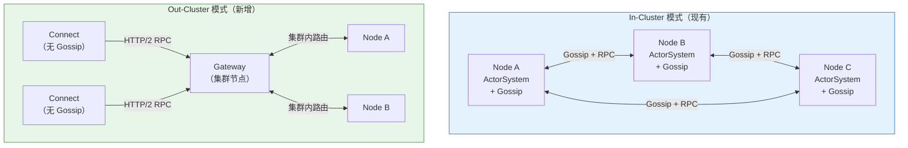
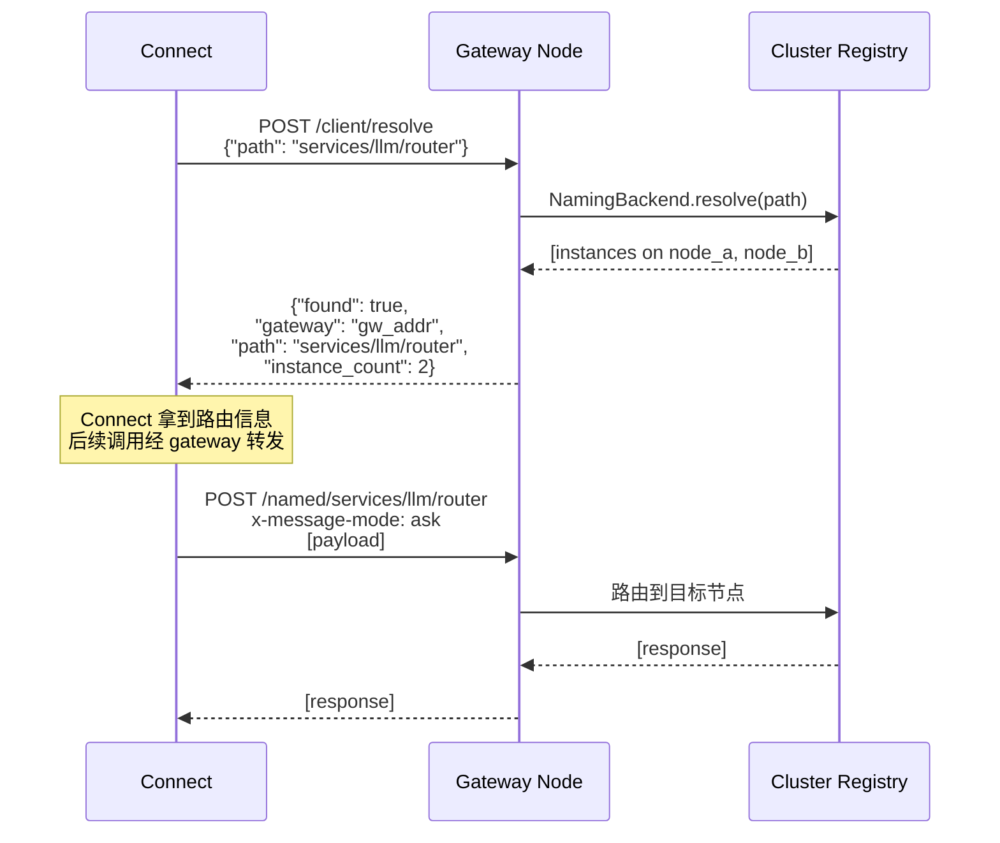
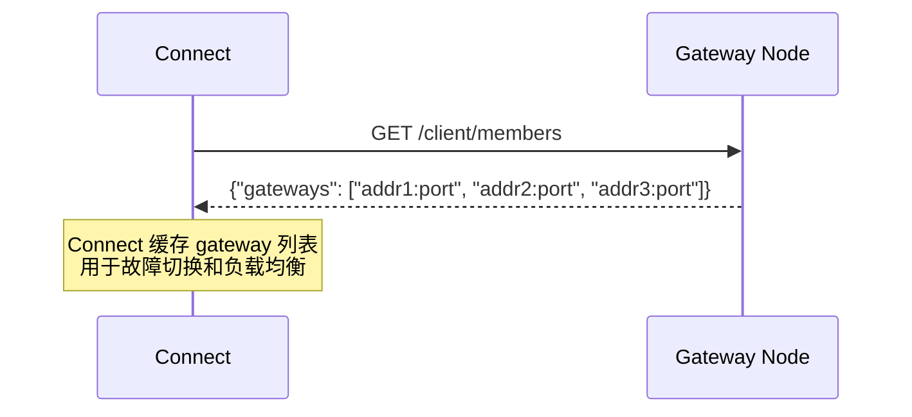
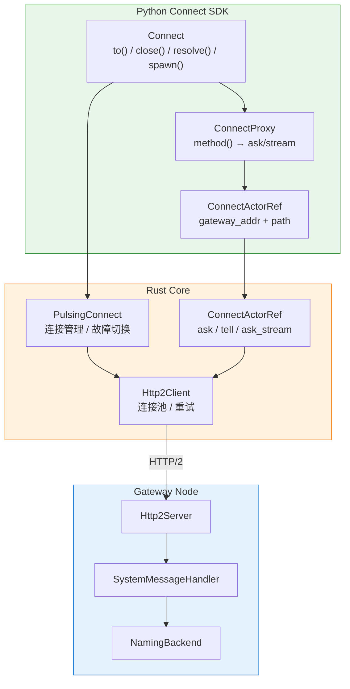
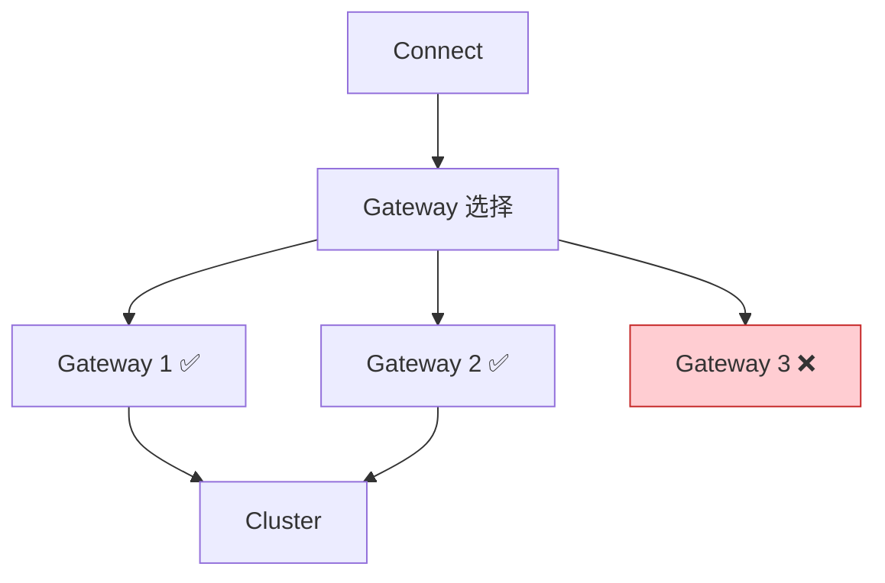

# Out-Cluster Connect 设计文档

## 概述

本文档描述 Pulsing 的 **Out-Cluster 通信模式**设计。该模式允许不参与集群成员协议的外部连接器，通过连接集群中的任意节点（作为 gateway），透明地访问集群内的所有 actor。

### 背景

当前 Pulsing 只支持 **In-Cluster 通信模式**：每个 `ActorSystem` 必须作为集群成员加入（参与 Gossip / Head 模式），才能 resolve 和访问远程 actor。这意味着即使只是一个简单的调用者（如 CLI 工具、Web 后端、Notebook），也必须承担完整的集群成员开销。

### 动机

| 场景 | 为什么需要 Out-Cluster |
|------|-------------------------|
| **轻量调用者** | Notebook、CLI 工具、Web 后端只需要调用集群中的 actor，不需要自身被发现 |
| **短生命周期进程** | 请求式调用不应频繁触发集群成员抖动（join/leave） |
| **安全隔离** | 外部调用者不应获知集群内部拓扑 |
| **跨网络访问** | 客户端可能在不同的网络区域，无法被集群内节点反向探测 |

---

## 设计目标

1. **API 一致性** — 连接器使用与 in-cluster 相同的 `resolve` + `proxy.method()` + `ask/tell/stream` 接口
2. **零集群开销** — 连接器不参与 Gossip、不注册为节点、不运行故障检测
3. **透明路由** — 连接器通过 gateway 节点访问集群内任意 actor，无需知道目标节点地址
4. **高可用** — 支持多 gateway、自动故障切换
5. **最小侵入** — 集群侧无需架构性改动，复用现有 HTTP/2 传输和路由机制

---

## 架构设计

### In-Cluster vs Out-Cluster 对比



### 核心思路：集群节点即 Gateway

**不引入独立的 gateway 组件。** 集群内每个节点的 HTTP/2 server 已经具备处理 `/named/{path}` 和 `/actors/{id}` 请求的能力。对于外部连接器，集群节点天然就是 gateway——它接收请求，在本地或通过集群内路由转发到目标 actor。

连接器只需要：

1. 一个 HTTP/2 client（复用现有 `Http2Client`）
2. 一个 resolve RPC 协议（新增 `/client/resolve` 端点）
3. `ConnectProxy` 包装（与 `ActorProxy` 接口一致）

---

## 协议设计

### 新增端点

在现有 HTTP/2 server 上新增以下端点，专为 out-cluster 连接器服务：

| 端点 | 方法 | 说明 |
|------|------|------|
| `/client/resolve` | POST | 解析命名 actor，返回路由信息 |
| `/client/members` | GET | 获取可用 gateway 节点列表（用于故障切换） |

现有端点直接复用，无需修改：

| 端点 | 说明 |
|------|------|
| `POST /named/{path}` | 发送消息给命名 actor（gateway 自动路由） |
| `POST /actors/{id}` | 发送消息给指定 actor |

### Resolve 协议



关键设计决策：**Server-side resolve**。连接器不知道也不需要知道目标 actor 的真实位置。所有路由决策在 gateway 侧完成。

### Resolve 请求/响应格式

```rust
/// Resolve 请求
#[derive(Serialize, Deserialize)]
struct ResolveRequest {
    path: String,
}

/// Resolve 响应
#[derive(Serialize, Deserialize)]
pub struct ResolveResponse {
    pub found: bool,
    pub path: String,
    pub gateway: String,
    pub instance_count: usize,
}
```

### Gateway 列表协议



连接器初始连接到一个 gateway 后，可获取其他可用 gateway 节点地址，实现故障切换。

---

## Connect SDK 设计

### Python API

```python
from pulsing.connect import Connect

# 连接到集群任意节点
conn = await Connect.to("10.0.1.1:8080")

# 支持多 gateway（故障切换）
conn = await Connect.to(["10.0.1.1:8080", "10.0.1.2:8080"])

# resolve 命名 actor
counter = await conn.resolve("services/counter")

# 调用方法（与 ActorProxy 一致）
result = await counter.increment()
value = await counter.get_value()

# 远程 spawn actor（在集群节点上创建）
calc = await conn.spawn(Calculator, init_value=100, name="services/calc")
result = await calc.multiply(6, 7)

# 流式调用
async for token in llm.generate(prompt="Hello"):
    print(token, end="")

# 关闭连接
await conn.close()
```

### 与 In-Cluster API 对比

```python
# === In-Cluster（现有） ===
await init()  # 启动完整 ActorSystem，加入集群
counter = await Counter.spawn(init=10)              # 可以 spawn
ref = await resolve("services/counter")             # 可以 resolve
result = await ref.increment()                      # 可以 ask/tell

# === Out-Cluster（新增） ===
conn = await Connect.to("10.0.1.1:8080")           # 轻量连接，不加入集群
counter = await conn.resolve("services/counter")    # 可以 resolve
result = await counter.increment()                  # 可以调用方法（完全一致）
counter = await conn.spawn(Counter, name="services/new_counter")  # 远程 spawn
```

| 能力 | In-Cluster | Out-Cluster Connect |
|------|:---:|:---:|
| `resolve` 命名 actor | ✅ | ✅ |
| 同步方法调用 | ✅ | ✅ |
| 异步方法调用 | ✅ | ✅ |
| 流式调用 (streaming) | ✅ | ✅ |
| `spawn` actor（远程） | ✅ | ✅ |
| `spawn` actor（本地） | ✅ | ❌ |
| 被其他 actor 发现 | ✅ | ❌ |
| 参与 Gossip | ✅ | ❌ |
| 占用端口 | ✅ | ❌ |

### 远程 Spawn

`Connect.spawn()` 允许通过 gateway 在集群节点上创建新 actor。内部复用集群已有的 `PythonActorService`（每个节点自动运行的 actor 创建服务），无需新增 gateway 端点：

```python
# 在集群上远程 spawn，返回 ConnectProxy
calc = await conn.spawn(Calculator, init_value=100, name="services/calc")
result = await calc.multiply(6, 7)  # 42

# 也可以 spawn 后通过 resolve 获取
await conn.spawn(Worker, name="services/worker")
worker = await conn.resolve("services/worker")
```

spawn 流程：

1. `Connect.spawn()` 通过 gateway 向 `system/python_actor_service` 发送 `CreateActor` 消息
2. 目标节点的 `PythonActorService` 在本地创建 actor 实例
3. 返回 `ConnectProxy`，后续调用与 `resolve()` 获取的 proxy 完全一致

**前提条件**：目标节点必须已注册对应的 `@remote` 类（即目标节点的代码中包含该类的定义）。

### 内部实现



---

## Rust 层实现

### PulsingConnect

```rust
/// Out-cluster 连接器（不参与集群成员协议）
pub struct PulsingConnect {
    active_gateway: RwLock<SocketAddr>,
    gateways: RwLock<Vec<SocketAddr>>,
    http_client: Arc<Http2Client>,
}

impl PulsingConnect {
    pub async fn connect(gateway_addr: SocketAddr) -> Result<Arc<Self>>;
    pub async fn connect_multi(gateway_addrs: Vec<SocketAddr>) -> Result<Arc<Self>>;
    pub async fn resolve(&self, path: &str) -> Result<ConnectActorRef>;
    pub async fn refresh_gateways(&self) -> Result<()>;
    pub async fn failover(&self) -> Result<()>;
    pub async fn active_gateway(&self) -> SocketAddr;
    pub fn close(&self);
}
```

### ConnectActorRef

```rust
/// 面向 out-cluster 连接器的 actor 引用
pub struct ConnectActorRef {
    gateway: SocketAddr,
    path: String,
    http_client: Arc<Http2Client>,
}

impl ConnectActorRef {
    pub async fn ask(&self, msg_type: &str, payload: Vec<u8>) -> Result<Vec<u8>>;
    pub async fn tell(&self, msg_type: &str, payload: Vec<u8>) -> Result<()>;
    pub async fn ask_stream(&self, msg_type: &str, payload: Vec<u8>)
        -> Result<StreamHandle<StreamFrame>>;
    pub async fn send_message(&self, msg: Message) -> Result<Message>;
}
```

### Gateway 侧实现

Gateway 侧在 `Http2ServerHandler` trait 上新增两个默认方法，由 `SystemMessageHandler` 提供实际实现：

```rust
// Http2ServerHandler trait 新增默认方法
async fn handle_client_resolve(&self, path: &str) -> serde_json::Value;
async fn handle_client_members(&self) -> serde_json::Value;

// SystemMessageHandler 实现
impl SystemMessageHandler {
    async fn handle_client_resolve(&self, path: &str) -> serde_json::Value {
        // 集群模式：通过 NamingBackend 查找
        // 单机模式：通过本地 registry 查找
    }

    async fn handle_client_members(&self) -> serde_json::Value {
        // 返回所有存活成员的地址列表
    }
}
```

---

## 连接管理与故障转移

### 多 Gateway 策略



连接器维护一个 gateway 列表，采用以下策略：

1. **初始连接**：尝试连接列表中的第一个可用 gateway
2. **定期刷新**：通过 `GET /client/members` 更新 gateway 列表
3. **故障切换**：当前 gateway 不可达时，自动切换到下一个
4. **健康检查**：可选的周期性 ping（复用 HTTP/2 keepalive）

### 引用失效处理

当持有的 `ConnectActorRef` 指向的 actor 已迁移或停止：

1. Gateway 路由时发现目标不可达，返回特定错误码
2. 连接器可选择重新 resolve 或向上层报错
3. 不自动重试（避免隐藏错误），由应用层决策

---

## 业界参考

| 框架 | 模式 | 与本设计的关系 |
|------|------|---------------|
| **Akka ClusterClient** | 连接 ClusterReceptionist | 类似思路，但已废弃。教训：避免紧耦合 |
| **Orleans IClusterClient** | 通过 Gateway Silo 连接 | 最接近的参考。Orleans 推荐 co-hosted 以减少网络开销 |
| **Ray Client** | gRPC 连接 head 节点 | 单 Proxy Actor 瓶颈（70 QPS）。我们通过多 gateway 避免 |
| **Dapr Sidecar** | HTTP/gRPC 代理 | sidecar 模式解耦了客户端版本。但部署复杂度更高 |

---

## 设计决策记录

| 决策 | 选择 | 理由 |
|------|------|------|
| Gateway 实现方式 | 集群节点即 gateway | 零新增组件，复用现有 HTTP/2 server |
| Resolve 位置 | Server-side | 不暴露集群拓扑，安全性更好 |
| 传输协议 | 复用 HTTP/2 | 与 in-cluster 一致，零额外端口 |
| 连接器能力范围 | resolve + spawn + method call + streaming | spawn 复用 PythonActorService，无需新端点 |
| 引用失效策略 | 报错，不自动重试 | 避免隐藏错误，由应用层控制 |
| 命名：connect vs client | `Connect` / `PulsingConnect` | "connect" 更准确地描述了建立连接的语义，而非客户端-服务端的角色关系 |

---

## 参见

- [Out-Cluster Connect 用户指南](../guide/connect.md) — 使用教程与最佳实践
- [Cluster Networking](cluster-networking.md) — 集群组网设计
- [HTTP2 Transport](http2-transport.md) — HTTP/2 传输层设计
- [Actor Addressing](actor-addressing.md) — Actor 寻址设计
- [Node Discovery](node-discovery.md) — 节点发现设计
