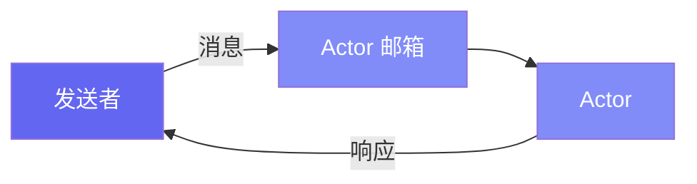

# Pulsing 入门指南

这份全面的指南介绍了 Pulsing 的核心概念——一个用于构建可扩展 AI 系统的轻量级分布式 Actor 框架。我们将涵盖：

- 定义 Actor 和处理消息
- 使用 `@as_actor` 装饰器简化代码
- 使用 ask/tell 模式发送消息
- 设置分布式集群
- 构建完整的分布式应用

---

## 什么是 Actor？

Pulsing 的核心使用 **Actor** 作为构建分布式程序的方式。Actor 是：

- 具有私有状态的隔离计算单元
- 顺序处理消息的消息处理器
- 位置透明：本地和远程 Actor 使用相同的 API



---

## 1. 你的第一个 Actor

让我们从创建一个简单的计数器 Actor 开始：

```python
import asyncio
from pulsing.actor import Actor, Message, SystemConfig, create_actor_system

class Counter(Actor):
    """一个跟踪值的简单计数器 Actor。"""
    
    def __init__(self):
        self.value = 0
    
    def on_start(self, actor_id):
        """Actor 启动时调用。"""
        print(f"Counter 已启动，ID: {actor_id}")
    
    async def receive(self, msg: Message) -> Message:
        """处理传入的消息。"""
        data = msg.to_json()
        
        if msg.msg_type == "Increment":
            n = data.get("n", 1)
            self.value += n
            return Message.from_json("Result", {"value": self.value})
        
        elif msg.msg_type == "GetValue":
            return Message.from_json("Value", {"value": self.value})
        
        else:
            return Message.from_json("Error", {"error": f"未知: {msg.msg_type}"})


async def main():
    # 创建 Actor 系统（单机模式 - 无集群）
    system = await create_actor_system(SystemConfig.standalone())
    
    # 生成计数器 Actor
    counter = await system.spawn("counter", Counter())
    
    # 发送消息并获取响应
    response = await counter.ask(Message.from_json("Increment", {"n": 10}))
    print(f"增量后: {response.to_json()}")  # {"value": 10}
    
    response = await counter.ask(Message.from_json("Increment", {"n": 5}))
    print(f"增量后: {response.to_json()}")  # {"value": 15}
    
    response = await counter.ask(Message.from_json("GetValue", {}))
    print(f"当前值: {response.to_json()}")  # {"value": 15}
    
    # 完成后务必关闭系统
    await system.shutdown()

asyncio.run(main())
```

**要点：**

- `Actor` 是基类 - 实现 `receive()` 来处理消息
- `Message.from_json(type, data)` 创建带有 JSON 负载的消息
- `actor.ask(msg)` 发送消息并等待响应
- `system.shutdown()` 干净地停止所有 Actor

---

## 2. @as_actor 装饰器（推荐）

`@as_actor` 装饰器提供了一种更简单、更 Pythonic 的方式来创建 Actor。
它自动将类方法转换为 Actor 消息：

```python
from pulsing.actor import as_actor, create_actor_system, SystemConfig

@as_actor
class Counter:
    """带自动方法到消息转换的计数器。"""
    
    def __init__(self, initial_value: int = 0):
        self.value = initial_value
    
    def increment(self, n: int = 1) -> int:
        """增加计数器并返回新值。"""
        self.value += n
        return self.value
    
    def decrement(self, n: int = 1) -> int:
        """减少计数器并返回新值。"""
        self.value -= n
        return self.value
    
    def get_value(self) -> int:
        """获取当前计数器值。"""
        return self.value
    
    def reset(self) -> int:
        """将计数器重置为零。"""
        self.value = 0
        return self.value


async def main():
    system = await create_actor_system(SystemConfig.standalone())
    
    # 创建本地 Actor 实例
    counter = await Counter.local(system, initial_value=100)
    
    # 像普通对象一样调用方法！
    result = await counter.increment(50)
    print(f"增量后: {result}")  # 150
    
    result = await counter.decrement(30)
    print(f"减量后: {result}")  # 120
    
    value = await counter.get_value()
    print(f"当前值: {value}")  # 120
    
    await system.shutdown()

asyncio.run(main())
```

**@as_actor 的优势：**

- 无需样板消息处理代码
- 保留类型提示
- IDE 自动补全有效
- 方法自动成为远程端点

---

## 3. 消息模式

Pulsing 支持两种主要的消息模式：

### 3.1 Ask 模式（请求-响应）

发送消息并等待响应：

```python
# 使用基础 Actor 类
response = await actor.ask(Message.from_json("Request", {"data": "hello"}))
result = response.to_json()

# 使用 @as_actor 装饰器
result = await counter.increment(10)
```

### 3.2 Tell 模式（发后即忘）

发送消息而不等待响应：

```python
# 发送并立即继续（无响应）
await actor.tell(Message.from_json("LogEvent", {"event": "user_login"}))

# 继续其他工作...
do_other_stuff()
```

**何时使用：**

| 模式 | 使用场景 |
|------|----------|
| **Ask** | 需要结果，请求-响应工作流 |
| **Tell** | 仅副作用，日志记录，通知，最大吞吐量 |

---

## 4. 设置集群

Pulsing 可以使用内置的 SWIM gossip 协议自动组建集群。
无需外部服务（etcd、NATS）！

### 节点 1：启动种子节点

```python
import asyncio
from pulsing.actor import as_actor, create_actor_system, SystemConfig

@as_actor
class WorkerService:
    def __init__(self, worker_id: str):
        self.worker_id = worker_id
        self.tasks_completed = 0
    
    def process(self, data: str) -> dict:
        self.tasks_completed += 1
        return {
            "worker_id": self.worker_id,
            "result": data.upper(),
            "tasks_completed": self.tasks_completed
        }
    
    def get_stats(self) -> dict:
        return {
            "worker_id": self.worker_id,
            "tasks_completed": self.tasks_completed
        }

async def main():
    # 在指定地址启动
    config = SystemConfig.with_addr("0.0.0.0:8000")
    system = await create_actor_system(config)
    
    # 生成一个 PUBLIC Actor（对其他节点可见）
    worker = await system.spawn("worker", WorkerService("node-1"), public=True)
    
    print(f"种子节点已在 0.0.0.0:8000 启动")
    print("按 Ctrl+C 停止...")
    
    # 保持运行
    try:
        while True:
            await asyncio.sleep(1)
    except KeyboardInterrupt:
        await system.shutdown()

asyncio.run(main())
```

### 节点 2：加入集群

```python
import asyncio
from pulsing.actor import create_actor_system, SystemConfig

async def main():
    # 通过指定种子节点加入
    config = SystemConfig.with_addr("0.0.0.0:8001") \
        .with_seeds(["192.168.1.100:8000"])  # 节点 1 的 IP
    
    system = await create_actor_system(config)
    
    # 等待集群同步
    await asyncio.sleep(1.0)
    
    # 查找远程 worker Actor
    worker = await system.find("worker")
    
    if worker:
        # 调用远程 Actor（与本地 API 相同！）
        result = await worker.ask(Message.from_json("Call", {
            "method": "process",
            "args": ["hello world"],
            "kwargs": {}
        }))
        print(f"结果: {result.to_json()}")
    else:
        print("未找到 Worker！")
    
    await system.shutdown()

asyncio.run(main())
```

**关键集群概念：**

| 概念 | 描述 |
|------|------|
| **种子节点** | 加入集群的初始联系点 |
| **Public Actor** | 对整个集群可见的 Actor（`public=True`） |
| **Private Actor** | 仅本地可访问的 Actor（`public=False`，默认） |
| **SWIM 协议** | 自动节点发现和故障检测 |

---

## 5. 构建分布式应用

让我们构建一个完整的示例：一个带有多个 Worker 的分布式键值存储。

### 步骤 1：定义存储 Actor

```python
# kv_store.py
from pulsing.actor import as_actor

@as_actor
class KeyValueStore:
    """一个简单的键值存储 Actor。"""
    
    def __init__(self, node_id: str):
        self.node_id = node_id
        self.store = {}
        self.operations = 0
    
    def put(self, key: str, value: str) -> dict:
        """存储一个键值对。"""
        self.store[key] = value
        self.operations += 1
        return {"status": "ok", "node": self.node_id}
    
    def get(self, key: str) -> dict:
        """通过键检索值。"""
        self.operations += 1
        if key in self.store:
            return {"status": "ok", "value": self.store[key], "node": self.node_id}
        return {"status": "not_found", "node": self.node_id}
    
    def delete(self, key: str) -> dict:
        """删除一个键。"""
        self.operations += 1
        if key in self.store:
            del self.store[key]
            return {"status": "ok", "node": self.node_id}
        return {"status": "not_found", "node": self.node_id}
    
    def stats(self) -> dict:
        """获取存储统计信息。"""
        return {
            "node": self.node_id,
            "keys": len(self.store),
            "operations": self.operations
        }
```

### 步骤 2：启动存储服务器

```python
# server.py
import asyncio
import argparse
from pulsing.actor import create_actor_system, SystemConfig
from kv_store import KeyValueStore

async def main(addr: str, seeds: list[str] = None):
    # 配置系统
    config = SystemConfig.with_addr(addr)
    if seeds:
        config = config.with_seeds(seeds)
    
    system = await create_actor_system(config)
    
    # 将键值存储生成为公共 Actor
    node_id = addr.replace(":", "-")
    store = await KeyValueStore.local(system, node_id=node_id)
    await system.spawn("kv-store", store.ref, public=True)
    
    print(f"KV 存储服务器已在 {addr} 启动")
    if seeds:
        print(f"通过种子节点加入集群: {seeds}")
    
    # 保持运行
    try:
        while True:
            await asyncio.sleep(1)
    except KeyboardInterrupt:
        print("正在关闭...")
        await system.shutdown()

if __name__ == "__main__":
    parser = argparse.ArgumentParser()
    parser.add_argument("--addr", default="0.0.0.0:8000")
    parser.add_argument("--seeds", nargs="*", default=[])
    args = parser.parse_args()
    
    asyncio.run(main(args.addr, args.seeds))
```

### 步骤 3：创建客户端

```python
# client.py
import asyncio
from pulsing.actor import create_actor_system, SystemConfig, Message

async def main():
    # 连接到集群
    config = SystemConfig.with_addr("0.0.0.0:9000") \
        .with_seeds(["localhost:8000"])
    
    system = await create_actor_system(config)
    await asyncio.sleep(1.0)  # 等待集群同步
    
    # 查找 KV 存储
    store = await system.find("kv-store")
    
    if not store:
        print("未找到 KV 存储！")
        await system.shutdown()
        return
    
    # 执行操作
    print("=== 键值存储客户端 ===\n")
    
    # 存储一些值
    for key, value in [("name", "Alice"), ("city", "Tokyo"), ("lang", "Python")]:
        result = await store.ask(Message.from_json("Call", {
            "method": "put",
            "args": [key, value],
            "kwargs": {}
        }))
        print(f"PUT {key}={value}: {result.to_json()}")
    
    print()
    
    # 获取值
    for key in ["name", "city", "missing"]:
        result = await store.ask(Message.from_json("Call", {
            "method": "get",
            "args": [key],
            "kwargs": {}
        }))
        print(f"GET {key}: {result.to_json()}")
    
    print()
    
    # 获取统计信息
    result = await store.ask(Message.from_json("Call", {
        "method": "stats",
        "args": [],
        "kwargs": {}
    }))
    print(f"STATS: {result.to_json()}")
    
    await system.shutdown()

asyncio.run(main())
```

### 步骤 4：运行分布式系统

```bash
# 终端 1：启动种子节点
python server.py --addr 0.0.0.0:8000

# 终端 2：启动另一个节点（加入集群）
python server.py --addr 0.0.0.0:8001 --seeds localhost:8000

# 终端 3：运行客户端
python client.py
```

---

## 6. 异步方法

Actor 可以使用异步方法处理 I/O 密集型操作：

```python
import aiohttp

@as_actor
class DataFetcher:
    def __init__(self):
        self.cache = {}
    
    async def fetch_url(self, url: str) -> dict:
        """从 URL 获取数据（异步操作）。"""
        if url in self.cache:
            return {"cached": True, "data": self.cache[url]}
        
        async with aiohttp.ClientSession() as session:
            async with session.get(url) as response:
                data = await response.text()
                self.cache[url] = data
                return {"cached": False, "data": data[:100]}
    
    async def fetch_multiple(self, urls: list[str]) -> list[dict]:
        """并发获取多个 URL。"""
        results = []
        for url in urls:
            result = await self.fetch_url(url)
            results.append(result)
        return results
```

---

## 7. 流式消息

Pulsing 支持流式响应用于连续数据流：

```python
from pulsing.actor import Actor, Message, StreamMessage

class TokenGenerator(Actor):
    """一个流式输出 token 的 Actor。"""
    
    async def receive(self, msg: Message) -> StreamMessage:
        if msg.msg_type == "Generate":
            data = msg.to_json()
            text = data.get("text", "Hello World")
            
            # 创建流式响应
            stream = StreamMessage.create("Tokens")
            
            # 将每个词作为 token 流式输出
            for token in text.split():
                stream.write({"token": token})
            
            stream.finish()
            return stream
        
        return Message.from_json("Error", {"error": "未知消息"})
```

---

## 8. 最佳实践

### 应该做 ✅

```python
# ✅ 在 __init__ 中初始化所有状态
@as_actor
class GoodActor:
    def __init__(self):
        self.counter = 0
        self.cache = {}

# ✅ 对 I/O 操作使用 async
@as_actor
class AsyncActor:
    async def fetch_data(self, url: str) -> dict:
        async with aiohttp.ClientSession() as session:
            async with session.get(url) as resp:
                return await resp.json()

# ✅ 优雅地处理错误
@as_actor
class ResilientActor:
    def risky_operation(self, data: dict) -> dict:
        try:
            result = self.process(data)
            return {"success": True, "result": result}
        except Exception as e:
            return {"success": False, "error": str(e)}

# ✅ 始终关闭系统
async def main():
    system = await create_actor_system(config)
    try:
        # ... 执行工作 ...
    finally:
        await system.shutdown()
```

### 不应该做 ❌

```python
# ❌ 不要在 Actor 之间共享可变状态
global_state = {}  # 不好！

@as_actor
class BadActor:
    def update(self, key, value):
        global_state[key] = value  # 竞态条件！

# ❌ 不要在 Actor 方法中阻塞
@as_actor
class BlockingActor:
    def slow_operation(self):
        import time
        time.sleep(10)  # 阻塞整个 Actor！
        # 应使用 asyncio.sleep() 代替

# ❌ 不要忘记错误处理
@as_actor
class FragileActor:
    def dangerous(self, data):
        return data["missing_key"]  # 会崩溃！
```

---

## 总结

你已经学习了 Pulsing 的核心概念：

| 概念 | 描述 |
|------|------|
| **Actor** | 具有私有状态的隔离单元，顺序处理消息 |
| **@as_actor** | 将任何类转换为分布式 Actor 的装饰器 |
| **Ask/Tell** | 请求-响应 vs 发后即忘消息模式 |
| **集群** | 使用 SWIM 协议自动节点发现 |
| **Public Actor** | 对整个集群可见的 Actor |
| **位置透明** | 本地和远程 Actor 使用相同的 API |

---

## 下一步

- 阅读 [Actor 完整指南](guide/actors.md) 了解高级模式
- 查看 [远程 Actor](guide/remote_actors.md) 了解集群详情
- 探索 [设计文档](design/actor-system.md) 了解实现细节
- 查看 [LLM 推理示例](examples/llm_inference.md) 了解真实用例
- 查阅 [API 参考](api_reference.md) 获取完整文档

