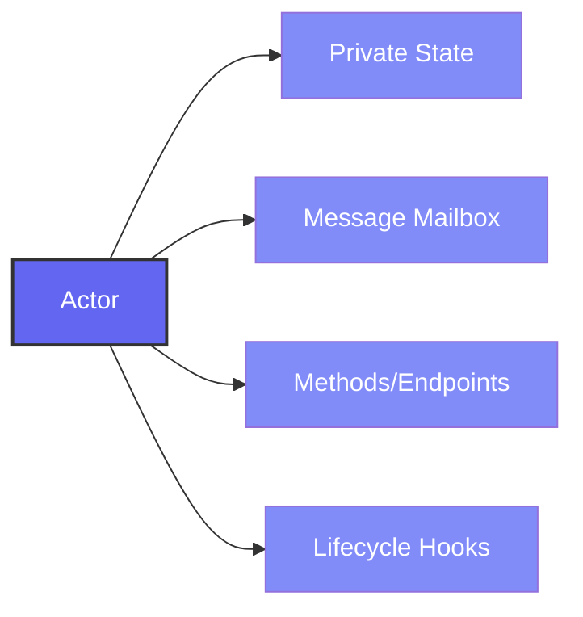
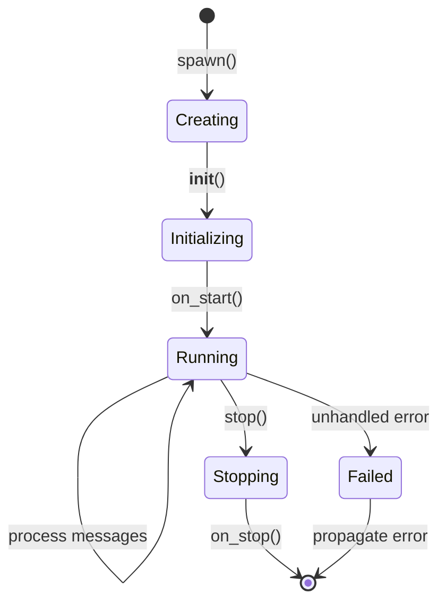
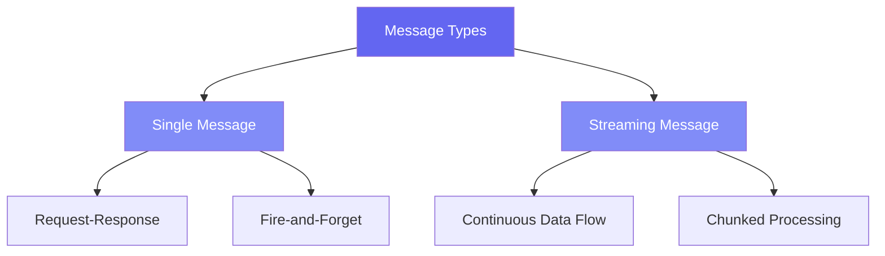
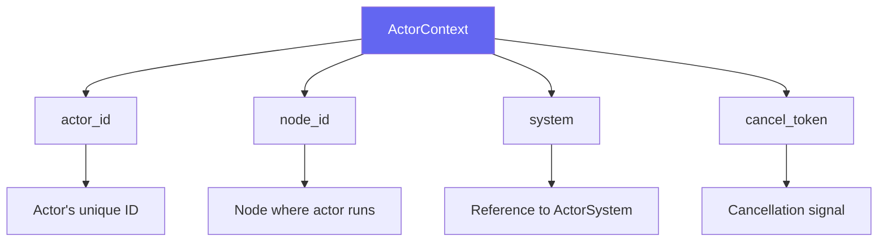
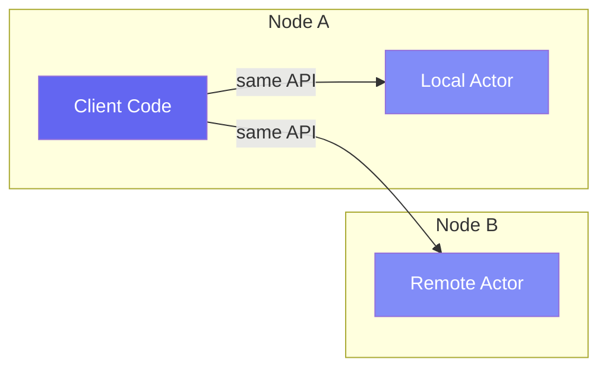
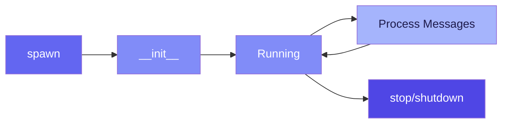

# Pulsing Actors: Complete Guide

## Table of Contents

1. [Introduction](#introduction)
2. [What is an Actor?](#what-is-an-actor)
3. [Actor Lifecycle](#actor-lifecycle)
4. [Creating Actors](#creating-actors)
5. [Message Passing](#message-passing)
6. [Actor Context](#actor-context)
7. [Remote Actors](#remote-actors)
8. [Advanced Patterns](#advanced-patterns)
9. [Best Practices](#best-practices)
10. [Quick Reference](#quick-reference)

---

## Introduction

Actors are the fundamental building blocks of Pulsing applications. They are isolated, concurrent state machines that communicate through asynchronous message passing. This document provides a comprehensive guide to understanding and using actors in Pulsing.

> **Key Design Philosophy**: Pulsing is designed to be lightweight and self-contained. Unlike other actor frameworks, it requires no external dependencies like etcd, NATS, or Consul. Everything you need is built-in.

---

## What is an Actor?

### Definition

An **Actor** in Pulsing is:

- An isolated unit of computation with private state
- A message handler that processes messages sequentially
- A typed entity with methods for remote invocation
- Location-transparent: local and remote actors use the same API

### Core Characteristics



**1. Isolation**

- Each actor has its own private state
- State is never directly accessed by other actors
- All interaction happens through messages

**2. Sequential Processing**

- Messages are processed one at a time
- Next message waits until current message completes
- Guarantees consistent state within actor

**3. Asynchronous Communication**

- Messages are sent asynchronously
- Sender can wait for response or fire-and-forget
- Results returned as awaitable futures

**4. Location Transparency**

- Actors can be local or remote
- Same API regardless of location
- Framework handles serialization and routing

---

## Actor Lifecycle

### Lifecycle Stages



### 1. Creation Phase

**Spawning an Actor:**

```python
from pulsing.actor import ActorSystem, SystemConfig

# Create the actor system
system = await ActorSystem.create(SystemConfig.standalone())

# Spawn an actor
actor_ref = await system.spawn(MyActor(), "my-actor")
```

**What Happens:**

1. Runtime allocates resources for the actor
2. Actor is registered in the system
3. Mailbox is created for message delivery
4. Actor ID is assigned

### 2. Initialization Phase

**The `__init__` Method:**

```python
class DataProcessor:
    def __init__(self, buffer_size: int):
        # Initialize state
        self.buffer_size = buffer_size
        self.buffer = []
        self.processed_count = 0
```

**Important Notes:**

- `__init__` is called during actor construction
- Should only initialize state
- No messaging yet - actor not fully registered

### 3. Running Phase

Once initialized, the actor enters its main lifecycle where it processes messages.

```mermaid
sequenceDiagram
    participant Sender
    participant Mailbox
    participant Actor

    loop Message Processing
        Sender->>Mailbox: send message
        Mailbox->>Actor: deliver message
        Actor->>Actor: process message
        Actor-->>Sender: return result
    end
```

**Message Processing:**

- Actor waits for messages in mailbox
- Processes one message at a time
- Invokes corresponding method
- Returns result to caller

### 4. Termination Phase

**Normal Termination:**

- All pending messages processed
- Mailbox drained
- Resources cleaned up
- System notified

**Error Termination:**

- Unhandled exception in handler
- Error propagated to caller
- Actor may be restarted (future feature)

---

## Creating Actors

### Method 1: Using @as_actor Decorator (Recommended)

The `@as_actor` decorator is the simplest way to create actors:

```python
from pulsing.actor import as_actor, SystemConfig, create_actor_system

@as_actor
class Calculator:
    """A simple calculator actor."""

    def __init__(self, initial_value: int = 0):
        self.value = initial_value
        self.history = []

    def add(self, n: int) -> int:
        """Add n to the current value."""
        self.value += n
        self.history.append(("add", n, self.value))
        return self.value

    def subtract(self, n: int) -> int:
        """Subtract n from the current value."""
        self.value -= n
        self.history.append(("subtract", n, self.value))
        return self.value

    def get_value(self) -> int:
        """Get the current value."""
        return self.value

    def get_history(self) -> list:
        """Get operation history."""
        return self.history


async def main():
    system = await create_actor_system(SystemConfig.standalone())

    # Create local actor
    calc = await Calculator.local(system, initial_value=100)

    # Call methods
    result = await calc.add(50)      # 150
    result = await calc.subtract(30) # 120
    value = await calc.get_value()   # 120

    await system.shutdown()
```

**Benefits of @as_actor:**

- No boilerplate code
- Methods become endpoints automatically
- Type hints preserved
- IDE autocompletion works

### Method 2: Using Actor Base Class

For more control, extend the Actor base class:

```python
from pulsing.actor import Actor, Message, SystemConfig, create_actor_system

class EchoActor(Actor):
    """An actor that echoes messages back."""

    def __init__(self):
        self.message_count = 0

    async def receive(self, msg: Message) -> Message:
        """Handle incoming messages."""
        self.message_count += 1

        if msg.msg_type == "echo":
            return Message.single("echo_response", msg.payload)
        elif msg.msg_type == "count":
            return Message.single("count_response",
                                  str(self.message_count).encode())
        else:
            raise ValueError(f"Unknown message type: {msg.msg_type}")


async def main():
    system = await create_actor_system(SystemConfig.standalone())

    actor_ref = await system.spawn(EchoActor(), "echo")

    # Send message and get response
    response = await actor_ref.ask(Message.single("echo", b"hello"))
    print(response.payload)  # b"hello"

    await system.shutdown()
```

### Method 3: Async Methods

Actors can have async methods for I/O operations:

```python
@as_actor
class AsyncWorker:
    """An actor with async methods."""

    def __init__(self):
        self.cache = {}

    async def fetch_data(self, url: str) -> dict:
        """Fetch data from URL (async operation)."""
        import aiohttp
        async with aiohttp.ClientSession() as session:
            async with session.get(url) as response:
                data = await response.json()
                self.cache[url] = data
                return data

    async def process_batch(self, items: list) -> list:
        """Process items with async operations."""
        results = []
        for item in items:
            await asyncio.sleep(0.01)  # Simulate async work
            results.append(item.upper())
        return results
```

---

## Message Passing

### Message Types

Pulsing supports two types of messages:



### Ask Pattern (Request-Response)

Send a message and wait for response:

```python
# Using @as_actor
result = await calc.add(10)

# Using Actor base class
response = await actor_ref.ask(Message.single("operation", data))
```

**Flow Diagram:**

```mermaid
sequenceDiagram
    participant Client
    participant Actor

    Client->>Actor: ask(message)
    Note over Actor: Process message
    Actor-->>Client: response
    Note over Client: Continue execution
```

### Tell Pattern (Fire-and-Forget)

Send a message without waiting for response:

```python
# Fire and forget
await actor_ref.tell(Message.single("notify", b"event_data"))

# Continues immediately
do_other_work()
```

**Use When:**

- Don't need the response
- Side effects only (logging, notifications)
- Maximum throughput needed

### Streaming Messages

For continuous data flow:

```python
# Send streaming request
msg = Message.stream("process", b"initial_data")

# Process responses as they arrive
async for chunk in actor_ref.ask_stream(msg):
    print(f"Received chunk: {chunk}")
    process_chunk(chunk)
```

**Use When:**

- Processing large datasets
- Real-time data streams
- LLM token generation

### Message Ordering

Pulsing guarantees FIFO (First-In-First-Out) message ordering:

```python
await actor.method1(arg1)  # Message M1
await actor.method2(arg2)  # Message M2
await actor.method3(arg3)  # Message M3

# Actor processes: M1, then M2, then M3 (in order)
```

---

## Actor Context

### What is Context?

The context provides runtime information about the current execution environment.

```python
from pulsing.actor import Actor, ActorContext

class ContextAwareActor(Actor):
    async def receive(self, msg: Message, ctx: ActorContext) -> Message:
        # Get actor information
        actor_id = ctx.actor_id
        node_id = ctx.node_id

        # Check if should stop
        if ctx.is_cancelled():
            return Message.single("cancelled", b"")

        # Get reference to another actor
        other_ref = await ctx.actor_ref("other-actor")

        return Message.single("info", f"{actor_id}@{node_id}".encode())
```

### Context Information



---

## Remote Actors

### Cluster Setup

**Starting a Seed Node:**

```python
# Node 1: Start seed node
config = SystemConfig.with_addr("0.0.0.0:8000")
system = await create_actor_system(config)

# Spawn a public actor (visible to cluster)
await system.spawn(WorkerActor(), "worker", public=True)
```

**Joining a Cluster:**

```python
# Node 2: Join cluster
config = (SystemConfig
          .with_addr("0.0.0.0:8001")
          .with_seeds(["192.168.1.1:8000"]))
system = await create_actor_system(config)

# Wait for cluster sync
await asyncio.sleep(1.0)

# Find remote actor
worker = await system.find("worker")
result = await worker.process(data)
```

### Location Transparency



```python
# Local actor
local_ref = await system.spawn(MyActor(), "local")

# Remote actor (found via cluster)
remote_ref = await system.find("remote-worker")

# SAME API for both!
response1 = await local_ref.process(data)
response2 = await remote_ref.process(data)
```

### Public vs Private Actors

| Feature | Public Actor | Private Actor |
|---------|-------------|---------------|
| Cluster Visibility | ✅ Visible to all nodes | ❌ Local only |
| Discovery via find() | ✅ Yes | ❌ No |
| Gossip Registration | ✅ Registered | ❌ Not registered |
| Use Case | Services, shared workers | Internal helpers |

```python
# Public actor - can be found by other nodes
await system.spawn(ServiceActor(), "api-service", public=True)

# Private actor - local only
await system.spawn(HelperActor(), "internal-helper", public=False)
```

---

## Advanced Patterns

### 1. Request-Response Pattern

Most common pattern for actor communication:

```python
@as_actor
class RequestHandler:
    async def handle_request(self, request: dict) -> dict:
        # Validate
        if not self.validate(request):
            return {"error": "Invalid request"}

        # Process
        result = await self.process(request)

        # Return response
        return {"success": True, "data": result}
```

### 2. Stateful Actor Pattern

Actors maintain state between calls:

```python
@as_actor
class SessionManager:
    def __init__(self):
        self.sessions = {}

    def create_session(self, user_id: str) -> str:
        import uuid
        session_id = str(uuid.uuid4())
        self.sessions[session_id] = {
            "user_id": user_id,
            "created_at": time.time(),
            "data": {}
        }
        return session_id

    def get_session(self, session_id: str) -> dict | None:
        return self.sessions.get(session_id)

    def update_session(self, session_id: str, key: str, value: any) -> bool:
        if session_id not in self.sessions:
            return False
        self.sessions[session_id]["data"][key] = value
        return True

    def delete_session(self, session_id: str) -> bool:
        if session_id in self.sessions:
            del self.sessions[session_id]
            return True
        return False
```

### 3. Worker Pool Pattern

Distribute work across multiple actors:

```python
@as_actor
class WorkerPool:
    def __init__(self, num_workers: int):
        self.workers = []
        self.current_worker = 0

    async def initialize(self, system):
        """Initialize worker actors."""
        for i in range(self.num_workers):
            worker = await Worker.local(system)
            self.workers.append(worker)

    async def submit(self, task: dict) -> any:
        """Submit task to next available worker (round-robin)."""
        worker = self.workers[self.current_worker]
        self.current_worker = (self.current_worker + 1) % len(self.workers)
        return await worker.process(task)

    async def broadcast(self, message: dict) -> list:
        """Send message to all workers."""
        results = await asyncio.gather(*[
            w.notify(message) for w in self.workers
        ])
        return results
```

### 4. Pipeline Pattern

Chain actors for data processing:

```python
@as_actor
class PipelineStage:
    def __init__(self, next_stage=None):
        self.next_stage = next_stage

    async def process(self, data: dict) -> dict:
        # Process at this stage
        processed = await self.do_processing(data)

        # Forward to next stage if exists
        if self.next_stage:
            return await self.next_stage.process(processed)

        return processed

    async def do_processing(self, data: dict) -> dict:
        # Override in subclass
        return data


# Usage
stage3 = await Stage3.local(system)
stage2 = await Stage2.local(system, next_stage=stage3)
stage1 = await Stage1.local(system, next_stage=stage2)

result = await stage1.process(input_data)
```

### 5. LLM Inference Service Pattern

```python
@as_actor
class LLMService:
    """Actor for LLM inference."""

    def __init__(self, model_name: str):
        self.model_name = model_name
        self.model = None
        self.tokenizer = None

    async def load_model(self):
        """Load the model (call once after creation)."""
        from transformers import AutoModelForCausalLM, AutoTokenizer
        self.tokenizer = AutoTokenizer.from_pretrained(self.model_name)
        self.model = AutoModelForCausalLM.from_pretrained(self.model_name)

    async def generate(self, prompt: str, max_tokens: int = 100) -> str:
        """Generate text from prompt."""
        inputs = self.tokenizer(prompt, return_tensors="pt")
        outputs = self.model.generate(**inputs, max_new_tokens=max_tokens)
        return self.tokenizer.decode(outputs[0], skip_special_tokens=True)

    async def generate_stream(self, prompt: str, max_tokens: int = 100):
        """Stream generated tokens."""
        inputs = self.tokenizer(prompt, return_tensors="pt")
        for token in self.model.generate_streaming(**inputs):
            yield self.tokenizer.decode(token)
```

---

## Best Practices

### 1. Actor Design

✅ **DO:**

- Keep actors focused on single responsibility
- Use immutable messages when possible
- Handle errors gracefully
- Document method contracts

❌ **DON'T:**

- Share mutable state between actors
- Block in methods (use async)
- Create circular dependencies
- Ignore error handling

### 2. State Management

```python
# ✅ Good: All state in __init__
@as_actor
class GoodActor:
    def __init__(self):
        self.counter = 0
        self.data = []

    def update(self, value):
        self.counter += 1
        self.data.append(value)
        return self.counter


# ❌ Bad: Global state
global_state = {}

@as_actor
class BadActor:
    def update(self, key, value):
        global_state[key] = value  # Race conditions!
```

### 3. Error Handling

```python
@as_actor
class ResilientActor:
    async def risky_operation(self, data: dict) -> dict:
        try:
            result = await self.process(data)
            return {"success": True, "result": result}
        except ValueError as e:
            # Expected error - return error response
            return {"success": False, "error": str(e)}
        except Exception as e:
            # Unexpected error - log and re-raise
            logger.error(f"Unexpected error: {e}")
            raise
```

### 4. Performance Tips

```python
@as_actor
class OptimizedActor:
    def __init__(self):
        # ✅ Pre-allocate resources
        self.buffer = bytearray(1024 * 1024)
        self.cache = {}

    async def process(self, data: bytes) -> bytes:
        # ✅ Use cache for expensive computations
        cache_key = hash(data)
        if cache_key in self.cache:
            return self.cache[cache_key]

        # ✅ Reuse buffers
        result = self.compute(data, self.buffer)
        self.cache[cache_key] = result
        return result
```

### 5. Testing Actors

```python
import pytest

@pytest.mark.asyncio
async def test_calculator():
    system = await create_actor_system(SystemConfig.standalone())

    try:
        # Spawn actor
        calc = await Calculator.local(system, initial_value=0)

        # Test operations
        assert await calc.add(10) == 10
        assert await calc.subtract(3) == 7
        assert await calc.get_value() == 7

        # Test history
        history = await calc.get_history()
        assert len(history) == 2

    finally:
        await system.shutdown()
```

---

## Quick Reference

### Basic Actor with @as_actor

```python
from pulsing.actor import as_actor, create_actor_system, SystemConfig

@as_actor
class MyActor:
    def __init__(self, param: int):
        self.param = param

    def method(self, arg: int) -> int:
        return self.param + arg

async def main():
    system = await create_actor_system(SystemConfig.standalone())
    actor = await MyActor.local(system, param=10)
    result = await actor.method(5)  # 15
    await system.shutdown()
```

### Cluster Setup

```python
# Seed node
config = SystemConfig.with_addr("0.0.0.0:8000")
system = await create_actor_system(config)
await system.spawn(MyActor(), "service", public=True)

# Joining node
config = SystemConfig.with_addr("0.0.0.0:8001").with_seeds(["seed:8000"])
system = await create_actor_system(config)
service = await system.find("service")
```

### Message Types

```python
# Single message
msg = Message.single("type", b"data")

# Streaming message
msg = Message.stream("type", b"data")
```

### Common Operations

```python
# Spawn local actor
actor = await system.spawn(MyActor(), "name")

# Spawn public actor
actor = await system.spawn(MyActor(), "name", public=True)

# Find remote actor
actor = await system.find("name")

# Check if actor exists
exists = await system.has_actor("name")

# Stop actor
await system.stop("name")

# Shutdown system
await system.shutdown()
```

---

## Summary

### Key Takeaways

1. **Actors are Isolated**: Private state, message-based communication
2. **Sequential Processing**: One message at a time, FIFO ordering
3. **@as_actor Decorator**: Simplest way to create actors
4. **Location Transparent**: Same code for local/remote actors
5. **Zero External Dependencies**: No etcd, NATS, or Consul needed
6. **Built-in Clustering**: SWIM protocol for discovery

### Actor Lifecycle Recap



### Next Steps

- Read [Remote Actors Guide](remote_actors.md) for cluster details
- Explore [Design Documents](../design/actor-system.md) for implementation details
- Check [Examples](../examples/index.md) for practical patterns
- See [API Reference](../api_reference.md) for complete documentation

