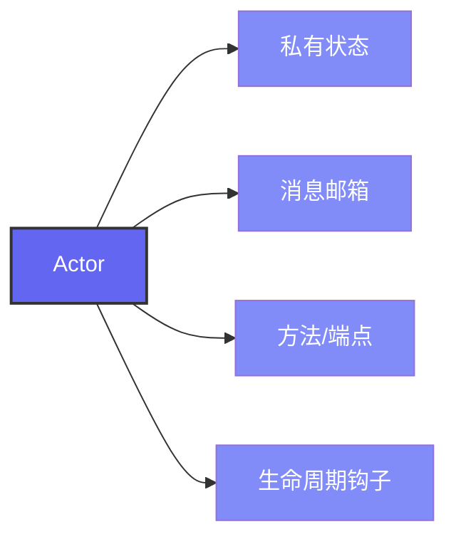
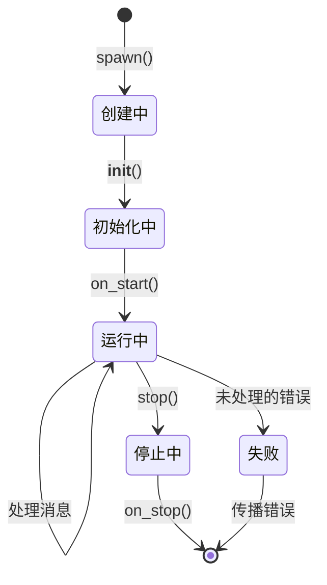
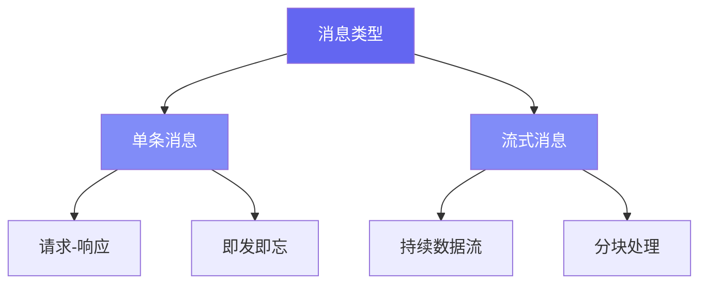

# Pulsing Actors: 完整指南

## 目录

1. [简介](#简介)
2. [什么是 Actor？](#什么是-actor)
3. [Actor 生命周期](#actor-生命周期)
4. [创建 Actor](#创建-actor)
5. [消息传递](#消息传递)
6. [Actor 上下文](#actor-上下文)
7. [远程 Actor](#远程-actor)
8. [高级模式](#高级模式)
9. [最佳实践](#最佳实践)
10. [快速参考](#快速参考)

---

## 简介

Actor 是 Pulsing 应用的基本构建块。它们是通过异步消息传递进行通信的隔离并发状态机。本文档提供了在 Pulsing 中理解和使用 Actor 的完整指南。

> **核心设计理念**: Pulsing 设计为轻量级且自包含。与其他 Actor 框架不同，它不需要 etcd、NATS 或 Consul 等外部依赖。所需的一切都是内置的。

---

## 什么是 Actor？

### 定义

Pulsing 中的 **Actor** 是：

- 具有私有状态的隔离计算单元
- 按顺序处理消息的消息处理器
- 具有用于远程调用的方法的类型化实体
- 位置透明：本地和远程 Actor 使用相同的 API

### 核心特性



**1. 隔离性**

- 每个 Actor 都有自己的私有状态
- 其他 Actor 永远不能直接访问状态
- 所有交互都通过消息进行

**2. 顺序处理**

- 消息一次处理一条
- 下一条消息等待当前消息处理完成
- 保证 Actor 内部状态一致性

**3. 异步通信**

- 消息异步发送
- 发送者可以等待响应或即发即忘
- 结果作为可等待的 future 返回

**4. 位置透明**

- Actor 可以是本地或远程的
- 无论位置如何，API 都相同
- 框架处理序列化和路由

---

## Actor 生命周期

### 生命周期阶段



### 1. 创建阶段

**生成 Actor：**

```python
from pulsing.actor import ActorSystem, SystemConfig

# 创建 Actor 系统
system = await ActorSystem.create(SystemConfig.standalone())

# 生成 Actor
actor_ref = await system.spawn(MyActor(), "my-actor")
```

**发生了什么：**

1. 运行时为 Actor 分配资源
2. Actor 在系统中注册
3. 创建用于消息传递的邮箱
4. 分配 Actor ID

### 2. 初始化阶段

**`__init__` 方法：**

```python
class DataProcessor:
    def __init__(self, buffer_size: int):
        # 初始化状态
        self.buffer_size = buffer_size
        self.buffer = []
        self.processed_count = 0
```

**重要说明：**

- `__init__` 在 Actor 构造期间调用
- 只应初始化状态
- 还没有消息传递 - Actor 尚未完全注册

### 3. 运行阶段

初始化后，Actor 进入主生命周期，开始处理消息。

```mermaid
sequenceDiagram
    participant 发送者
    participant 邮箱
    participant Actor

    loop 消息处理
        发送者->>邮箱: 发送消息
        邮箱->>Actor: 传递消息
        Actor->>Actor: 处理消息
        Actor-->>发送者: 返回结果
    end
```

### 4. 终止阶段

**正常终止：**

- 处理所有待处理消息
- 清空邮箱
- 清理资源
- 通知系统

**错误终止：**

- 处理器中未处理的异常
- 错误传播给调用者

---

## 创建 Actor

### 方法 1：使用 @as_actor 装饰器（推荐）

`@as_actor` 装饰器是创建 Actor 的最简单方式：

```python
from pulsing.actor import as_actor, SystemConfig, create_actor_system

@as_actor
class Calculator:
    """一个简单的计算器 Actor。"""

    def __init__(self, initial_value: int = 0):
        self.value = initial_value
        self.history = []

    def add(self, n: int) -> int:
        """将 n 加到当前值。"""
        self.value += n
        self.history.append(("add", n, self.value))
        return self.value

    def subtract(self, n: int) -> int:
        """从当前值减去 n。"""
        self.value -= n
        self.history.append(("subtract", n, self.value))
        return self.value

    def get_value(self) -> int:
        """获取当前值。"""
        return self.value


async def main():
    system = await create_actor_system(SystemConfig.standalone())

    # 创建本地 Actor
    calc = await Calculator.local(system, initial_value=100)

    # 调用方法
    result = await calc.add(50)      # 150
    result = await calc.subtract(30) # 120
    value = await calc.get_value()   # 120

    await system.shutdown()
```

**@as_actor 的优点：**

- 无样板代码
- 方法自动成为端点
- 保留类型提示
- IDE 自动补全正常工作

### 方法 2：使用 Actor 基类

需要更多控制时，扩展 Actor 基类：

```python
from pulsing.actor import Actor, Message, SystemConfig, create_actor_system

class EchoActor(Actor):
    """回显消息的 Actor。"""

    def __init__(self):
        self.message_count = 0

    async def receive(self, msg: Message) -> Message:
        """处理传入消息。"""
        self.message_count += 1

        if msg.msg_type == "echo":
            return Message.single("echo_response", msg.payload)
        elif msg.msg_type == "count":
            return Message.single("count_response",
                                  str(self.message_count).encode())
        else:
            raise ValueError(f"未知消息类型: {msg.msg_type}")


async def main():
    system = await create_actor_system(SystemConfig.standalone())

    actor_ref = await system.spawn(EchoActor(), "echo")

    # 发送消息并获取响应
    response = await actor_ref.ask(Message.single("echo", b"hello"))
    print(response.payload)  # b"hello"

    await system.shutdown()
```

### 方法 3：异步方法

Actor 可以有用于 I/O 操作的异步方法：

```python
@as_actor
class AsyncWorker:
    """具有异步方法的 Actor。"""

    def __init__(self):
        self.cache = {}

    async def fetch_data(self, url: str) -> dict:
        """从 URL 获取数据（异步操作）。"""
        import aiohttp
        async with aiohttp.ClientSession() as session:
            async with session.get(url) as response:
                data = await response.json()
                self.cache[url] = data
                return data

    async def process_batch(self, items: list) -> list:
        """使用异步操作处理项目。"""
        results = []
        for item in items:
            await asyncio.sleep(0.01)  # 模拟异步工作
            results.append(item.upper())
        return results
```

---

## 消息传递

### 消息类型

Pulsing 支持两种类型的消息：



### Ask 模式（请求-响应）

发送消息并等待响应：

```python
# 使用 @as_actor
result = await calc.add(10)

# 使用 Actor 基类
response = await actor_ref.ask(Message.single("operation", data))
```

### Tell 模式（即发即忘）

发送消息而不等待响应：

```python
# 即发即忘
await actor_ref.tell(Message.single("notify", b"event_data"))

# 立即继续
do_other_work()
```

### 流式消息

用于持续数据流：

```python
# 发送流式请求
msg = Message.stream("process", b"initial_data")

# 在响应到达时处理
async for chunk in actor_ref.ask_stream(msg):
    print(f"收到块: {chunk}")
    process_chunk(chunk)
```

---

## 远程 Actor

### 集群设置

**启动种子节点：**

```python
# 节点 1：启动种子节点
config = SystemConfig.with_addr("0.0.0.0:8000")
system = await create_actor_system(config)

# 生成公共 Actor（对集群可见）
await system.spawn(WorkerActor(), "worker", public=True)
```

**加入集群：**

```python
# 节点 2：加入集群
config = (SystemConfig
          .with_addr("0.0.0.0:8001")
          .with_seeds(["192.168.1.1:8000"]))
system = await create_actor_system(config)

# 等待集群同步
await asyncio.sleep(1.0)

# 查找远程 Actor
worker = await system.find("worker")
result = await worker.process(data)
```

### 位置透明

```python
# 本地 Actor
local_ref = await system.spawn(MyActor(), "local")

# 远程 Actor（通过集群找到）
remote_ref = await system.find("remote-worker")

# 两者使用相同的 API！
response1 = await local_ref.process(data)
response2 = await remote_ref.process(data)
```

### 公共 vs 私有 Actor

| 特性 | 公共 Actor | 私有 Actor |
|------|-----------|-----------|
| 集群可见性 | ✅ 对所有节点可见 | ❌ 仅本地 |
| 通过 find() 发现 | ✅ 是 | ❌ 否 |
| Gossip 注册 | ✅ 已注册 | ❌ 未注册 |
| 用例 | 服务、共享工作器 | 内部辅助器 |

```python
# 公共 Actor - 可被其他节点找到
await system.spawn(ServiceActor(), "api-service", public=True)

# 私有 Actor - 仅本地
await system.spawn(HelperActor(), "internal-helper", public=False)
```

---

## 高级模式

### 1. LLM 推理服务模式

```python
@as_actor
class LLMService:
    """用于 LLM 推理的 Actor。"""

    def __init__(self, model_name: str):
        self.model_name = model_name
        self.model = None
        self.tokenizer = None

    async def load_model(self):
        """加载模型（创建后调用一次）。"""
        from transformers import AutoModelForCausalLM, AutoTokenizer
        self.tokenizer = AutoTokenizer.from_pretrained(self.model_name)
        self.model = AutoModelForCausalLM.from_pretrained(self.model_name)

    async def generate(self, prompt: str, max_tokens: int = 100) -> str:
        """从提示生成文本。"""
        inputs = self.tokenizer(prompt, return_tensors="pt")
        outputs = self.model.generate(**inputs, max_new_tokens=max_tokens)
        return self.tokenizer.decode(outputs[0], skip_special_tokens=True)
```

### 2. 工作池模式

```python
@as_actor
class WorkerPool:
    def __init__(self, num_workers: int):
        self.workers = []
        self.current_worker = 0

    async def submit(self, task: dict) -> any:
        """将任务提交给下一个可用的工作器（轮询）。"""
        worker = self.workers[self.current_worker]
        self.current_worker = (self.current_worker + 1) % len(self.workers)
        return await worker.process(task)
```

---

## 最佳实践

### 1. Actor 设计

✅ **应该：**

- 保持 Actor 专注于单一职责
- 尽可能使用不可变消息
- 优雅地处理错误
- 记录方法契约

❌ **不应该：**

- 在 Actor 之间共享可变状态
- 在方法中阻塞（使用 async）
- 创建循环依赖
- 忽略错误处理

### 2. 错误处理

```python
@as_actor
class ResilientActor:
    async def risky_operation(self, data: dict) -> dict:
        try:
            result = await self.process(data)
            return {"success": True, "result": result}
        except ValueError as e:
            # 预期错误 - 返回错误响应
            return {"success": False, "error": str(e)}
        except Exception as e:
            # 意外错误 - 记录并重新抛出
            logger.error(f"意外错误: {e}")
            raise
```

---

## 快速参考

### 基本 Actor

```python
from pulsing.actor import as_actor, create_actor_system, SystemConfig

@as_actor
class MyActor:
    def __init__(self, param: int):
        self.param = param

    def method(self, arg: int) -> int:
        return self.param + arg

async def main():
    system = await create_actor_system(SystemConfig.standalone())
    actor = await MyActor.local(system, param=10)
    result = await actor.method(5)  # 15
    await system.shutdown()
```

### 集群设置

```python
# 种子节点
config = SystemConfig.with_addr("0.0.0.0:8000")
system = await create_actor_system(config)
await system.spawn(MyActor(), "service", public=True)

# 加入节点
config = SystemConfig.with_addr("0.0.0.0:8001").with_seeds(["seed:8000"])
system = await create_actor_system(config)
service = await system.find("service")
```

### 常用操作

```python
# 生成本地 Actor
actor = await system.spawn(MyActor(), "name")

# 生成公共 Actor
actor = await system.spawn(MyActor(), "name", public=True)

# 查找远程 Actor
actor = await system.find("name")

# 检查 Actor 是否存在
exists = await system.has_actor("name")

# 停止 Actor
await system.stop("name")

# 关闭系统
await system.shutdown()
```

---

## 总结

### 关键要点

1. **Actor 是隔离的**：私有状态，基于消息的通信
2. **顺序处理**：一次处理一条消息，FIFO 顺序
3. **@as_actor 装饰器**：创建 Actor 的最简单方式
4. **位置透明**：本地/远程 Actor 使用相同代码
5. **零外部依赖**：不需要 etcd、NATS 或 Consul
6. **内置集群**：用于发现的 SWIM 协议

### 下一步

- 阅读[远程 Actor 指南](remote_actors.md)了解集群详情
- 探索[设计文档](../design/actor-system.md)了解实现细节
- 查看[示例](../examples/index.zh.md)了解实用模式
- 参阅 [API 参考](../api_reference.md)获取完整文档

