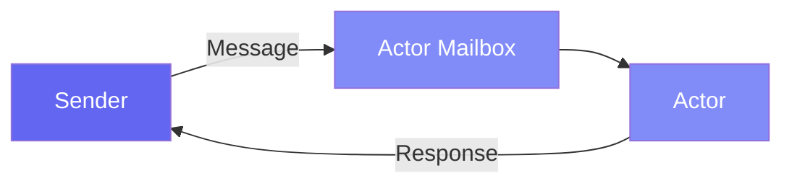

# Getting Started

This guide introduces the core concepts of Pulsing, a lightweight distributed Actor framework for building scalable AI systems.

---

## What is an Actor?

An Actor is:

- An isolated unit of computation with private state
- A message handler that processes messages sequentially
- Location-transparent: same API for local and remote actors



---

## Installation

```bash
pip install pulsing
```

---

## Your First Actor (30 seconds)

```python
import asyncio
from pulsing.actor import Actor, SystemConfig, create_actor_system


class PingPong(Actor):
    async def receive(self, msg):
        if msg == "ping":
            return "pong"
        return f"echo: {msg}"


async def main():
    system = await create_actor_system(SystemConfig.standalone())
    actor = await system.spawn("pingpong", PingPong())

    print(await actor.ask("ping"))   # -> pong
    print(await actor.ask("hello"))  # -> echo: hello

    await system.shutdown()


asyncio.run(main())
```

That's it! **Any Python object** can be a message - strings, dicts, lists, or custom classes.

---

## Stateful Actor

```python
class Counter(Actor):
    def __init__(self):
        self.value = 0

    async def receive(self, msg):
        if msg == "inc":
            self.value += 1
            return self.value
        if msg == "get":
            return self.value


async def main():
    system = await create_actor_system(SystemConfig.standalone())
    counter = await system.spawn("counter", Counter())

    print(await counter.ask("inc"))  # 1
    print(await counter.ask("inc"))  # 2
    print(await counter.ask("get"))  # 2

    await system.shutdown()
```

---

## Dict Messages (Most Common)

For structured data, use dicts:

```python
class Calculator(Actor):
    def __init__(self):
        self.result = 0

    async def receive(self, msg):
        if isinstance(msg, dict):
            op = msg.get("op")
            n = msg.get("n", 0)

            if op == "add":
                self.result += n
            elif op == "mul":
                self.result *= n
            elif op == "reset":
                self.result = 0

            return {"result": self.result}


# Usage
resp = await calc.ask({"op": "add", "n": 10})  # {'result': 10}
resp = await calc.ask({"op": "mul", "n": 2})   # {'result': 20}
```

---

## @as_actor Decorator (Method Calls)

For a more object-oriented API, use `@as_actor`:

```python
from pulsing.actor import as_actor, create_actor_system, SystemConfig


@as_actor
class Counter:
    def __init__(self, initial=0):
        self.value = initial

    def inc(self, n=1):
        self.value += n
        return self.value

    def get(self):
        return self.value


async def main():
    system = await create_actor_system(SystemConfig.standalone())
    counter = await Counter.local(system, initial=10)

    print(await counter.inc(5))   # 15
    print(await counter.get())    # 15

    await system.shutdown()
```

---

## Ask vs Tell

| Pattern | Description | Use When |
|---------|-------------|----------|
| `ask` | Send and wait for response | Need the result |
| `tell` | Fire-and-forget | Side effects only, logging |

```python
# ask - wait for response
result = await actor.ask("ping")

# tell - don't wait
await actor.tell("log this event")
```

---

## Streaming Responses

For continuous data (LLM tokens, progress updates):

```python
from pulsing.actor import StreamMessage

@as_actor
class TokenGenerator:
    async def generate(self, prompt: str):
        stream_msg, writer = StreamMessage.create("tokens")

        async def produce():
            for i, word in enumerate(prompt.split()):
                await writer.write({"token": word, "index": i})  # auto-serialized
            await writer.close()

        asyncio.create_task(produce())
        return stream_msg


# Consume the stream
response = await generator.generate("Hello world from Pulsing")
async for chunk in response.stream_reader():
    print(chunk["token"])  # chunk is already a Python dict
```

**Key features:**

- `writer.write(obj)` - Write any Python object (auto-pickled)
- `stream_reader()` - Iterate and receive Python objects (auto-unpickled)
- Bounded buffer with backpressure

---

## Cluster Setup

Pulsing uses SWIM gossip protocol - no external services needed!

**Node 1 (Seed):**
```python
config = SystemConfig.with_addr("0.0.0.0:8000")
system = await create_actor_system(config)
await system.spawn("worker", MyActor(), public=True)  # public = visible to cluster
```

**Node 2 (Join):**
```python
config = SystemConfig.with_addr("0.0.0.0:8001").with_seeds(["192.168.1.100:8000"])
system = await create_actor_system(config)

# Find and call remote actor (same API!)
worker = await system.resolve_named("worker")
result = await worker.ask("do_work")
```

---

## Summary

| Concept | Description |
|---------|-------------|
| **Actor** | Isolated unit with private state |
| **Message** | Any Python object (string, dict, list, etc.) |
| **ask/tell** | Request-response / fire-and-forget |
| **Streaming** | Continuous data with automatic serialization |
| **@as_actor** | Turn any class into an actor with method calls |
| **Cluster** | Automatic discovery with SWIM protocol |

---

## Next Steps

- [Actor Guide](../guide/actors.md) - Advanced patterns
- [Remote Actors](../guide/remote_actors.md) - Cluster details
- [Examples](../examples/index.md) - Real-world use cases
