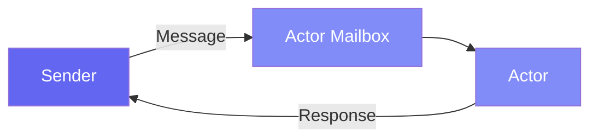

# Getting Started

This comprehensive guide introduces the core concepts of Pulsing, a lightweight distributed Actor framework for building scalable AI systems.

---

## What is an Actor?

At its core, Pulsing uses **Actors** as a way to build distributed programs. An Actor is:

- An isolated unit of computation with private state
- A message handler that processes messages sequentially
- Location-transparent: same API for local and remote actors



---

## Installation

```bash
# Install from source
pip install maturin
maturin develop

# Or using uv
uv pip install -e .
```

---

## 1. Your First Actor

Let's start by creating a simple counter actor using the base `Actor` class:

```python
import asyncio
from pulsing.actor import Actor, Message, SystemConfig, create_actor_system

class Counter(Actor):
    """A simple counter actor that tracks a value."""
    
    def __init__(self):
        self.value = 0
    
    def on_start(self, actor_id):
        """Called when the actor starts."""
        print(f"Counter started with ID: {actor_id}")
    
    async def receive(self, msg: Message) -> Message:
        """Handle incoming messages."""
        data = msg.to_json()
        
        if msg.msg_type == "Increment":
            n = data.get("n", 1)
            self.value += n
            return Message.from_json("Result", {"value": self.value})
        
        elif msg.msg_type == "GetValue":
            return Message.from_json("Value", {"value": self.value})
        
        return Message.from_json("Error", {"error": f"Unknown: {msg.msg_type}"})


async def main():
    # Create an actor system (standalone mode - no cluster)
    system = await create_actor_system(SystemConfig.standalone())
    
    # Spawn the counter actor
    counter = await system.spawn("counter", Counter())
    
    # Send messages and get responses
    response = await counter.ask(Message.from_json("Increment", {"n": 10}))
    print(f"After increment: {response.to_json()}")  # {"value": 10}
    
    response = await counter.ask(Message.from_json("GetValue", {}))
    print(f"Current value: {response.to_json()}")  # {"value": 10}
    
    # Always shutdown the system when done
    await system.shutdown()

asyncio.run(main())
```

**Key Points:**

- `Actor` is the base class - implement `receive()` to handle messages
- `Message.from_json(type, data)` creates a message with JSON payload
- `actor.ask(msg)` sends a message and waits for response
- `system.shutdown()` cleanly stops all actors

---

## 2. The @as_actor Decorator (Recommended)

The `@as_actor` decorator provides a simpler, more Pythonic way to create actors:

```python
from pulsing.actor import as_actor, create_actor_system, SystemConfig

@as_actor
class Counter:
    """A counter with automatic method-to-message conversion."""
    
    def __init__(self, initial_value: int = 0):
        self.value = initial_value
    
    def increment(self, n: int = 1) -> int:
        """Increment the counter and return the new value."""
        self.value += n
        return self.value
    
    def decrement(self, n: int = 1) -> int:
        """Decrement the counter and return the new value."""
        self.value -= n
        return self.value
    
    def get_value(self) -> int:
        """Get the current counter value."""
        return self.value


async def main():
    system = await create_actor_system(SystemConfig.standalone())
    
    # Create a local actor instance
    counter = await Counter.local(system, initial_value=100)
    
    # Call methods just like a regular object!
    result = await counter.increment(50)
    print(f"After increment: {result}")  # 150
    
    result = await counter.decrement(30)
    print(f"After decrement: {result}")  # 120
    
    value = await counter.get_value()
    print(f"Current value: {value}")  # 120
    
    await system.shutdown()

asyncio.run(main())
```

**Benefits:**

- No boilerplate message handling code
- Type hints are preserved
- IDE autocompletion works
- Methods become remote endpoints automatically

---

## 3. Message Patterns

### Ask Pattern (Request-Response)

Send a message and wait for a response:

```python
# With base Actor class
response = await actor.ask(Message.from_json("Request", {"data": "hello"}))
result = response.to_json()

# With @as_actor decorator
result = await counter.increment(10)
```

### Tell Pattern (Fire-and-Forget)

Send a message without waiting:

```python
# Send and continue immediately (no response)
await actor.tell(Message.from_json("LogEvent", {"event": "user_login"}))
```

| Pattern | Use When |
|---------|----------|
| **Ask** | You need the result, request-response workflows |
| **Tell** | Side effects only, logging, notifications |

---

## 4. Setting Up a Cluster

Pulsing can form a cluster automatically using the built-in SWIM gossip protocol. No external services required!

### Node 1: Start a Seed Node

```python
import asyncio
from pulsing.actor import as_actor, create_actor_system, SystemConfig

@as_actor
class WorkerService:
    def __init__(self, worker_id: str):
        self.worker_id = worker_id
        self.tasks_completed = 0
    
    def process(self, data: str) -> dict:
        self.tasks_completed += 1
        return {
            "worker_id": self.worker_id,
            "result": data.upper(),
            "tasks_completed": self.tasks_completed
        }

async def main():
    # Start on a specific address
    config = SystemConfig.with_addr("0.0.0.0:8000")
    system = await create_actor_system(config)
    
    # Spawn a PUBLIC actor (visible to other nodes)
    worker = await system.spawn("worker", WorkerService("node-1"), public=True)
    
    print("Seed node started on 0.0.0.0:8000")
    
    # Keep running
    try:
        while True:
            await asyncio.sleep(1)
    except KeyboardInterrupt:
        await system.shutdown()

asyncio.run(main())
```

### Node 2: Join the Cluster

```python
import asyncio
from pulsing.actor import create_actor_system, SystemConfig, Message

async def main():
    # Join by specifying seed nodes
    config = SystemConfig.with_addr("0.0.0.0:8001") \
        .with_seeds(["192.168.1.100:8000"])  # IP of Node 1
    
    system = await create_actor_system(config)
    
    # Wait for cluster sync
    await asyncio.sleep(1.0)
    
    # Find the remote worker actor
    worker = await system.find("worker")
    
    if worker:
        # Call the remote actor (same API as local!)
        result = await worker.ask(Message.from_json("Call", {
            "method": "process",
            "args": ["hello world"],
            "kwargs": {}
        }))
        print(f"Result: {result.to_json()}")
    
    await system.shutdown()

asyncio.run(main())
```

### Public vs Private Actors

| Feature | Public Actor | Private Actor |
|---------|-------------|---------------|
| Cluster Visibility | ✅ Visible to all nodes | ❌ Local only |
| Discovery via find() | ✅ Yes | ❌ No |
| Use Case | Services, shared workers | Internal helpers |

```python
# Public actor - can be found by other nodes
await system.spawn("api-service", MyActor(), public=True)

# Private actor - local only (default)
await system.spawn("helper", HelperActor(), public=False)
```

---

## 5. Building a Distributed Application

Let's build a complete distributed key-value store:

### Define the Storage Actor

```python
# kv_store.py
from pulsing.actor import as_actor

@as_actor
class KeyValueStore:
    def __init__(self, node_id: str):
        self.node_id = node_id
        self.store = {}
    
    def put(self, key: str, value: str) -> dict:
        self.store[key] = value
        return {"status": "ok", "node": self.node_id}
    
    def get(self, key: str) -> dict:
        if key in self.store:
            return {"status": "ok", "value": self.store[key]}
        return {"status": "not_found"}
    
    def delete(self, key: str) -> dict:
        if key in self.store:
            del self.store[key]
            return {"status": "ok"}
        return {"status": "not_found"}
```

### Run the Distributed System

```bash
# Terminal 1: Start seed node
python server.py --addr 0.0.0.0:8000

# Terminal 2: Join the cluster
python server.py --addr 0.0.0.0:8001 --seeds localhost:8000

# Terminal 3: Run client
python client.py
```

---

## 6. Streaming Messages

Pulsing supports streaming for continuous data flows (e.g., LLM token generation):

```python
# Create streaming message
msg = Message.stream("process", b"data")

# Process streaming response
async for chunk in actor_ref.ask_stream(msg):
    print(f"Chunk: {chunk}")
```

---

## 7. Best Practices

### ✅ Do's

```python
# Initialize all state in __init__
@as_actor
class GoodActor:
    def __init__(self):
        self.counter = 0
        self.cache = {}

# Use async for I/O operations
@as_actor
class AsyncActor:
    async def fetch_data(self, url: str) -> dict:
        async with aiohttp.ClientSession() as session:
            async with session.get(url) as resp:
                return await resp.json()

# Handle errors gracefully
@as_actor
class ResilientActor:
    def operation(self, data: dict) -> dict:
        try:
            result = self.process(data)
            return {"success": True, "result": result}
        except Exception as e:
            return {"success": False, "error": str(e)}

# Always shutdown the system
async def main():
    system = await create_actor_system(config)
    try:
        # ... do work ...
    finally:
        await system.shutdown()
```

### ❌ Don'ts

```python
# Don't share mutable state between actors
global_state = {}  # Bad!

# Don't block in actor methods
def slow_operation(self):
    time.sleep(10)  # Blocks the actor!
    # Use asyncio.sleep() instead

# Don't forget error handling
def dangerous(self, data):
    return data["missing_key"]  # Will crash!
```

---

## Summary

| Concept | Description |
|---------|-------------|
| **Actor** | Isolated unit with private state |
| **@as_actor** | Decorator that turns any class into an actor |
| **Ask/Tell** | Request-response vs fire-and-forget patterns |
| **Cluster** | Automatic discovery with SWIM protocol |
| **Public Actors** | Actors visible across the cluster |
| **Location Transparency** | Same API for local and remote actors |

---

## Next Steps

- Read the [Actor Complete Guide](../guide/actors.md) for advanced patterns
- Check out [Remote Actors](../guide/remote_actors.md) for cluster details
- Explore [Design Documents](../design/actor-system.md) for implementation details
- See the [LLM Inference Example](../examples/llm_inference.md) for a real-world use case
- Review the [API Reference](../api_reference.md) for complete documentation
