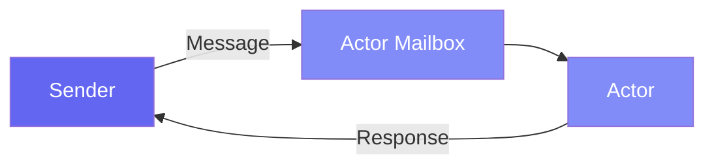

# Getting Started

Get up and running with Pulsing quickly.

## Installation

### Prerequisites

- **Python 3.10+**
- **Rust toolchain** (for building native extensions)
- **Linux/macOS**

### From Source

```bash
git clone https://github.com/reiase/pulsing.git
cd pulsing

# Install Rust (if not already installed)
curl --proto '=https' --tlsv1.2 -sSf https://sh.rustup.rs | sh

# Build and install
pip install maturin
maturin develop
```

### From PyPI

```bash
pip install pulsing
```

---

## What is an Actor?

An Actor is an isolated computational unit with private state that processes messages sequentially. Local and remote Actors use the same API.



---

## Your First Actor (30 seconds)

```python
import asyncio
from pulsing.actor import Actor, SystemConfig, create_actor_system

class PingPong(Actor):
    async def receive(self, msg):
        if msg == "ping":
            return "pong"
        return f"echo: {msg}"

async def main():
    system = await create_actor_system(SystemConfig.standalone())
    actor = await system.spawn("pingpong", PingPong())

    print(await actor.ask("ping"))   # -> pong
    print(await actor.ask("hello"))  # -> echo: hello

    await system.shutdown()

asyncio.run(main())
```

**Any Python object** can be a message—strings, dicts, lists, or custom classes.

---

## Stateful Actors

```python
class Counter(Actor):
    def __init__(self):
        self.value = 0

    async def receive(self, msg):
        if msg == "inc":
            self.value += 1
            return self.value
        if msg == "get":
            return self.value
```

---

## @as_actor Decorator

For a more object-oriented API:

```python
from pulsing.actor import as_actor

@as_actor
class Counter:
    def __init__(self, initial=0):
        self.value = initial

    def inc(self, n=1):
        self.value += n
        return self.value

async def main():
    system = await create_actor_system(SystemConfig.standalone())
    counter = await Counter.local(system, initial=10)
    print(await counter.inc(5))   # 15
```

---

## Cluster Communication

Pulsing uses SWIM gossip protocol—no external services needed!

**Node 1 (Seed):**
```python
config = SystemConfig.with_addr("0.0.0.0:8000")
system = await create_actor_system(config)
await system.spawn("worker", MyActor(), public=True)
```

**Node 2 (Join):**
```python
config = SystemConfig.with_addr("0.0.0.0:8001").with_seeds(["node1:8000"])
system = await create_actor_system(config)

worker = await system.resolve_named("worker")
result = await worker.ask("do_work")  # Same API!
```

---

## Core Concepts

| Concept | Description |
|---------|-------------|
| **Actor** | Isolated unit with private state |
| **Message** | Any Python object |
| **ask/tell** | Request-response / Fire-and-forget |
| **@as_actor** | Method-call style Actor |
| **Cluster** | SWIM protocol auto-discovery |

---

## Next Steps

- [Actor Guide](../guide/actors.md) - Advanced patterns
- [Agent Frameworks](../agent/index.md) - AutoGen and LangGraph integration
- [Examples](../examples/index.md) - Real-world use cases
