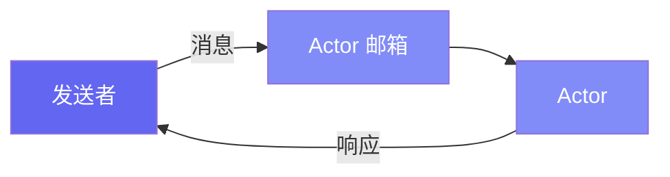

# 快速开始

本指南帮助您快速安装 Pulsing 并掌握核心概念。

## 安装

### 前置条件

- **Python 3.10+**
- **Rust 工具链** (用于构建原生扩展)
- **Linux/macOS**

### 从源码安装

```bash
git clone https://github.com/reiase/pulsing.git
cd pulsing

# 安装 Rust (如果尚未安装)
curl --proto '=https' --tlsv1.2 -sSf https://sh.rustup.rs | sh

# 构建和安装
pip install maturin
maturin develop
```

### 从 PyPI 安装

```bash
pip install pulsing
```

---

## 什么是 Actor？

Actor 是具有私有状态的隔离计算单元，顺序处理消息，本地和远程 Actor 使用相同的 API。



---

## 第一个 Actor（30秒）

```python
import asyncio
from pulsing.actor import Actor, SystemConfig, create_actor_system

class PingPong(Actor):
    async def receive(self, msg):
        if msg == "ping":
            return "pong"
        return f"echo: {msg}"

async def main():
    system = await create_actor_system(SystemConfig.standalone())
    actor = await system.spawn("pingpong", PingPong())

    print(await actor.ask("ping"))   # -> pong
    print(await actor.ask("hello"))  # -> echo: hello

    await system.shutdown()

asyncio.run(main())
```

**任意 Python 对象**都可以作为消息——字符串、字典、列表或自定义类。

---

## 有状态的 Actor

```python
class Counter(Actor):
    def __init__(self):
        self.value = 0

    async def receive(self, msg):
        if msg == "inc":
            self.value += 1
            return self.value
        if msg == "get":
            return self.value
```

---

## @as_actor 装饰器

更面向对象的 API：

```python
from pulsing.actor import as_actor

@as_actor
class Counter:
    def __init__(self, initial=0):
        self.value = initial

    def inc(self, n=1):
        self.value += n
        return self.value

async def main():
    system = await create_actor_system(SystemConfig.standalone())
    counter = await Counter.local(system, initial=10)
    print(await counter.inc(5))   # 15
```

---

## 集群通信

Pulsing 使用 SWIM gossip 协议——无需外部服务！

**节点 1（种子节点）：**
```python
config = SystemConfig.with_addr("0.0.0.0:8000")
system = await create_actor_system(config)
await system.spawn("worker", MyActor(), public=True)
```

**节点 2（加入集群）：**
```python
config = SystemConfig.with_addr("0.0.0.0:8001").with_seeds(["node1:8000"])
system = await create_actor_system(config)

worker = await system.resolve_named("worker")
result = await worker.ask("do_work")  # API 完全相同！
```

---

## 核心概念

| 概念 | 描述 |
|------|------|
| **Actor** | 具有私有状态的隔离单元 |
| **消息** | 任意 Python 对象 |
| **ask/tell** | 请求-响应 / 发后即忘 |
| **@as_actor** | 方法调用风格的 Actor |
| **集群** | SWIM 协议自动发现 |

---

## 下一步

- [Actor 指南](../guide/actors.zh.md) - 高级模式
- [Agent 框架](../agent/index.zh.md) - AutoGen 和 LangGraph 集成
- [示例](../examples/index.zh.md) - 真实用例
