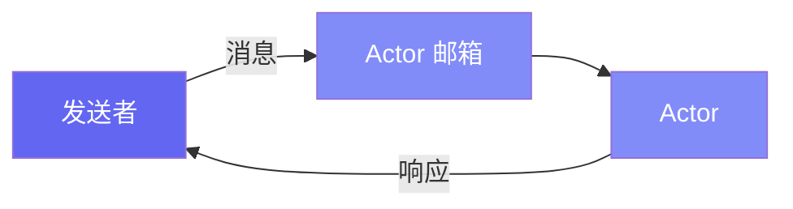

# 入门指南

这份全面的指南介绍了 Pulsing 的核心概念——一个用于构建可扩展 AI 系统的轻量级分布式 Actor 框架。

---

## 什么是 Actor？

Pulsing 的核心使用 **Actor** 作为构建分布式程序的方式。Actor 是：

- 具有私有状态的隔离计算单元
- 顺序处理消息的消息处理器
- 位置透明：本地和远程 Actor 使用相同的 API



---

## 安装

```bash
# 从源码安装
pip install maturin
maturin develop

# 或使用 uv
uv pip install -e .
```

---

## 1. 你的第一个 Actor

让我们使用基础 `Actor` 类创建一个简单的计数器：

```python
import asyncio
from pulsing.actor import Actor, Message, SystemConfig, create_actor_system

class Counter(Actor):
    """一个跟踪值的简单计数器 Actor。"""
    
    def __init__(self):
        self.value = 0
    
    def on_start(self, actor_id):
        """Actor 启动时调用。"""
        print(f"Counter 已启动，ID: {actor_id}")
    
    async def receive(self, msg: Message) -> Message:
        """处理传入的消息。"""
        data = msg.to_json()
        
        if msg.msg_type == "Increment":
            n = data.get("n", 1)
            self.value += n
            return Message.from_json("Result", {"value": self.value})
        
        elif msg.msg_type == "GetValue":
            return Message.from_json("Value", {"value": self.value})
        
        return Message.from_json("Error", {"error": f"未知: {msg.msg_type}"})


async def main():
    # 创建 Actor 系统（单机模式）
    system = await create_actor_system(SystemConfig.standalone())
    
    # 生成计数器 Actor
    counter = await system.spawn("counter", Counter())
    
    # 发送消息并获取响应
    response = await counter.ask(Message.from_json("Increment", {"n": 10}))
    print(f"增量后: {response.to_json()}")  # {"value": 10}
    
    response = await counter.ask(Message.from_json("GetValue", {}))
    print(f"当前值: {response.to_json()}")  # {"value": 10}
    
    # 完成后务必关闭系统
    await system.shutdown()

asyncio.run(main())
```

**要点：**

- `Actor` 是基类 - 实现 `receive()` 来处理消息
- `Message.from_json(type, data)` 创建带有 JSON 负载的消息
- `actor.ask(msg)` 发送消息并等待响应
- `system.shutdown()` 干净地停止所有 Actor

---

## 2. @as_actor 装饰器（推荐）

`@as_actor` 装饰器提供了一种更简单、更 Pythonic 的方式来创建 Actor：

```python
from pulsing.actor import as_actor, create_actor_system, SystemConfig

@as_actor
class Counter:
    """带自动方法到消息转换的计数器。"""
    
    def __init__(self, initial_value: int = 0):
        self.value = initial_value
    
    def increment(self, n: int = 1) -> int:
        """增加计数器并返回新值。"""
        self.value += n
        return self.value
    
    def decrement(self, n: int = 1) -> int:
        """减少计数器并返回新值。"""
        self.value -= n
        return self.value
    
    def get_value(self) -> int:
        """获取当前计数器值。"""
        return self.value


async def main():
    system = await create_actor_system(SystemConfig.standalone())
    
    # 创建本地 Actor 实例
    counter = await Counter.local(system, initial_value=100)
    
    # 像普通对象一样调用方法！
    result = await counter.increment(50)
    print(f"增量后: {result}")  # 150
    
    result = await counter.decrement(30)
    print(f"减量后: {result}")  # 120
    
    value = await counter.get_value()
    print(f"当前值: {value}")  # 120
    
    await system.shutdown()

asyncio.run(main())
```

**优势：**

- 无需样板消息处理代码
- 保留类型提示
- IDE 自动补全有效
- 方法自动成为远程端点

---

## 3. 消息模式

### Ask 模式（请求-响应）

发送消息并等待响应：

```python
# 使用基础 Actor 类
response = await actor.ask(Message.from_json("Request", {"data": "hello"}))
result = response.to_json()

# 使用 @as_actor 装饰器
result = await counter.increment(10)
```

### Tell 模式（发后即忘）

发送消息而不等待：

```python
# 发送并立即继续（无响应）
await actor.tell(Message.from_json("LogEvent", {"event": "user_login"}))
```

| 模式 | 使用场景 |
|------|----------|
| **Ask** | 需要结果，请求-响应工作流 |
| **Tell** | 仅副作用，日志记录，通知 |

---

## 4. 设置集群

Pulsing 可以使用内置的 SWIM gossip 协议自动组建集群，无需外部服务！

### 节点 1：启动种子节点

```python
import asyncio
from pulsing.actor import as_actor, create_actor_system, SystemConfig

@as_actor
class WorkerService:
    def __init__(self, worker_id: str):
        self.worker_id = worker_id
        self.tasks_completed = 0
    
    def process(self, data: str) -> dict:
        self.tasks_completed += 1
        return {
            "worker_id": self.worker_id,
            "result": data.upper(),
            "tasks_completed": self.tasks_completed
        }

async def main():
    # 在指定地址启动
    config = SystemConfig.with_addr("0.0.0.0:8000")
    system = await create_actor_system(config)
    
    # 生成一个 PUBLIC Actor（对其他节点可见）
    worker = await system.spawn("worker", WorkerService("node-1"), public=True)
    
    print("种子节点已在 0.0.0.0:8000 启动")
    
    # 保持运行
    try:
        while True:
            await asyncio.sleep(1)
    except KeyboardInterrupt:
        await system.shutdown()

asyncio.run(main())
```

### 节点 2：加入集群

```python
import asyncio
from pulsing.actor import create_actor_system, SystemConfig, Message

async def main():
    # 通过指定种子节点加入
    config = SystemConfig.with_addr("0.0.0.0:8001") \
        .with_seeds(["192.168.1.100:8000"])  # 节点 1 的 IP
    
    system = await create_actor_system(config)
    
    # 等待集群同步
    await asyncio.sleep(1.0)
    
    # 查找远程 worker Actor
    worker = await system.find("worker")
    
    if worker:
        # 调用远程 Actor（与本地 API 相同！）
        result = await worker.ask(Message.from_json("Call", {
            "method": "process",
            "args": ["hello world"],
            "kwargs": {}
        }))
        print(f"结果: {result.to_json()}")
    
    await system.shutdown()

asyncio.run(main())
```

### 公共 vs 私有 Actor

| 特性 | 公共 Actor | 私有 Actor |
|------|------------|------------|
| 集群可见性 | ✅ 对所有节点可见 | ❌ 仅本地 |
| 通过 find() 发现 | ✅ 是 | ❌ 否 |
| 使用场景 | 服务，共享 worker | 内部辅助 |

```python
# 公共 actor - 可被其他节点找到
await system.spawn("api-service", MyActor(), public=True)

# 私有 actor - 仅本地（默认）
await system.spawn("helper", HelperActor(), public=False)
```

---

## 5. 构建分布式应用

让我们构建一个完整的分布式键值存储：

### 定义存储 Actor

```python
# kv_store.py
from pulsing.actor import as_actor

@as_actor
class KeyValueStore:
    def __init__(self, node_id: str):
        self.node_id = node_id
        self.store = {}
    
    def put(self, key: str, value: str) -> dict:
        self.store[key] = value
        return {"status": "ok", "node": self.node_id}
    
    def get(self, key: str) -> dict:
        if key in self.store:
            return {"status": "ok", "value": self.store[key]}
        return {"status": "not_found"}
    
    def delete(self, key: str) -> dict:
        if key in self.store:
            del self.store[key]
            return {"status": "ok"}
        return {"status": "not_found"}
```

### 运行分布式系统

```bash
# 终端 1：启动种子节点
python server.py --addr 0.0.0.0:8000

# 终端 2：加入集群
python server.py --addr 0.0.0.0:8001 --seeds localhost:8000

# 终端 3：运行客户端
python client.py
```

---

## 6. 流式消息

Pulsing 支持流式响应用于连续数据流（如 LLM token 生成）：

```python
# 创建流式消息
msg = Message.stream("process", b"data")

# 处理流式响应
async for chunk in actor_ref.ask_stream(msg):
    print(f"Chunk: {chunk}")
```

---

## 7. 最佳实践

### ✅ 应该做

```python
# 在 __init__ 中初始化所有状态
@as_actor
class GoodActor:
    def __init__(self):
        self.counter = 0
        self.cache = {}

# 对 I/O 操作使用 async
@as_actor
class AsyncActor:
    async def fetch_data(self, url: str) -> dict:
        async with aiohttp.ClientSession() as session:
            async with session.get(url) as resp:
                return await resp.json()

# 优雅地处理错误
@as_actor
class ResilientActor:
    def operation(self, data: dict) -> dict:
        try:
            result = self.process(data)
            return {"success": True, "result": result}
        except Exception as e:
            return {"success": False, "error": str(e)}

# 始终关闭系统
async def main():
    system = await create_actor_system(config)
    try:
        # ... 执行工作 ...
    finally:
        await system.shutdown()
```

### ❌ 不应该做

```python
# 不要在 Actor 之间共享可变状态
global_state = {}  # 不好！

# 不要在 Actor 方法中阻塞
def slow_operation(self):
    time.sleep(10)  # 阻塞 Actor！
    # 应使用 asyncio.sleep() 代替

# 不要忘记错误处理
def dangerous(self, data):
    return data["missing_key"]  # 会崩溃！
```

---

## 总结

| 概念 | 描述 |
|------|------|
| **Actor** | 具有私有状态的隔离单元 |
| **@as_actor** | 将任何类转换为 Actor 的装饰器 |
| **Ask/Tell** | 请求-响应 vs 发后即忘模式 |
| **集群** | 使用 SWIM 协议自动发现 |
| **公共 Actor** | 对整个集群可见的 Actor |
| **位置透明** | 本地和远程 Actor 使用相同的 API |

---

## 下一步

- 阅读 [Actor 完整指南](../guide/actors.md) 了解高级模式
- 查看 [远程 Actor](../guide/remote_actors.md) 了解集群详情
- 探索 [设计文档](../design/actor-system.md) 了解实现细节
- 查看 [LLM 推理示例](../examples/llm_inference.md) 了解真实用例
- 查阅 [API 参考](../api_reference.md) 获取完整文档
