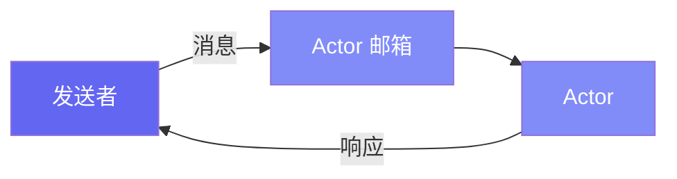

# 入门指南

本指南介绍 Pulsing 的核心概念——一个用于构建可扩展 AI 系统的轻量级分布式 Actor 框架。

---

## 什么是 Actor？

Actor 是：

- 具有私有状态的隔离计算单元
- 顺序处理消息的消息处理器
- 位置透明：本地和远程 Actor 使用相同的 API



---

## 安装

```bash
pip install pulsing
```

---

## 第一个 Actor（30秒）

```python
import asyncio
from pulsing.actor import Actor, SystemConfig, create_actor_system


class PingPong(Actor):
    async def receive(self, msg):
        if msg == "ping":
            return "pong"
        return f"echo: {msg}"


async def main():
    system = await create_actor_system(SystemConfig.standalone())
    actor = await system.spawn("pingpong", PingPong())

    print(await actor.ask("ping"))   # -> pong
    print(await actor.ask("hello"))  # -> echo: hello

    await system.shutdown()


asyncio.run(main())
```

就是这样！**任意 Python 对象**都可以作为消息——字符串、字典、列表或自定义类。

---

## 有状态的 Actor

```python
class Counter(Actor):
    def __init__(self):
        self.value = 0

    async def receive(self, msg):
        if msg == "inc":
            self.value += 1
            return self.value
        if msg == "get":
            return self.value


async def main():
    system = await create_actor_system(SystemConfig.standalone())
    counter = await system.spawn("counter", Counter())

    print(await counter.ask("inc"))  # 1
    print(await counter.ask("inc"))  # 2
    print(await counter.ask("get"))  # 2

    await system.shutdown()
```

---

## 字典消息（最常用）

对于结构化数据，使用字典：

```python
class Calculator(Actor):
    def __init__(self):
        self.result = 0

    async def receive(self, msg):
        if isinstance(msg, dict):
            op = msg.get("op")
            n = msg.get("n", 0)

            if op == "add":
                self.result += n
            elif op == "mul":
                self.result *= n
            elif op == "reset":
                self.result = 0

            return {"result": self.result}


# 使用
resp = await calc.ask({"op": "add", "n": 10})  # {'result': 10}
resp = await calc.ask({"op": "mul", "n": 2})   # {'result': 20}
```

---

## @as_actor 装饰器（方法调用风格）

想要更面向对象的 API，使用 `@as_actor`：

```python
from pulsing.actor import as_actor, create_actor_system, SystemConfig


@as_actor
class Counter:
    def __init__(self, initial=0):
        self.value = initial

    def inc(self, n=1):
        self.value += n
        return self.value

    def get(self):
        return self.value


async def main():
    system = await create_actor_system(SystemConfig.standalone())
    counter = await Counter.local(system, initial=10)

    print(await counter.inc(5))   # 15
    print(await counter.get())    # 15

    await system.shutdown()
```

---

## Ask vs Tell

| 模式 | 描述 | 使用场景 |
|------|------|----------|
| `ask` | 发送并等待响应 | 需要结果 |
| `tell` | 发后即忘 | 仅副作用、日志 |

```python
# ask - 等待响应
result = await actor.ask("ping")

# tell - 不等待
await actor.tell("log this event")
```

---

## 集群配置

Pulsing 使用 SWIM gossip 协议——无需外部服务！

**节点 1（种子节点）：**
```python
config = SystemConfig.with_addr("0.0.0.0:8000")
system = await create_actor_system(config)
await system.spawn("worker", MyActor(), public=True)  # public = 对集群可见
```

**节点 2（加入集群）：**
```python
config = SystemConfig.with_addr("0.0.0.0:8001").with_seeds(["192.168.1.100:8000"])
system = await create_actor_system(config)

# 查找并调用远程 actor（API 完全相同！）
worker = await system.resolve_named("worker")
result = await worker.ask("do_work")
```

---

## 总结

| 概念 | 描述 |
|------|------|
| **Actor** | 具有私有状态的隔离单元 |
| **消息** | 任意 Python 对象（字符串、字典、列表等） |
| **ask/tell** | 请求-响应 / 发后即忘 |
| **@as_actor** | 将任何类转换为支持方法调用的 Actor |
| **集群** | 使用 SWIM 协议自动发现 |

---

## 下一步

- [Actor 指南](../guide/actors.md) - 高级模式
- [远程 Actor](../guide/remote_actors.md) - 集群详情
- [示例](../examples/index.md) - 真实用例
